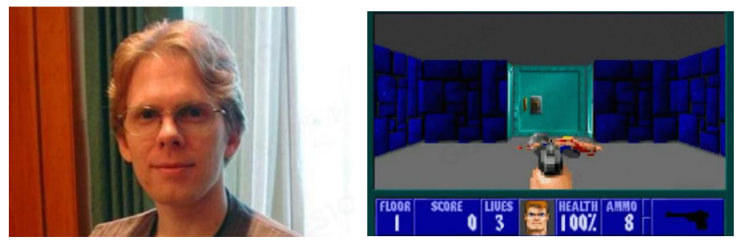

# 01\_现代游戏引擎导论

# 为什么要学游戏引擎？

应用领域——虚拟数字人、影视动画、军事模拟、数字孪生

[元宇宙-虚拟数字人概述](https://zhuanlan.zhihu.com/p/468194499)

# 游戏引擎历史

## 早期游戏时代

早期时候的游戏非常简单，常见的游戏机包括任天堂的“红白机”，彼时做游戏面临的最大问题是**如何把复杂元素放入非常小的存储空间中**，常见做法包括复用贴图，比如将云彩贴图变化颜色后复用成草丛贴图等。在这期间，也涌现了《魂斗罗》、《马里奥》、《坦克大战》等知名 IP。

## **第一个游戏引擎**

  

提到游戏引擎，就不得不提到游戏引擎之父**John D. Carmack，**他与另一个游戏软件天才 John Romero 共同开发出了全球首款第一人称射击游戏《德军总部 3D》_（Wolfenstein 3D，1992）_，他将游戏中能够复用的核心功能分离出来，产生了游戏引擎雏形。

John Carmack 开发的第二款游戏——《毁灭战士》_（Doom）_，将该游戏分离的功能制作成为游戏引擎，才有了另一款游戏《魅影术士》_（Shadow Caster）_。但真正的游戏引擎还没到来，直到《雷神之锤》*（Quake）*问世。

《雷神之锤》由 id Software 开发的第一人称射击游戏，是**第一个系统研究联网对战下如何进行网络同步的游戏**，最早的版本发布于 1996 年 5 月 31 日。雷神之锤引擎*（Quake engine，又称 Q1 引擎）*是《雷神之锤》一代游戏的核心，也被用来制作其他的第一人称射击游戏，比如《半条命》（_Half-life_
）和《荣誉勋章》（*Medal of Honor）。Quake engine*是第一个实现即时 3D 的游戏引擎，该引擎提供了实时 3D 渲染，并通过 OpenGL 支持 3D 加速，给游戏画面带来了质的飞跃。

早期计算机硬件中没有显卡，但图形运算涉及大量矩阵、向量运算，非常适合并行计算，此时就来到了游戏发展的转折点——**显卡**诞生。游戏引擎的发展非常依赖于硬件的发展，例如从**PlayStation 1**
到**PlayStation 5**其算力提升 20 万倍，算力的增长导致游戏质量急速提升。

## 现代游戏引擎

目前市面上的游戏引擎可分为三种：商业引擎*（Commercial Engine）*、自研引擎*（In-house Engine）*以及免费引擎*（Free Engine）*。商业引擎主要包括 UE、Unity 等引擎，自研引擎为各大游戏公司内部使用的引擎，包括大名鼎鼎的寒霜引擎*（Frostbite Engine）*，大多数免费引擎通常只适用于轻量级作品，与商业和自研引擎差距较大。

除此以外，针对特定功能模块还产生了细分功能的各类引擎。随着游戏行业的不断发展，开发者意识到物理计算等比较复杂，早期游戏都会自行实现物理碰撞等，但计算越来越复杂时，为了减少开发中不必要消耗，出现了专门用于处理物理计算的模块。在此基础上，出现了各种各样的中间件供游戏开发者使用。例如 SpeedTree，可为动画、建筑以及视频游戏和要求实时模拟的实时生成虚拟植物。

### 什么是游戏引擎？

- 构建“黑客帝国”的技术基础
- 创造力工具
- 复杂性的艺术

游戏引擎作为**构建虚拟世界的底层框架**，对于创作者（艺术家、设计师），游戏引擎需要提供工具链，使其成为**人类创意或者想象力的生产力工具**。对于编程者，可扩展 API 接口无需修改核心即可定义游戏可玩性*（gameplay）*。对于工作室，游戏引擎需要提供可协作性，使得开发者能够合作完成不同工作。游戏引擎体量非常复杂、庞大，很好地展现了**复杂性系统的艺术-系统复杂之美**，但也带来了版本迭代兼容性问题。

