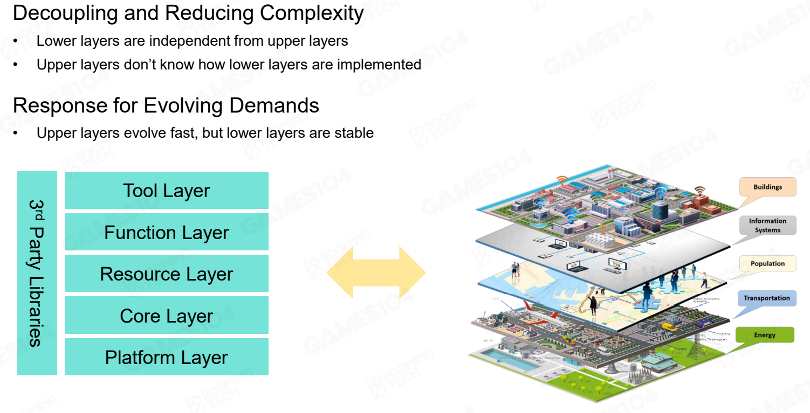

# **为什么需要分层架构？**

- 为了将游戏引擎解耦并降低复杂度
  - 每一层都将独立，底层提供基础服务，顶层无需知道底层的具体实现，也有利于开发与版本迭代。
- 为了响应不断变化的需求
  - 顶层部分迭代迅速，底层部分保持稳定

游戏引擎的架构类似于一个城市的结构：自底向上分别为各种各样的能源（类似于平台层，有多种能源都需要使用），交通（类似于核心层，运输核心，效率至上），人口（类似于资源层，需要被合理调配），信息系统（类似于功能层，有无数的信息系统可供使用，并且在不断迭代进化），建筑（类似于工具层，人们依托不同的建筑里做各种各样的事情）

# 引擎分层架构简介

游戏引擎主要包括 5 个架构分层以及第三方库，下面将自顶向下介绍这些架构分层（工具层、功能层、资源层、核心层、平台层）。

## 工具层 Tool Layer

通过在引擎编辑器中进行简单的 GUI 操作，即可实现游戏功能（设计关卡、动画等），这一层被称为**工具层**，也是接触引擎时最直观、最直接交互的层级，也是释放创造力的地方。

工具层通常以编辑器的形式存在，可用多种编程语言，开发效率优先，更加强调用户的便捷性。

DCC——数字内容创作。由于很多游戏资源是在 Maya、3ds Max、Houdini 等 DCC 中完成的，工具层通常包含导入、导出器用于导入、导出游戏资源。简单说来，就是别人用工具开发的数字资产通过引擎进入游戏中。

## **功能层 Function Layer**

### 一些基本功能

- 为了使游戏呈现在屏幕上，需要渲染系统对虚拟世界进行渲染。
- 动画系统将艺术家设计的动作动画在引擎中进行组合、过渡，让游戏人物在游戏动起来。
- 逼真的虚拟世界也离不开物理，物理系统将使用刚体、软体、流体等去表达世界，使得人与人、人与物不会发生碰撞。
- 游戏中的玩法以及 NPC 人物，也都离不开脚本、事件、AI 系统等。
- 为了实现游戏中的人机交互，还需要与输入、输出设备连接。

### 关键点 1——tick

功能层将使得整个虚拟世界变得栩栩如生：每隔`tick`时间，分别执行逻辑与绘制——`tickLogic`与`tickRender`。`tickLogic`主要用于模拟世界，包括处理输入输出，计算物理并进行碰撞检测等；`tickRender`将`tickLogic`计算的结果（人物位置等）进行绘制。

**每一个 tick 中(过于简化状态下)**

- **获取角色的动画帧**
- 驱动角色**的骨架和皮肤**
- **渲染器处理每一帧的 render tick 的迭代中的所有渲染工作**

### 关键点 2——复杂性

功能层非常复杂、庞大，提供了游戏引擎中大部分功能模块，但哪些功能属于游戏，哪些功能属于引擎，界限不明确。

### 关键点 3——多线程

考虑到功能层需要实现大量功能并对运行时间存在要求，功能层复杂性高，并通常需要借助多线程计算。

现代计算机 CPU 通常有多个核心，主流引擎将拆分适合并行计算的任务，分配到多个线程运算，但一些计算互相依赖，不适用于并行执行。在未来，引擎将所有任务变为原子计算，将任务分配到每个核上。

## **资源层 Resource Layer**

游戏引擎中通常包含大量数据和文件，这些文件通常以不同的形式存在，上万、上十万的数据文件由**资源层**进行加载与管理。

如 psd 格式将保存 Photoshop 中所有的图层，包含通道、参考线、注解和颜色模式等信息。为了避免在使用资源时频繁调度并减少不必要的内存消耗，在导入资源时进行转换，将不同资源（纹理、模型几何、动画等）都转换为资产文件，即 assest 文件*（.ast）*。

对于引擎中最常使用的贴图数据，可使用 png、jpg 格式进行存储，上述格式对应相应的压缩算法，但这些压缩算法不是 GPU 高效的算法，直接在 GPU 中使用会浪费性能，通常在引擎中被转换成 dds 格式。

dds 格式针对纹理设计，支持很多其他图像格式不支持的功能，如 Mipmap 等。

对于一个游戏人物，可能需要绑定网格、动画、贴图、材质等资源，定义 Composite asset 文件（如 XML）关联不同资源，并使用 Guid 唯一识别号对资产进行管理。

在游戏实际运行时，需要使用**资产管理器*（Asset Manager）***根据**资产生命周期*（Asset Life Cycle）***
对资产进行管理，包括资产实时加载卸载、资源池分配、垃圾回收与延迟加载等。

## **核心层 Core Layer**

工具层、功能层、资源层会频繁调用底层代码，使用容器创建、内存分配、数学库、多线程等底层功能，而**核心层**能够提供上述功能。核心层是游戏引擎的基础，提供各种功能模块所需的工具，包括数学库、数据结构与容器、内存管理等。

对于数学库，当前已有很多成熟的第三方库，例如 Eigen。但游戏引擎需要为效率服务，可使用**近似计算**或者**SIMD（单指令多数据流，可并行处理多个数据的指令）**提高运算效率。

对于数据结构与容器，编程语言中的数据结构可能不满足要求，比如 C++一些标准实现会产生内存空洞，引擎中实现的数据结构更加方便内存管理，提高访问效率。

对于内存管理，引擎内存管理与操作系统类似，内存性能瓶颈主要在内存池（分配器）、缓存缺失、内存对齐等。

## **平台层 Platform Layer**

在游戏引擎中最容易被忽略的是平台层，引擎或者游戏需要发布在不同平台上，可能需要使用不同的图形 API。此外，用户使用的输入设备、硬件设备可能也完全不同，这都需要平台层进行处理。

平台层使得游戏能兼容不同平台、不同硬件设备，为上层提供平台无关的服务和信息。对于图形 API（如 OpenGL、DirectX、Vulkan 等），平台层需要使用 RHI（Render Hardware Interface）去除不同 API 的差异，上层使用时无需关心渲染使用的是何种 API。

## **第三方库**

第三方库或者中间件通过 SDK 的形式或者通过文件格式转化。

# 总结

1. 游戏引擎被设计为分层结构
2. 在引擎的分层结构中，越往上，越灵活；越往下，越稳定
3. 虚拟世界由一系列 tick 时间组成
