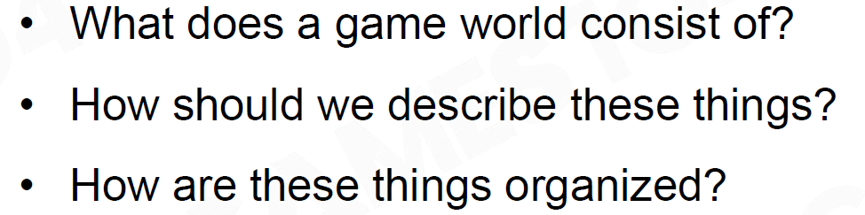

# 前言

对于标题的问题，我们要回答以下三个问题：

# 一个游戏世界由什么构成？

- 一个游戏世界我们首先关注到的就是一系列可移动可操作的动态物（Dynamic Game Objects），如坦克、火炮等；
    
    
    
- 还有一系列静态物（Static Game Object），如石头、棚屋等，这些静态物虽然不能交互，却是GamePlay中很关键的元素；
    
    
    
- 最容易被忽略却又无处不在的是游戏的环境（Environments），它一般由天空（Sky）、植被（Vegetation）和地形（Terrain）组成；游戏中还存在着大量其他物体，如触发检测体（Trigger Area）、导航网格（Navigation Mesh）等。
    
    
    

以上的各种对象，无论静态还是动态，我们统称为Game Object（GO）。

# 如何描述一个Game Object？

游戏中描述一个物体，可以分为属性（Property）和行为（Behaviour）两方面，这就和面向对象的语言相匹配了。我们可以为物体设计定义一个类，根据它的属性定义成员变量（如position、battery），根据它的行为定义成员函数（如move、scout）。

根据上述定义描述出一个类对象后，我们还可以通过定义继承（Inheritance）类，衍生出更多的类对象，比如说一个物体在继承无人机类后，再定义弹药量属性和攻击行为，我们便得到了察打一体无人机类。

但是继承类的使用又给我们带来了新的问题：类似水陆两栖坦克的类是继承自坦克类还是航船类？这就需要考虑将**对象组件化**，通过Component的组合来设计定义GO。以C语言为例，我们只需定义一个ComponentBase基类，由此派生出其他行为接口类（如Transform、Model、Motor、AI等），再根据需要实现改造这些接口类，像这样以组件的形式代替继承类的使用可以使我们对GO的设计更加灵活。

# 如何使游戏世界动起来？

这就需要用到之前提过的`Tick`函数，在每个`Tick`内都让世界向前走一小步，这样世界就动起来了。

- `Object-based Tick`：在每个`Tick`内，将每个GO的每个`Component`的`Tick`函数都调用一次。
    
    
    
- `Component-based Tick`：各个`Component`依次调用`Tick`函数，比如先将`Motor`组件中的任务执行完，然后执行Controller组件中的任务，再执行`Animation`中的任务。这样流水线般的处理方式效率更高，在现代游戏引擎中也更常用。
    
    
    
    下图将`Object-based Tick` 与`Component-based Tick` 对比，看出来`Component-based Tick` 是对于每种组件依次对所有GO执行任务。
    

# 如何在游戏中发射炮弹？

以一个坦克发射炮弹为例，早期的设计方式是定义一个炮弹对象，在其爆炸时检查周围GO的类型，并对应的造成影响。

现在可以通过**事件机制**来解耦（Decouple）GO之间的通信，通过向不同GO发送事件，将事件交由对应的GO处理，使得不同GO之间的逻辑解耦合，降低代码的复杂性。比如当一个炸弹接触到地面时，它向周围的GO发送一个Explode事件，像Health组件监听到这个事件后，它会对应处理事件造成一个如Damage的影响。

# 如何管理GO？

每个GO都有一个唯一标识UID和一个位置，通过这两个元素我们可以对场景中的GO进行管理。当我们对于场景中的位置没有进行划分时，一个事件的发送可能需要遍历场景一定范围内的所有GO，这样处理的时间复杂度是极高的。

我们可以将场景分为数个网格，每个网格分别管理，当发送事件时，优先对邻近的网格发送。但是当每个网格中GO分布不均时，这样处理效率又会变得很低。

为了提高效率，我们可以对对象集群进行层级划分，类似于世界-国家-省-市-县这样的层级结构。当我们需要搜查一个GO邻近的GO时，只需要在它的父节点、兄弟节点、子节点之间搜查即可。

[19.1 空间数据结构](https://zhuanlan.zhihu.com/p/403554758)

其它的空间数据划分方法有：

- BVH：核心思想就是用体积略大而几何特征简单的包围盒来近似描述复杂的几何对象，并且这种包围盒是嵌套的，我们只需要对包围盒进行进一步的相交测试，就可以越来越逼近实际对象（很明显这个功能需要用到树形的层次结构）。
- BSP：**二进制空间划分(BSP)**递归地将空间一分为二，直到划分的空间满足一定条件。**BSP树**
可以看作是其它一些**空间划分树形数据结构**的一般化。比如**k-d树**可以看作是进行划分的**超平面**与坐标轴对齐的**BSP树，这样做的好处在于它可以使得遍历和构建的效率得到极大提高，代价则是在空间划分时失去了一定的的灵活度。**在计算机图形学中使用它进行场景渲染时，通常使用场景中的多边形来确定划分使用的平面。
    
    [Binary space partitioning(二进制空间划分)](https://zhuanlan.zhihu.com/p/53388395)
    
    [PBRT-E4.4-KD树(KD-Tree)](https://zhuanlan.zhihu.com/p/54747714)
    
- OcTree：八叉树（四叉树）作为空间对象的一种组织方式，能够根据单位的密集度，对空间进行划分，从而避免查找对象时，循环所有对象。八叉树的原理较为简单：当满足切分条件时，将三维空间等分为8份，分配空间对象。
    
    [空间对象管理管理（二）：八叉树（OcTree）](https://zhuanlan.zhihu.com/p/419376860)
    
- 场景图：一个面向用户的树结构，通过纹理、变换、细节层次、渲染状态(例如材质属性)、光源和其他任何合适的元素来增强。 它由一棵树来表示，这棵树以某种顺序被遍历以渲染场景。

# 其它需要处理的复杂情况

## 物体之间的绑定

GO之间一般会出现绑定的现象，那么在执行Tick函数时，绑定的双方哪一方先执行Tick函数呢？这就要考虑Tick的时序。

一般会要求父节点先执行Tick函数，绑定其上的GO随后执行。但是因为不同Component的Tick函数是分散到不同CPU上并行处理的，所以不同Component的Tick时序问题则会更复杂。

当两个Component互相发送事件时，因Tick函数是多线程执行的，我们没有办法确定哪一方先发送（正如上图左多个GO可以互相通信，但多线程时无法判定谁先发出了信件），这时我就们需要一个中介的事件发送器（正如上图右的邮局）来转发事件，并确定Tick的时序。

实际上在所有的Component的实现中会有一个`preTick()`和`postTick()`就是为了解决时序问题。

## tick时间过长的处理

假设一个游戏30ms进行一次tick()，但如果某个tick过于复杂，无法在这个时间内计算出所有的数据，处理方法可以优化整个引擎和设计，或者将计算分批进行（如在多个帧之后完成）

## tick时，渲染线程和逻辑线程怎么同步？

逻辑线程（tick各个组件的逻辑部分）一般会比渲染线程（做各种数据准备，如粒子系统）早一点，且分为两个线程。

## 空间划分如何处理动态的游戏对象？

对于动态的游戏对象，利用性能开销较小的BVH效率会更高。因此游戏引擎要支持多种空间划分的方法，根据不同的场景来选择空间划分策略。

## 组件模式的缺点？

访问代价高：需要找到某个组件的某个接口去调用

频繁的query性能消耗：GO之间有通讯机制，组件之间也有通讯机制。GO行为相关的组件可能会频繁调用GO的某些信息

## 物理和动画互相影响的时候怎么处理？

例如，当一个角色收到攻击倒地的动作，首先用动画去表现刚准备倒地的一部分动作，之后将动画的结束状态输入到物理系统去模拟之后的动作。