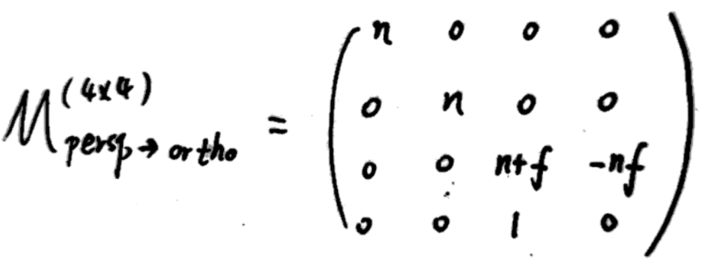
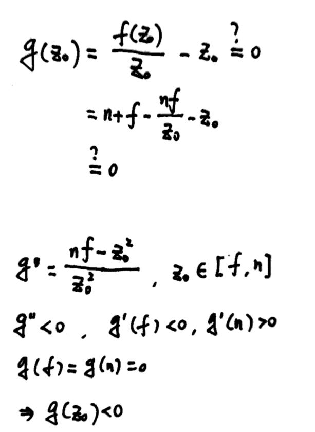

# Rodrigues旋转公式

## 概要
实现某三维物体的坐标绕过原点的向量轴**n**（默认过原点），旋转α角度（右手定则的四指方向）的旋转矩阵为R(**n**,α)，其表达形式为：


该旋转矩阵左乘三维物体上的某个点（列向量、列矩阵）即可得到旋转变换后的点。
## 推导过程
> 说明：字母上带有`→`表示向量，不带箭头表示该向量对应的列矩阵；字母上的`^`表示该向量的单位向量。

#### Step1
将**S**向量分解为旋转轴**n**方向和垂直于旋转轴方向的两个向量，其中`I`表示旋转轴的单位列矩阵


#### Step2
求出与旋转轴**n**和向量**S**所在平面垂直的向量**C**


#### Step3
将**S**在垂直于旋转轴的分量向**C**旋转α度


#### Step4
上一步得到的向量与**S**在旋转轴的分量相加，得到旋转后的向量，由于两个向量的叉乘可以写成一个矩阵乘以列向量的形式（证明略）


整理与提取，即可得到旋转矩阵R（A为单位矩阵）：


---

# 透视投影变换坐标变化证明

## 概要

透视投影是利用相似三角形原理将远处平面坐标映射到相机可见的窗口处：


但该过程可以等价为：可以看作先将远处的平面压缩为等同于相机可见的窗口大小的平面，得到一个长方体，然后再进行正交投影得到以原点为中心的边长为2的立方体


这个压缩过程规定：近处的平面的大小和位置永远不变；远处平面的大小会被压缩，但远近（z值不变）；远处平面的中心点在压缩后也不变。那么对于近处和远处平面中间的点，其坐标是向远处平面靠近的，下面给出证明。

## 证明过程

#### Step1 透视投影变换矩阵形式
该矩阵的推导过程见[课程PPT](https://sites.cs.ucsb.edu/~lingqi/teaching/resources/GAMES101_Lecture_04.pdf)，下面直接给出其形式：



#### Step2 
初始点经过变换后得到新坐标，其中z方向的新坐标为`f(z0)/z0`


#### Step3
判断新坐标与初始坐标的z方向的大小，记为函数`g(z0)`



最终得到g(z0)始终<0，即新坐标小于初始坐标，由于视角方向是-z方向，可以得到中间点是向远处平面靠近的。

# 蒙特卡洛路径追踪算法

```cpp
// 着色算法
shade(p, wo)
	// Contribution from the light source.
	L_dir = 0.0
	Uniformly sample the light at x’ (pdf_light = 1 / A)
	Shoot a ray from p to x’
	If the ray is not blocked in the middle
		L_dir = L_i * f_r * cos θ * cos θ’ / |x’ - p|^2 / pdf_light

	// Contribution from other reflectors.
	L_indir = 0.0
	Test Russian Roulette with probability P_RR
	Uniformly sample the hemisphere toward wi (pdf_hemi = 1 / 2pi)
	Trace a ray r(p, wi)
	If ray r hit a non-emitting object at q
		L_indir = shade(q, -wi) * f_r * cos θ / pdf_hemi / P_RR
Return L_dir + L_indir
```
