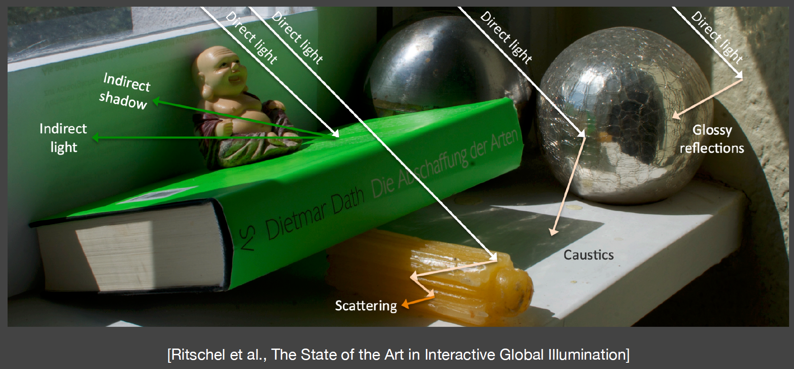

# 前言

### 简介

全局光照是用来模拟现实世界中基于物理的真实的光线传输过程，如下图：



这是一张通过离线渲染所生成的图片，其中展示了包括能够被光源直接照亮的直接光照、光线在物体之间来回弹射所产生的间接光照、佛像背后 产生的边缘柔和的软阴影、在经过蜡烛这类半透明物体时所产生的散射、在光滑材质表面发生的反射、以及焦散等等真实的物理现象。

### GI算法分类

实时全局光照（**Real-Time Global Illumination in 3D**），其实就是直接+间接光照，其分类如下：

- 图像空间的GI：信息是来自从**灯光看向的场景**所获得的信息。主要有RSM
- 3D空间的GI：信息来自于3D空间，在3D空间中进行光线计算，也就是**世界空间**。主要有LPV、VXGI
- 屏幕空间的GI：使用的**所有信息都来自屏幕**。主要有SSAO、HBAO、SSDO、SSR

### 问题引入

如果是直接照明，我们可以看到P点在柱子后面,不可能接收到直接光照,我们稀疏的标示出次级光源：


加上一次光线弹射的全局光照，现在的P点就是所有标示次级光源反射出的光照来照亮P点所得到的结果：


# 图像空间方法-Reflective Shadow Maps (RSM)

思路是，为了计算点P的shading需要知道什么？分为以下两个问题。

## 问题**1：哪些表面（surface patch）会被直接照到？**

**解决：**

**使用shadow map**，shadow map上每一个像素可以看成是一个小surface patch。

**假设：**

**所有的反射物(次级光源)都是diffuse的。**次级光源如果想照亮点P,观察方向是从P点去观察次级光源的,也就是**对于不同的P点来说出射方向（p到次级光源）是unknown的**,因此是无法计算P点的shading的,为了不依赖于观察方向,在RSM中我们假设，**所有次级光源(reflector)都是diffuse(这里是假设反射物reflector，没有要求接受物receiver点p也是diffuse)**，故outgoing radiance在所有方向上都是uniform的,这样不管从camera看过去还是从点p看过去所得到的结果是一样的.

## 问题**2：如何计算每个surface patch对着色点p的贡献，也就是如何解面光源的渲染方程？**

回顾辐射度量学的内容：


- **Radiant Intensity：一个单位立体角上对应的能量。(单位立体角上的光通量)**
- **Irrdiance：在一个单位面积下对应的能量。(单位面积上的光通量)**
- **Radiance：一个单位立体角下单位面积上的能量。(个人理解是,单位立体角上通过单位投影面积的光通量)**

每一个小的patch都可能对照亮p点做出贡献,因此我们可以先计算出一个patch做出的贡献,之后用求和的形式将所有patch的贡献加在一起.


上图的次级光源patch为q，来照亮点p。q其实就是RSM中一个Texel所对应的patch,在games101中我们说过（回顾：[Lecture_14_16_基于物理的渲染 - Dream Fields](https://dreamfields.github.io/2022/01/26/Lecture-14-16-%E5%9F%BA%E4%BA%8E%E7%89%A9%E7%90%86%E7%9A%84%E6%B8%B2%E6%9F%93/#stpe3-%E7%9B%B4%E6%8E%A5%E5%AF%B9%E5%85%89%E6%BA%90%E8%BF%9B%E8%A1%8C%E9%87%87%E6%A0%B7%E5%87%8F%E5%B0%91%E6%97%A0%E6%95%88%E5%85%89%E7%BA%BF)）,原本计算q对p点的贡献,我们应该是在p点对整个立体角进行采样,但是这样的话很浪费很多的sample,所以**仅仅在light处采样然后去计算p点的shading值。**

而**对光源面积 dA 的积分，就等价于只对光源对应的面积投影到半球立体角的那部分积分（左下角的积分域），换言之就是需要找到 dA 与 dω 的关系即可：**


然后根据立体角的定义：$dω=dA/r^2$

最终得到：


上图中的dA，如果足够小就不用积分，直接用dltaA乘上去即可，而$L_i$怎么计算呢？

对于diffuse材质的可反射patch（图中的q），其brdf为常数，入射的irrandance就等于flux（由光源决定）除以点q的面积，代入上图的渲染方程中，q的面积dA消掉。Ep表示次级光源对着色点贡献的入射irradiance：


## 值得注意的细节

1. **次级光源能否看到着色点？**

渲染方程中的V是指次级光源到着色点是否可见，如果想解决这个问题，需要为每个次级光源算一次shadow map，这个运算不好算也是很难算的，于是…就不算了。

1. **并不是所有的pixel都能成为次级光源**


由于可见性、方向性以及距离的不同，对于某一个着色点，认为shadow map上所有的pixel不可能都有贡献：

- Visibility（仍然非常难算）
- 方向：比如X-1点在shaow map中记录的是桌子的表面，而且这个表面的点法线方向是朝上的，因此根本不可能照亮X点；
- 距离：因为远处的次级光源贡献很少，通常只要找距离足够近的次级光源就行了


假设512^2是shadowmap的大小，按每个shadowmap上的一个像素代表一个次级光源来算计算量会很大，为了加速该过程，我们认为在shadow map中着色点x的位置和间接光源xp的距离可以近似为它们在世界空间中的距离。所以我们认为，对着色点x影响大的间接光源在shadow map中一定也是接近的。

于是我们决定先获取着色点x在shadow map中的投影位置(s,t)，在该位置附近采样间接光源，多选取一点离着色点近的VPL，并且为了弥补越往外采样数越少可能会带来的问题，引入了权重，越近了权重越小，越远的权重越大。那么对于一个shading point差不多找400个次级光源来计算是比较合适的。（以上是某篇论文提出的加速方法）

1. **数据存储**

RSM在每一个像素p中都需要存储深度值dp，世界坐标xp，法线np，反射光功率ϕp，如下图的可视化效果，四个map对应像素p的四个参数


## 优缺点

RSM其实和离线中[实时辐射度算法 Instant radiosity (VPL / many light methods）](https://dreamfields.github.io/2022/02/12/Lecture-18-%E9%AB%98%E7%BA%A7%E5%85%89%E7%BA%BF%E4%BC%A0%E6%92%AD%E4%B8%8E%E6%9D%90%E8%B4%A8/#%E5%AE%9E%E6%97%B6%E8%BE%90%E5%B0%84%E5%BA%A6%E7%AE%97%E6%B3%95-instant-radiosity-vpl-many-light-methods)概念很接近,RSM其实就是光栅化版本的VPL方法,VPL广义上属于即使辐射度(IR)。RSM和shadowmap一样属于图像空间的方法,在这里当成3D空间的方法一是不会像图像空间记录不下丢失信息受到影响,另外一点LPV方法会基于RSM.

**优点：**

- 易于实现
- 多应用于手电筒的效果（[https://www.gdcvault.com/play/1020475/In-Game-and-Cinematic-Lighting](https://www.gdcvault.com/play/1020475/In-Game-and-Cinematic-Lighting)）
    
    
    

**缺点：**

- 性能随着直接光源数的增加而降低(因为需要计算更多的shadow map)
- 对于间接光照，没有做可见性检查，即渲染方程中的visibility项
- 有许多假设：反射物需要是diffuse等
- 需要在质量和采样率上做一个平衡

# 3D空间方法-**Light Propagation Volumes （LPV）**

## 简介

**思想：在3D空间中去传播光线,从而利用它做出间接光照从而实现GI** 


历史：最早是在Cry Engine 3中被引入的,其初衷是用来做Crysis系列(孤岛危机).如果你是一名系列爱好者应该知道2007年用Cry Engine2做出来的显卡危机,其使用了我们下文要讲的SSAO技术,而Cry Engine3中的一项主要技术是LPV.

**优点：**

- Fast；Good quality
- 可以处理动态物体，因为每一帧都在进行计算，实时方法

**主要问题:**

如果我们能获得任何一个Shading point上来自四周的radiance的话,就可以立刻得到其间接光照.

**核心思路:**

我们假设光在传播过程中,radiance是uniform的.(intensity会平方衰减)

**核心解法:**

将场景划分为若干个3D网格,每个网格叫做Voxel(体素),在计算完直接光照后,将接受到直接光照的表面看作间接光照在场景中传播的起点.

**主要步骤：**

1. 找出接收直接光照的点
2. 把这些点注入(inject)到3D网格中作为间接光照(虚拟光源)的传播起点
3. 在3D网格中传播radiance
4. 传播完后，渲染场景

## 具体步骤

### 1.生成


- 与RSM一样,首先通过Shadow Map找出接受直接光照的表面或物体
- 对得到的光源数量可以通过采样一些进行简化，从而降低次级光源数量,最后获得一系列虚拟光源

### 2.注入


- 预先把场景划分为若干个3D网格(体素)
- 把虚拟光源注入到其对应的格子内
- 一个格子内可能包含许多不同朝向的虚拟光源,把格子内所有虚拟光源的不同朝向的radiance算出来并sum up从而得到一个往四面八方的radiance
- 由于是在空间上的分布,也就可以看作是**球面函数**，自然可以用**SH**来表示(工业界用两阶SH就可以表示各个方向上的radiance初始值)

### 3.传播


- 由于是3D网格,因此可以向六个面进行传播(上下左右前后),由于radiance是沿直线传播的,我们认为radiance是从网格中心往不同方向进行传播的,穿过哪个表面就往哪个方向传播,比如穿过右表面的radiance,就传播到右边的格子里(不考虑斜角,比如右上方向,我们认为是先到右边格子,再到上面格子)
- 每个格子从周围的六个面计算收到的radiance，并用SH表示，可以理解为每个格子实时存储着light transport
- 迭代四五次之后,场景中各voxel的radiance趋于稳定

### 4.渲染

- 对于任意的shading point，找到他所在的网格
- 获得所在网格中所有方向的Radicance，计算渲染结果

### 存在的问题

**漏光现象**


由于我们认为radiance是从格子正中心向四周发散的,当遇到这种情况时，按理说点P反射的radiance是无法照亮墙壁的背后,但是由于我们的假设,会导致墙壁后面也被间接光照照亮,也就是所谓的漏光现象，如下图所示：


**漏光问题的解决**：让划分的格子足够小，但是这样会导致存储量增多，而且传播过程中传播的格子量增多，也就导致了速度慢

# 3D空间方法-Light Propagation Volumes (LPV)

## 简介

VXGI也是一个类似于RSM的2-pass的算法,但是与RSM有一些区别:

- **次级光源从RSM中的Pixel--->VXGI中的Voxel(格子)**。
    
    
    
    - RSM 中次级光源是**像素中所包含的微小表面**，这些表面是根据Shadow Map来划分的；
    - VXGI把**场景完全离散化成了一系列微小的格子**，可以理解为场景是由一堆乐高堆起来的，如图，这些是最细的层级，也就是最小的格子我们可以在这一层基础上去建立一层大点的格子，依此类推从而根据场景的不同划分**建立出一个Hierachical树形结构的体素**。
- 与LPV相比，**光线从传播变为了追踪**。
    - 在LPV中,我们将受到直接光照的点注入到场景划分的Voxel之后进行传播,只需要**传播一次**就可以知道场景中任何一个shading point收到间接光照的radiance
    - 在VXGI中第二趟我们从camera出发,就像有一个Camera Ray打到每一个pixel上,根据pixel上代表的物体材质做出不同的操作。如果是**glossy则打出一个锥形区域**,**diffuse则打出若干个锥形区域**,打出的锥形区域与场景中一些已经存在的voxel相交,这些voxel对于Shading point的贡献可以算出来。也就是我们要对每一个shading point都做一个cone tracing（圆锥）,可想而知,这个速度比起LPV来说是很慢的,但是是可以优化的,暂且不提

## 具体步骤

### Pass1.Light Pass

不管如何我们首先肯定是先要算直接光照找到哪些voxel会被照亮,那么我们要先从接收到直接光照的patch开始,不管是RSM还是什么先找出接受直接光照的Patch.


但是由于场景是由voxel来表示的,那么对于任何一个格子,跟LPV的注入很像,但是这里不再像LPV一样（认为表面是diffuse的半球分布）将所有的radiance加在一起求各方向的初始值，而是可以支持反射物(patch)也是Glossy的。

记录的是直接光源从哪些范围来（绿色部分），记录各个反射表面的法线（橙色部分），通过**输入方向**和**法线范围**两个信息然后通过表面的材质，来准确的算出出射的分布，这样就比LPV认为格子表面是diffuse再用SH来压缩的方法要准确，然后建立更高层级格子的这些特性。

### Pass2.Camera Pass

从这一步开始考虑场景的渲染了,对于任何一个像素，已知的是Camera Ray的方向。

- 对于Glossy的表面，**向反射方向追踪出一个锥形(cone)区域**


基于**追踪出的圆锥面**的大小，对格子的层级进行查询，就是对于场景中的所有体素都要判断是不是与这个锥形相交，如果相交的话就要把对于这个点的间接光照的贡献算出来(我们存储了体素的光照输入方向和法线方向,因此可以算出其输出的radiance,将cone区域内所有体素的radiance都算出来从而在shading point得到间接光照)，也就是**根据传播出的距离远近找对应层级的体素，然后找覆盖的范围。**

- 对于diffuse的情况来说，**通常考虑成若干圆锥**，忽略圆锥Tracing时的重叠和空隙


效果：


## 总结

**LPV与VXGI的区别**：

- LPV是把所有的次级光源发出的Radiance传播到了场景中的所有位置，只需要做一次从而让场景每个Voxel都有自己的radiance，但是由于LPV使用的3D网格特性，并且采用了SH进行表示和压缩，因此结果并不准确，而且**由于使用了低阶SH因此只能考虑diffuse的**，但是速度是很快的。
- VXGI把场景的次级光源记录为一个层次结构，对于一个Shading Point，我们要去通过Corn Tracing找到哪些次级光源能够照亮这个点。

**优点**：VXGI结果的质量非常好，**与光线追踪的结果非常接近。**

**缺点**：开销还是太大，应用受到了限制。对于VXGI我们需要预先对场景体素化，也是一个非常大的问题，由于每一个Shading point都要做一些cone Tracing，操作已经非常像离线渲染了。

# 3D空间方法-**Ambient Occlusion（AO）**

## 什么是**AO？**

**环境光遮蔽（Ambient Occlusion，简称AO）是全局光照明的一种近似替代品**，可以产生重要的视觉明暗效果，**通过描绘物体之间由于遮挡而产生的阴影**(contact shadow)， 能够更好地捕捉到场景中的细节，可以解决漏光，阴影漂浮等问题，改善场景中角落、锯齿、裂缝等细小物体阴影不清晰等问题，**增强场景的深度和立体感**。


可以说，环境光遮蔽在直观上给玩家的主要感觉体现在画面的明暗程度上，未开启环境光遮蔽特效的画面光照稍亮一些；而开启环境光遮蔽特效之后， 局部的细节画面尤其是暗部阴影会更加明显一些。

Ambient Occlusion的细分种类有：

• SSAO Screen space ambient occlusion

• SSDO Screen space directional occlusion

• HDAO High Definition Ambient Occlusion

• HBAO+ Horizon Based Ambient Occlusion+

• AAO Alchemy Ambient Occlusion

• ABAO Angle Based Am bient Occlusion

• PBAO

• VXAO Voxel Accelerated Ambient Occlusion

一般而言，Ambient Occlusion最常用方法是SSAO，如Unreal Engine 4中的AO，即是用SSAO，它是**在屏幕空间对于全局光照的近似**。

### AO的三个重要假设

- 假设1：由于我们不知道间接光照是什么，因此我们假设任何一个**shading point**上来自**任何方向**的**间接光照**(incident lighting)是一个**常数**，其实就类似于Phong模型的环境光
- **关键假设2**：虽然我们考虑了任何一个**shading point**上来自**任何方向**的**间接光照**是一样的，但并不是每个方向都可能接收到间接光照(incident lighting)，也就是**不同位置的Visibility是不同的**
    - 图中红色部分表示被遮挡,黄色部分表示未被遮挡,我们可以明显的得出一个结论,左边的 Shading point要比右边的亮一点
    
    
    
- 假设3：假设物体是diffuse的，即使是一个glossy物体我们也以diffuse去渲染


Ambient term form Phong：任何一个shading point上来自任何方向的间接光照(incident lighting)是一个常数

Ambient Occlusion：考虑了任何一个shading point上不同方向的visibility后得到的结果

### AO背后的理论

**要说明的问题：为什么说AO是一个对GI的近似**

首先所有的理论都要聚焦于渲染方程来：


在RTR中常用的一个近似（上图中第二个公式），两个函数的乘积的积分，在满足如下条件之一时，可以将其中一项拆出为该项在另一项的积分域的加权平均：

- $g(x)$的**积分域support较小**
- $g(x)$本身是**光滑smooth的，也就是值的变化不大**

基于AO的三个假设，我们认为来自所有方向的间接光照$L_i$是常数，且材质为Diffuse的，于是BRDF为常数，上面的近似公式已经不是近似，而是精确相等。

于是可以将visibility项拆出来得到$k_A$项，在《RTR4》书中直接给出这个公式，并没有给出推导过程：

$$
k_{A}(\mathbf{p})=\frac{1}{\pi} \int_{\mathbf{l} \in \Omega} v(\mathbf{p}, \mathbf{l})(\mathbf{n} \cdot \mathbf{l})^{+} \mathrm{d} \mathbf{l} 
$$

而《games202》中给出了如下推导：


在渲染方程中将visibility项拆开后，会得到$k_A$和剩余的积分两个部分。

**第一部分**

对于$k_A$，其意义是从一个点往所有方向看去按cos加权平均的平均visibility。观察到拆出来之后，其形式上多了一个cos：


要理解这一点需要引入**投影立体角**的概念：


- 立体角的理解：某个立体角的大小=单位球上对应的面积。
- 在渲染方程中，我们所说的$\mathrm{d}w$都是立体角，而cos项为入射方向与表面法线的夹角。
- $cos \theta \cdot
\mathrm{d}w$的含义，其实就是将单位球上对应的面积投影到该半球对应的单位圆上
- 所以在拆分的时候可以将$cos \theta \cdot
\mathrm{d}w$看成一个微元的整体

理解了上面的部分之后，会发现$k_A$的分母$\int_{\Omega} cos\theta \mathrm{d}w$ 其实就是半球投影到单位圆上的面积，也就是公式$k_A$中$\pi$的来历。

**第二部分**

对于剩余积分，由于我们假设了所有方向的间接光照是一个常数、物体是Diffuse的，因此BRDF也是常数。因此最终结果就是**漫反射系数×间接光照强度**。由于间接光照强度$Li$你可以随便指定,漫反射系数也是你可以随便指定的，因此就是橙色部分的结果是你自己来定义的一个数。

因此最终变形之后我们会得到下面的渲染方程，只需要计算visibility的积分即可：


**如何实时计算visibility？**


- 在世界空间下，可以通过ray tarcing做。而在工业界会做一下处理：
    - 反射光肯定是在有限的距离里反射过来的,也就是间接光照是从一定范围内来的,不可能是从无限远处,因此如果我们做tracing肯定也是在一定范围内的，这样就解决了tracing无限远的话一定会被遮挡住这个问题。
        
        
        
    - 而这个范围是一个trade off，通常会选一个合适的范围，也就是找一个合适的球的半径-R
- 在屏幕空间下，如何来做？接下来的SSAO会讲到。

# 屏幕空间方法-**Screen Space Ambient Occlusion**

## 前言

**SSAO是在屏幕空间做AO的一种方法**。

### **什么是屏幕空间？**

1. 使用的所有信息都来自“屏幕”，也就是做全局光照之前屏幕上能看到的信息，这些信息也就是做全局光照之前的直接光照信息；
2. 也就相当于对这张图做一个后期处理，从而来“弄”出全局光照。
3. 为了与此区别我们把RSM与SM的方法称为图像空间，因为信息是来自从灯光看向的场景 所获得的信息。

### **历史**

SSAO最早应用的游戏是使用CRY ENGINE2做出来的孤岛危机一代,AKA显卡杀手。


## 具体算法

上文提到，对于AO只需要计算visibility项即可，SSAO中对此做了一个假设，它没有去往四周trace光线，而是：


- 以任何一个Shading Point（图中的白点）为圆心,半径为R的球的内部随机撒一些点,然后判断这些点能不能被Shading Point直接看到
- 由于是屏幕空间，因此我们从camera出发进行渲染，得到一个深度图（蓝色区域部分表示的是场景物体，蓝色区域下部的白线表示深度图，看样子是俯视图的感觉），是可以把他看成是场景的一个简单近似，球内部的点是可以投影到Camera然后找之前记录的深度,如果深度更深,则表示在物体内部,被遮挡,反之则未被遮挡

存在的问题：

- 箭头所指的红点，从camera看过去,这个点比所圈部分的深度深,因此虽然这个红点是能够被Shading Point看到的，但是由于是从camera出发，深度图并不知道这种凹陷，这里被判断为了看不到
- Rendering Equation通常只考虑法线所在的那半边，因此做这个判断也只判断法线所在的那半边也是没有问题的，也就是后面那个半球的的采样点没有用处。而由于**SSAO的时代并不能获得场景的法线信息**，因此SSAO采用了另一种方法来替代，也就是在整个球采样红点过半的时候才开始考虑AO问题。
- 由于没有考虑法线，因此并没有cos项，没有进行加权，所以这个假设并不是物理准确的，但是在实时渲染中看起来问题并不太大。
- 采样存在的问题：选Sample数量与Pcss 一样，也就是越多的Sample效果越好，但是这也会越慢。一个方法是用少量的Sample，得到一个noisy的结果，然后在这个noisy的结果上进行一个denoising来实现降噪，这些降噪的模糊和噪声在和场景中其他效果与光照叠加后就会变得非常不明显，从而获得比较好的综合效果。

一个SSAO错误的例子：


上图所圈部分，我们是知道那一片的地板是不可能被石椅所遮挡的，但是在开启了SSAO，由于我们是**从camera出发去判断深度**的，所以这一块不可避免的出现了错误的AO。

# 屏幕空间方法-Horizon Based Ambient Occlusion（HBAO）

对于SSAO没有考虑法线的问题，现在已经完全可以得到法线，因此衍生出了另一种方法——HBAO。


**核心思想**：当有了场景normal之后，我们就知道去采样哪半球，就可以按照SSAO的方法在球内撒点（采样），但区别是只去算半球的情况。同时也可以对不同的方向来加权（靠近中间的点权重大，靠近两边小）。

HBAO的效果明显要比SSAO效果要好一点,有效的减少了错误遮挡的情况（柱子后面尤为明显），但是要多存一个屏幕空间的法线。


# 屏幕空间方法-**Screen Space Direction Occlusion （SSDO）**

## 前言（DO的介绍）

**SSDO是屏幕空间的DO方法**。

### 什么是DO？

关于SSDO，其来源于DO——Direction Occlusion，它是对AO的一种改进，比起AO考虑间接光照是一个常数,在DO里我们更精确地考虑了间接光照。如下图：


在复杂光照条件下，不同方法求出的a点和b点辐照度的近似颜色。AO环境光遮蔽不考虑方向性，所以在两点上颜色是相同的。使用bent normal方法（该方向矢量计算为未遮挡光方向的余弦加权平均值，见参考文献）可以有效地将余弦lobe移向天空中未遮挡的部分，但由于积分范围不受任何方式的限制，因此不足以提供准确的结果。DO方向遮蔽方法能够正确地消除来自天空遮挡部分的光线。

### **DO的关键思路**

- **我们不去假设间接光照是固定不变的；**
- **RSM中我们用shadow map去找到接收直接光照的点当作间接光照为其他的Shading point提供直接光照,也就是说我们一定程度上是可以已经得到间接光照的信息。**


> [Ritschel et al., Approximating Dynamic Global Illumination in Image Space]
> 

通过AO和DO的对比我们可以看到,AO能够产生变暗的效果使得物体相对感更强烈,但AO并不能做到Clolor Blending（不同颜色的Diffuse会互相照亮），因此O是更加精准的获得全局光照的一种方法。

### **DO的做法**


SSDO的做法于path tracing很像,假设在Shading Point的P点，随机的往某一个方向打出一根光线：

1. 如果光线没碰到物体，则认为P点这里接收直接光照
2. 如果碰到了一个点Q,那么算出Q点接受的直接光照打到P点的贡献,从而求出P点的间接光照。

### **AO与DO的对比**


- AO：在AO中我们认为红色的框里能接收间接光照，黄色框里无法接收间接光照，然后求出加权平均的visibility值,也就是**假设间接光照是从比较远的地方来的**；
- DO：在DO中,我们认为红色框里接收的是直接光照,而黄色框里才是接收到的间接光照.因为红色框里的光线打不到用来反射的面，因此这些方向上就不会有间接光照，黄色框里的光线能打到物体上，P点接收到的是来自红色框的**直接光照**+黄色框里的**间接光照**,也就是**假设间接光照是从比较近的反射物来的。**

其实这两个假设都不是完全正确的，**物理真实的情况是这两种的混合：近处的是DO，远距离是AO**，因此AO与DO也并没有矛盾。

### DO解渲染方程


- 在一个shading point往任何方向发射光线，如果没有遮挡，V=1，计算直接光照，与DO无关
- 当V=0时也就是间接光照的情况，这个是我们需要关注与计算的。**关于从一个pixel或者patch计算间接光照可以使用RSM等方法。**

## SSDO

### 核心做法

在SSDO中，我们要用直接光照的信息，但不是从RSM中获得，而是**从screen space中得到**。

SSDO的核心是要找哪些patch会被挡住，也就是对点P提供间接光照贡献的是哪些点，做法是与AO完全一样的。


这里A/B/D这三个点的深度比从camera看去的最小深度深，也就是说PA，PB，PD方向会**被物体挡住，因此会为P点提供间接光照**。然后把我们用在RSM中介绍的计算间接光照的方法这些点对P的贡献加起来。

从计算量上来看与SSAO差不多，但是不同之处是，判定会被挡住的时候，会额外计算被挡住的小片的贡献，质量非常接近离线渲染。

### 存在的问题

- SSDO只能解决一个**很小范围内的全局光照**，下图是接近正确的情况，而如果使用SSDO来计算，方块右边是追踪不到远处绿色的墙的，方块上也就不会有绿色的反光。
    
    
    
- **可见性出错**。下图反映的例子是SSDO中的假设与实际情况不同。因为我们是在屏幕空间处理的，因此在A点虽然会被camera看不到，但是AP之间是不会挡住的，实际上A点需要提供间接光照给P点，但在SSDO算法中则不提供。


- **屏幕空间中丢失信息的问题**（其实与上面的问题是同一类型）。从camera方向看过去只能看到世间空间下场景面向相机的一个表层信息，表层之后的信息一无所知。下图是一个很明显的例子，当黄色的面朝向屏幕的时候地面的SSDO信息是正确的，而当旋转过去之后，就看不到SSDO的信息了。
    
    
    

# 屏幕空间方法-**Screen space Reflection（SSR）**

在games202中闫老师说更愿意把他叫做**Screen space Raytracing(SSR)**，只把它理解成反射的话其实是狭隘的。

## 前言

**什么是SSR**？

- 仍然是一种在RTR中实现GI的方式；
- 是在屏幕空间做光线追踪
- 不需要知道3D空间中的三角形、网格、加速结构等3D信息，只需要屏幕空间中已有的信息，也就是从camera看去场景的得到的这样一层“壳”。

**两个基本的任务**：

- 求交：考虑的是**任何光线**(不单单是反射光)与场景中**从camera看得到的这层壳**去做求交
- 着色：找到交点后算出对shading point的贡献值

**效果**：


**核心思想**：

白框里反射的是红框内的场景信息，也就是说我们并不需要3D场景的什么信息，而是从屏幕空间里已有的信息得到，也就是反射的绝大多数信息是屏幕内已有的信息，这就是屏幕空间反射的核心思路。


## SSR算法

### 基本思路

SSR最基本的应用是做屏幕空间的镜面反射。


- 我们有一个还没有进行反射的场景，如shaded scene上的地面还并没有得到反射的结果
- 得到normal信息和深度信息
- 进行SSR，对于地面的每一个pixel
    - 知道shading point（黄点）的观察方向后,可以得出其反射方向
    - 从Shading point点沿着反射方向延长找到与屏幕的壳的交点（绿点）
    - 将交点的颜色作为反射的颜色记录到shading point。
- 得到一个镜面反射的效果

### 关键问题1-如何求反射光与场景相交

******************线性光线步进Linear Raymarch******************

如下图，黄色是shading point，虚线是反射光，假设camera在右边，那么从camera看去，场景的壳就是图左部的曲线。


我们是为了找到反射光与场景“壳”的交点:

- 沿着反射方向以一个**固定的步长**逐步前进，并将每次停止时的深度与壳的深度进行比较，如果浅于壳，则继续前进；比壳深，则停止求交。就是我们**用深度来进行可见性判断**。
- 质量取决于步长的大小，步长小越精准，同时计算量也越大，因此步长太大太小都不行，在没有SDF的情况下，步长只能是一个定值。

**层级式光线追踪Hierachical ray trace**


该方法可以**动态决定步长**。如上图，我们认为一个像素是一格，只trace一根反射光线的情况下，如果按一格一格的走，每一个fragment shader都要做深度比较，那么八格就是八次。但我们就算一次走四格都不会与物体相交，这启发我们：如果可以快速的得到一次往前走几格这个信息的话会加速步进。

**深度多级渐远纹理Depth Mip-Map**

为了得到这个信息，需要将场景的深度图做一个mipmap：**高一级的Mipmap存的并不是下一级周围四个深度的平均，而是四个深度中的最小值**


为什么要生成Depth Mip-Map？

- 在3D空间做光线追踪时，为了加速光线与场景求交，我们通常会做一个加速的层次结构（BVH/KD-tree）
- 在屏幕空间同样做一个类似加速结构，可以快速跳过不可能相交的像素；
- 如果我们用最小值操作的mip-map会得到一个保守逻辑：**如果一根光线与mip-map中的上层结点不相交，那他肯定也不会与这个结点的子节点相交**

********具体算法********

```cpp
mip = 0;
while (level > -1)
		step through current cell;
		if (above Z plane) ++level;
		if (below Z plane) --level;
```

下图是对二维mip-map的一维表示，一格表示一个像素的长度，level 0是初始深度图，每存储每个像素的深度值；level 1是高一级深度图，存储上一级4个像素的最小深度值，反映到一维图中是两格为一组。

1. 在level 0中，先走一个格子(最小的步长)，发现没有交点，于是步长可以变大了，进入level 1


1. 然后在原来的基础上再走两格(level 1包含的格子)，发现还没交点，步长继续变大，进入level 2


1. 继续走4格(level 2)，有了交点，进入右半边的level1（与左半边还是右半边相交可以立即判断）


1. 考虑更精细的层(退回level 1)，发现还是有交点


1. 在考虑level 1情况时交点出现在了边界，先试左半边，因此退回level 0先判断与左边有没有交点，这时候发现没有交点，试右半边，有交点就停止；


因此，步进停止的条件：

- 找到交点
- 走到最后依旧没有交点

注意：Mipmap可以做范围查询，可以做正方形查询，但是做不了准确的起点不在2的K次方上的深度的查询，例如下图黄框部分，而只能算出对应level 1的最小深度，然后进行插值（不准确）。


### 关键问题2-SSR中的shading


这部分与路径追踪的方法完全相同，仅仅是**把光线与场景求交变成了光线与“壳”求交**，因此路径追踪的算法在这里是可以直接使用的。

对于任何一个shading point，看到的radicance就是对半球进行积分。

- specular情况：那么相当于光线打到物体的哪里，就用它所发出的radiance就可以。
- glossy情况：用蒙特卡洛多采样几根光线，打到的物体反射过来的radiance，一定就是shading point点接收到的incident radiance
- diffuse情况：更多的光线计算…

### 各种不同的效果

由于结果是tracing出来的，因此很多现象是自然就能做到的，并不用做trick，类似很多模糊等现象可以**直接实现**。

**Sharp/specular  reflections（镜面反射）**


**Blurry reflections（Glossy材质的反射）**


如果说specular反射只需要反射一个方向的话，那么对于一定roughness的材质（就是glossy材质）来说我们要根据其BRDF的lobe（**波瓣**）来考虑。如果lobe比较细，则需要很少的光线；如果lobe比较越大，像diffuse那种的话我们需要射出很多根光线。


因此可以想到，如果lobe极小，就趋近于镜面反射，对应的速度也会越快，因为只需要trace一个方向；lobe极大，就趋近于漫反射，对应的速度也会更慢，需要trace到各个方向。

**Per-pixel roughness and normal**（**凹凸反射）**


在地面的各法线方向不一致的情况下，仍然可以得到反射的结果。

****Contact hardening****


对于物体来说，近处的物体反射清晰，远处反射模糊，当反射物是Glossy时反射的lobe是一个锥形，当距离越远锥形的截面越大，也就会发生模糊现象。

**Specular elongation**


反射在垂直方向被拉长的现象，在雨天常见的现象，当我们认为地面是各向同性的，也就是法线分布是一个圆，反射出去的lobe就是一个椭圆。

### 小结

**SSR 正是蒙特卡罗光线追踪只计算直接光照，以及光线在景物表面之间散射一次的间接光照的情形**。只不过，SSR **假设景物表面在散射光线时都是漫反射材质**，而且，SSR 在追踪光线时不是借助 BVH 或 k 维树这样的三维加速结构，而是借助深度 mipmap 这个二维加速结构。

对于SSR人们还做了其它工作：

- 对于glossy的物体求其反射的lobe时，可以使用重要性抽样法（importance sampling method），根据着色点的BRDF构建反射光线方向的分布，根据其概率密度函数采样那些可能性更大的反射光线
    
    
    
- 如果两个着色点相邻，那么分别求取的两个光线与场景的交点可能对这两个着色点都会贡献间接光照，于是可以重复利用光线与场景的交点以加速计算。
    
    
    
- 可以引入分离求和方法（split sum method）中预滤波（prefiltering）的思想，对屏幕空间的信息施加滤波，这样一来，沿理想镜面反射方向追踪一根光线，就能得到沿多个反射方向追踪多根光线的结果（详见“[实时环境映射](https://www.notion.so/3d78bfde08084be4b77e2920f8d247ef)”）。不过，屏幕空间中各点的深度不一，因此在施加滤波时需要考虑深度上的差异。
    
    
    

**存在的问题**：

- **在Diffuse 物体上并不是非常高效，因为利用了光线追踪的方法。而在实时环境映射中提到的Diffuse物体可以很好得到环境光是很简单的，低阶SH就可以做到，也就是Diffuse在不同的方法中的效率是不同的**。
- 丢失屏幕外的信息，但这个是屏幕空间的局限性，而不是光线追踪的问题

# 参考

《Real-Time Rendering 4th》

[Lecture7 Real-time GLobal Illumination (in 3D)_哔哩哔哩_bilibili](https://www.bilibili.com/video/BV1YK4y1T7yY/?p=7)

[Lecture8 Real-time GLobal Illumination (screen space)_哔哩哔哩_bilibili](https://www.bilibili.com/video/BV1YK4y1T7yY/?p=8)

[Lecture9 Real-time GLobal Illumination (screen space cont.)_哔哩哔哩_bilibili](https://www.bilibili.com/video/BV1YK4y1T7yY?p=9)

[GAMES202 高质量实时渲染笔记Lecture07：Real-Time Global Illumination (In 3D) - 知乎 (zhihu.com)](https://zhuanlan.zhihu.com/p/377104538)

[GAMES202 高质量实时渲染笔记Lecture08：Real-Time Global Illumination (In Screen space) - 知乎 (zhihu.com)](https://zhuanlan.zhihu.com/p/381782999)

[GAMES202 高质量实时渲染笔记Lecture09：Real-Time Global Illumination (Screen space cont.) - 知乎 (zhihu.com)](https://zhuanlan.zhihu.com/p/383370745)

[《GAMES202：高质量实时渲染》3 实时全局光照：RSM、LPV、VXGI、SSAO、SSDO、SSR - 知乎 (zhihu.com)](https://zhuanlan.zhihu.com/p/556057984)

# 实践

[SSAO实现：游戏后期特效第四发 -- 屏幕空间环境光遮蔽(SSAO) - 知乎 (zhihu.com)](https://zhuanlan.zhihu.com/p/25038820)

# 论文

【SSAO】Mittring, Martin, “Finding Next Gen—CryEngine 2,” SIGGRAPH Advanced Real-Time Rendering in 3D Graphics and Games course, Aug. 2007. Cited on p. 43, 195, 239, 242, 255, 457,
476, 559, 856, 860, 861

【HBAO】Max, Nelson L., “Horizon Mapping: Shadows for Bump-Mapped Surfaces,” The Visual Computer,vol. 4, no. 2, pp. 109–117, 1988. Cited on p. 460, 466

【AO，bent normal的提出】Landis, Hayden, “Production-Ready Global llumination,” SIGGRAPH RenderMan in Production course, July 2002. Cited on p. 446, 448, 465

【SSR的改进】Ritschel et al., [Stochastic Screen-Space Reflections](https://link.zhihu.com/?target=https%3A//www.ea.com/frostbite/news/stochastic-screen-space-reflections), SIGGRAPH 2015 course