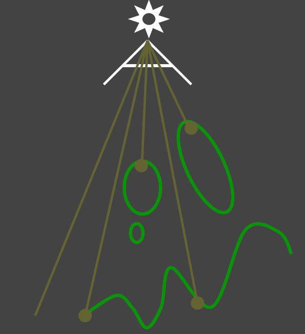

# Shadow Mapping

**概述**：是一个完全在图像空间中的算法，将深度信息渲染到深度图上，并在运行时通过深度对比检测物体是否在阴影中的算法。Shadow map是一个2-pass的算法

**优点**：一旦shadow Map已经生成,就可以利用shadow map来获取场景中的几何表示而不是场景中的几何

**缺点**：会产生自遮挡和走样现象

## 步骤

1. 从light处出发看向场景生成一张记录每个像素中最近物体深度的一张图，图中有很多像素,我们记录下每个像素中他们各自看到的最浅的深度或是最近的物体他们的位置在哪,存下来从而得到一张texture。
    
    
    
2. 从Camera(眼睛)出发，再渲染一遍场景。看渲染中的每个像素中都要来判断是否能被light照到,如果被照到则不在阴影中,反之,则存在于阴影中
    
    
    

在Opengl中,1-pass就是在light处放置一个相机,然后往某一方向看去,定义framebuffer写到某个texture上,然后在fragment shader中定义写的是一个深度而非shading的结果,在2-pass中则只需要用1-pass得到的texture即可。

## 存在的问题

1. **自遮挡**
    - 在使用 Shadow Map 的时候，如果不做任何处理，就会出现下图这种现象，被称为 Shadow Acne 或者 Self-Shadowing。
        
        
        
    - 成因：物体的实际深度，与自己的采样深度，相比较不相等（实际深度大于采样深度）导致的，所以可谓是自己（采样的副本）遮挡了自己（实际的物体），所以被称为 self shadowing。
        
        
        
    - 解决方法：Shadow Bias。在判断前先每个 shading point 深度往光照方向挪一挪，让由于自遮挡被判断处于阴影的点挪到有光照的地方，就能很大程度改善这一点。
        
        
        
    - 但是存在另一个问题：这个现象只有在加入了 shadow bias 的时候才会出现，如下图，会看到影子脱离了物体（像飞起来的小飞侠一样），被称为 peter-panning。
        
        
        
    - 解决 peter-panning 的方法
        - 可以看到，bias 加小了没用，依旧会有自遮挡；加多了又会导致 peter panning。所以要怎么加，是有一定技巧的，最终的目标是要找到一个刚好能够消除 shadow acne 的 bias 值。
        - 现在常用的 shadow bias 的计算方法，是基于物体斜度的，称为 **slope scale based depth bias**。**原理：当斜度大的时候，shadow map 上的一个点，所对应的实际物体的一小块面，其深度变化就会更大。**
        - 基于斜度的偏移可以根据表面的斜度，更改深度的偏差值。当表面与灯光的夹角越小，那么阴影贴图中一个像素对应的表面区域越大，其深度变化也就越大，就需要添加更大的 bias。表面与灯光的夹角可以通过法线与灯光方向的夹角余弦值来计算（dot(normal,lightDir)），所以 bias 要和夹角余弦值成反比。
            
            
            
        - 最终公式是：$bias = factorSlope * slope + constantBias$
        - factorSlope 是斜度偏差范围的系数，表示斜度偏差的程度，slope 是根据夹角余弦值计算，constantBias 是基础的阴影偏差。由此可知，factorSlope 与 constantBias 都是需要手动给出的，通过调试才能得到最优的效果。
        - 举例来说，一个 x 方向的斜坡，同样是在 x 方向上差 0.01，如果坡角是 45 度，那么深度差就是 0.01，如果坡角是 60 度，那么深度差就是 0.017.
            
            
            
            如果采样点都是在 x=0.005 处，那么对坡角 60 的情况，就需要 bias 至少为 0.0085，才可以保证不会产生 shadow acne，而 45 度的情况，bias 只要 0.005 就可以了
            
            对于这个公式，需要做一些说明：
            
            1）坡度如何确定？当然是用顶点的 normal，但是需要注意的是，我们是在灯光坐标系下观察物体的，所以 normal 需要转换到 light space 中。
            
            2）里面的两个参数 factorSlope 和 constantBias 如何确定？只能通过不断调整才能得到。
            
        - 解决 peter-panning 的另一种方法：**Second-depth shadow mapping**，此时我们就舍弃biasd的概念,而是在渲染时不仅存最小的深度,我们还要存第二小的深度,然后我们用最小深度和第二小深度中间的深度来作比较。但实际中并没有人去使用这个技术,因为场景内的物体必须都是watertight（非面片），还有就是计算复杂，开销太大
2. **走样**
    - shadow map本身就存在分辨率，当分辨率不够大自然会看到锯齿,因为shadow map上每一个像素都可以看为小片,那么投出来的阴影自然会存在锯齿。
        
        
        
    - 解决的方法是下面提到的PCF

# **PCF(percentage Closer Filtering)**

概述：PCF能解决shadow map的锯齿块和硬边问题，产生柔和软阴影。

核心思想：从深度贴图中多次采样，每一次采样的纹理坐标都稍有不同（比如采样像素周围一圈范围）。每个独立的样本可能在也可能不再阴影中。所有的次生结果接着结合在一起，最终通过样本的总数目将深度结果平均化，得到的可见性变为0~1之间的数。

步骤：在**第二个pass中**，对于这个shading point我们仍要判断是否在阴影内,但是我们把其投影到light之后不再只找其对应的单个像素,而是**找其周围一圈的像素**（**采样方式可以是均匀采样、泊松圆盘采样等，采样的范围称为Filter Size**）,把周围像素深度比较的结果**加起来平均一下**，就得到一个0-1之间的数，就得到了一个模糊的结果。

```glsl
float PCF(sampler2D shadowMap,vec4 coords){
  poissonDiskSamples(coords.xy);
  // uniformDiskSamples(coords.xy); // 均匀圆盘采样时阴影边缘不够自然
  float blocker=0.;
  float filterSize=25.;
  // 上面生成的采样点处于单位圆内，因此可以使用一个 filterSize 来控制整体的采样范围。由于作业框架 Shadowmap 的大小为 2048 x 2048，每个像素的长度可以近似为 1 / 2048。
  for(int i=0;i<NUM_SAMPLES;i++){
    vec2 uv_bias=poissonDisk[i]/2048.*filterSize;
    float shadowDepth=unpack(texture2D(shadowMap,coords.xy+uv_bias));
    if(coords.z-Bias3()>shadowDepth){
      blocker++;
    }
  }
  return 1.-blocker/float(NUM_SAMPLES);
}
```

# **PCSS（Percentage Closer Soft Shadows）**


PCSS为了实现更真实的软阴影，达到离遮挡物距离近的时候硬，远的时候软的效果：**阴影接受物与阴影投射物的距离越小,阴影越锐利。因此,我们要解决的一个问题是我们如何决定一个软阴影的半影区。换句话说，就是filter size 有多大的问题。**


1. 算每个区块深度（shadow map上，**只算被遮挡点的平均深度，而不是区块内所有点的平均深度**）
2. 利用相似三角形的原理计算新的半影直径
3. PCF。在shadow map上采样，范围由第二步确定。

**本质**：求出了阴影中需要做PCF的半影部分后再进行PCF的计算，这样动态调节了半影范围，也就是动态设置了PCF的搜索范围，这样我们的硬阴影部分清晰，软阴影部分模糊，动态的实现了不错的软阴影效果。

```glsl
float PCSS(sampler2D shadowMap,vec4 coords){
  
  // STEP 1: avgblocker depth
  float d_Blocker = findBlocker(shadowMap,coords.xy,coords.z);
  float w_Light = 1.;
  float d_Receiver = coords.z;
  
  // STEP 2: penumbra size
  float w_penumbra = w_Light*(d_Receiver-d_Blocker)/d_Blocker;
  // return w_penumbra;
  // STEP 3: filtering
  float blocker=0.;
  float filterSize=25.;
  // 上面生成的采样点处于单位圆内，因此可以使用一个 filterSize 来控制整体的采样范围。由于作业框架 Shadowmap 的大小为 2048 x 2048，每个像素的长度可以近似为 1 / 2048。
  for(int i=0;i<NUM_SAMPLES;i++){
    vec2 uv_bias=poissonDisk[i]/2048.*filterSize*w_penumbra;// !这里与PCF不同
    float shadowDepth=unpack(texture2D(shadowMap,coords.xy+uv_bias));
    if(coords.z-Bias3()>shadowDepth){
      blocker++;
    }
  }
  return 1.-blocker/float(NUM_SAMPLES);
  
}
```

步骤1和步骤3需要对整个区域的**各个shading point与点x的深度进行比较**，所以会导致很慢。由于需要在一个范围内进行比较，那么步骤1和3的时间开销会决定整个算法的时间开销，此外为了得到越“软”的阴影意味着需要使用更大的filtering size，会导致速度越慢。为了解决这两步慢的问题,就有人提出了Variance Soft Shadow Mapping。

# **VSSM (Variance Soft Shadow Mapping)**

解决PCSS第一步和第三步慢的问题，优化了第三步范围查询shadow map得到平均深度值，直接使用切比雪夫进行猜测。

## 第一步的优化：如何更快地求遮挡物的平均深度


- 将其分为两个区域，**蓝色**是深度小于shading point的遮挡区域,其平均深度为$Z_{occ}$。**红色**是深度大于shading point的非遮挡区域，其平均深度为$Z_{unocc}$。并且我们认为区域内的像素总数为**N，**非遮挡的像素为**N1**个，遮挡的像素为**N2**个
- 重要公式**：非遮挡像素占的比例 * 非遮挡物的平均深度 + 遮挡像素占的比例 * 遮挡物的平均深度 = 总区域内的平均深度**
- **VSSM核心思想**
    - 求范围内有百分之多少的像素比shading point浅，于是就可以把范围内所有的深度做一个直方图，根据直方图可以判断shaing point的深度排名。而**VSSM假设这个直方图的分布是正态分布，而该分布最重要的是得到均值和方差。而求”有百分之多少的像素比shading point浅”这个问题就转化为”给定shading point值，PDF（概论密度函数）下的阴影面积是多少，或者是CDF在shading poingt处的函数值是多少“**（对于一个通用的高斯的PDF，对于这类PDF，可以直接把CDF结果，输出为一个表，叫误差函数Error Fuction，误差函数有数值解，但是没有解析解，在C++ 中的函数ERF(lower_limit,[upper_limit])函数可以计算CDF。）
        
        
        
    - 但是计算PDF的面积又过于麻烦，于是找到了一个不等式来近似计算。那么就可以通过均值和方差获得图中红色面积的值。因此就可以不用计算CDF了，而是通过1 - 求出的x>t的面积值得到CDF.但是**切比雪夫不等式有一个苛刻的条件：t 必须在均值右边，也就是t大于均值。**
        
        
        
- 总区域内的平均深度$Z_{Avg}$我们用**mipmap**或者**SAT(Summed Area Tables)**去求,也就是得到了正态分布的**均值。**然后用shadow map（存储的是深度值）和square-depth map(存储的是深度值的平方）来计算**方差**：$Var(X) = E(X^2)-E^2(X)$
- 根据切比雪夫不等式近似求出两个比例$N_1/N、N_2/N$
- 最后一个假设：认为非遮挡物的平均深度$Z_{unocc}$ = shading point的深度
- 将所有值代入可求出遮挡物的平均深度$Z_{occ}$p
- ps：接受平面是曲面或者与光源不平行的时候就会出问题

## 第三步的优化

- 我们通过生成shadow map和square-depth map得到期望值的平方和平方值的期望再根据公式得到方差：$Var(X) = E(X^2)-E^2(X)$
- 通过mipmap或者SAT得到期望
- 得到期望和方差之后，根据切比雪夫不等式近似得到一个depth大于shading point点深度的面积，也就是求出了未遮挡Shading point的概率，从而可以求出一个在1-0之间的visilibity
- ps：省去了在这个范围内进行**采样**或者**循环**的操作,大大加速了第三步。如果场景/光源出现移动 就需要更新MIPMAP，本身还是有一定的开销，但是生成MIPMAP硬件GPU支持的非常到位，生成非常快（几乎不花时间），而是SAT会慢一点。

# ****Moment shadow mapping****

为了避免VSSM中不是正态分布情况下的问题,就引入了更高阶的**moments**来得到更加准确的深度分布情况.想要描述的更准确，就要使用更高阶的**moment(矩)**，矩的定义有很多，最简单的矩就是记录一个数的次方，**VSSM 就等于用了前两阶的矩**。这样多记录几阶矩就能得到更准确的结果。

如果保留前M阶的矩，就能描述一个阶跃函数，阶数等2/M,就等于某种展开。越多的阶数就和原本的分布越拟合。一般来说4阶就够用。


# **SDF(Disatance field soft shadows)**

**有向距离场SDF**：记录了空间中任何一点到定义该场的物体之间的最小距离。

**背后的理论**：optimal transport最优传输。

## 应用1：Ray Marching


简述：将SDF距离作为安全距离，判断光线是否与物体相交，可以加速光线步进。

详述：

任意一点的SDF我们是已知的,因此在P0 点时,我们以它的SDF(P0)为半径做一个圆(此处假设在2D内,如果在3D内则是一个球),在这个圆内无论是哪个方向前进,只要不超过半径距离,都不会碰见物体,是安全的.

因此我们可以利用这个特性不断的朝一个方向前进,以P0开始朝一方向走SDF(P0)到达 P1 点,若仍与物体表面相距甚远,则以P1点为新起点继续走SDF(P1)到达 P2 点,假设此处 P2 点的SDF足够小,也就是代表离物体表面足够接近了,则进行求交操作.

如果在超一方向trace非常远的距离但仍然什么都没trace到,此时就可以舍弃这条光线,也就是停止了.

虚幻引擎中便使用了这种方法判断静态网格的表面：[Mesh Distance Fields in Unreal Engine | Unreal Engine 5.1 Documentation](https://docs.unrealengine.com/5.1/en-US/mesh-distance-fields-in-unreal-engine/)

## 应用2：生成软阴影

将安全距离的概念进行延伸，在任意一点通过sdf可以获得一个safe angle，即取点P为shading point往一方向打出一根光线,光线上的一点a,有一个SDF值SDF(a),也就是在a点以SDF(a)为半径所做的球或圆内是安全的,不会碰到物体.


把shading point和**面光源**相连，所得到的安全角度越小，被遮蔽的可能越高，就可以认为

**safe angle越小，阴影越黑,越趋近于硬阴影;**

**safe angle够大就视为不被遮挡没有阴影,也就越趋近于软阴影。**

### 具体步骤


- 我们以o为起点,沿一个方向推进,仍然是ray marhcing的步骤,在p1点以SDF(p1)进行推进,其余点也是一样,此处主要是为了求safe angle,我们在起点o沿每个点的sdf为半径所形成的圆做切线,从而求出各个点的safe angle,我们最后再**取其中最小的角度作为总的safe angle.**
- 求safe angle的公式：以p1点为例,从o点到p1的距离为斜边,sdf(p1)是直角边,因此我们用arcsin就可以求出safe angle了.
- 但是对于反函数计算对于计算机不友好，于是使用比值而不是比值的arcsin来描述safe angle的大小，然后引入一个系数k（k的大小是控制阴影的软硬程度）即可
    
    
    

## 总结

SDF是一个快速的高质量的软阴影生成方法(比shadow map快是忽略了SDF生成的时间),但是在存储上的消耗非常大，而且生成SDF的花的时间也要很久，SDF是预计算，在有动态形变的物体的情况就得重新计算SDF。

# 概念补充

## SAT

SAT是百分百准确的一个数据结构。

SAT的出现是为了解决范围查询(在区域内快速得到平均值),并且,范围内求平均值是等价于范围内求和的,毕竟总和除以个数=平均值.


## MIPMAP


是一个**快速的,近似的,正方形的范围查询**,由于它要做插值,因此即便是方形有时也会不准确.同时当插值的范围不是2的次方时，也就是在两个MIPMAP之间时，还要再进行一次插值，也就是“三线性插值”，这样会让结果更加不准确,因此局限性太大且准确度也不算高.

# 参考

[Lecture2 Recap of CG Basics_哔哩哔哩_bilibili](https://www.bilibili.com/video/BV1YK4y1T7yY?p=2)

[Lecture3 Real-time Shadows 1_哔哩哔哩_bilibili](https://www.bilibili.com/video/BV1YK4y1T7yY?p=3)

[Lecture4 Real-time Shadows 2_哔哩哔哩_bilibili](https://www.bilibili.com/video/BV1YK4y1T7yY?p=4)

[GAMES202 高质量实时渲染课程笔记Lecture 2: Recap of CG Basics - 知乎 (zhihu.com)](https://zhuanlan.zhihu.com/p/363355018)

[GAMES202 Real-Time High Quality Rendrting 高质量实时渲染课程笔记Lecture 3: Shadow 01 - 知乎 (zhihu.com)](https://zhuanlan.zhihu.com/p/363355909)

[GAMES202 Real-Time High Quality Rendrting 高质量实时渲染课程笔记Lecture 4: Shadow 02 - 知乎 (zhihu.com)](https://zhuanlan.zhihu.com/p/363357318)