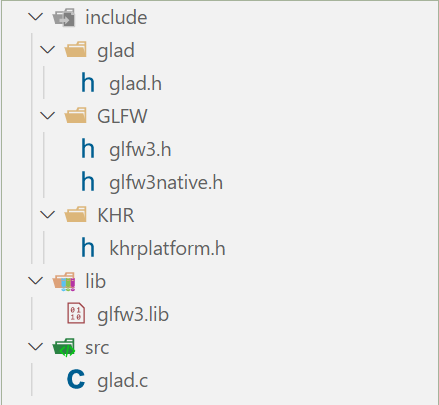
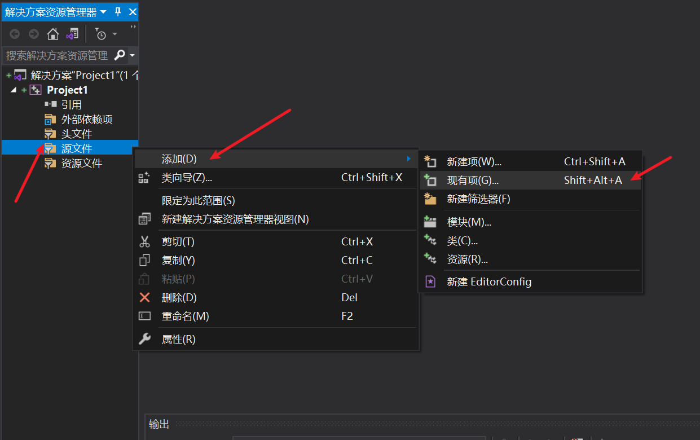
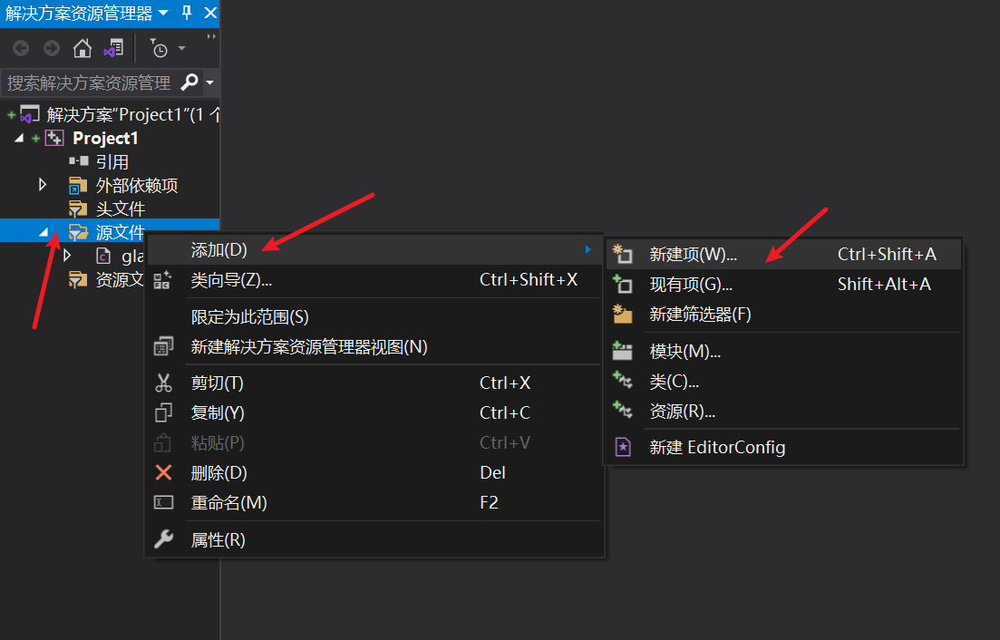
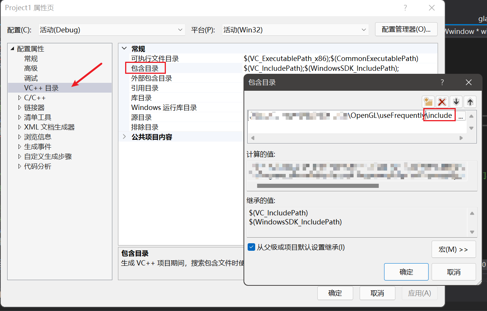
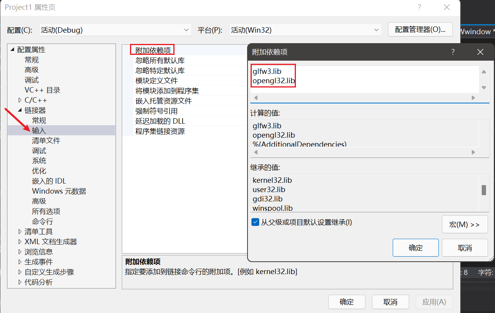
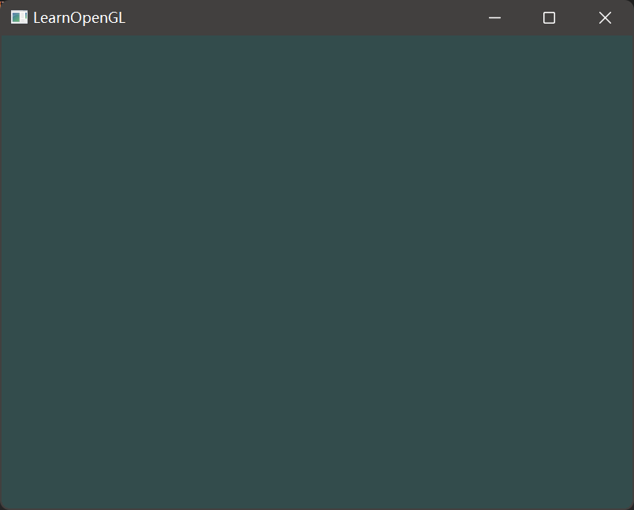

# Step1：获取GLFW与GLAD依赖库

GLFW是一个专门针对OpenGL的C语言库，它提供了一些渲染物体所需的最低限度的接口。它允许用户创建OpenGL上下文，定义窗口参数以及处理用户输入。该步骤保证它恰当地创建OpenGL上下文并显示窗口。

GLAD是用来管理OpenGL的函数指针的，所以在调用任何OpenGL的函数之前我们需要初始化GLAD。

> 获取教程参考链接：
> - [Learn OpenGL——创建窗口](https://learnopengl-cn.github.io/01%20Getting%20started/02%20Creating%20a%20window/)
> - [openGL学习笔记七： glad库及使用](https://blog.csdn.net/u012278016/article/details/105582080)

按照上面的参考链接得到的文件，整理为如下结构：




# Step2：创建项目并编写代码
按照以下步骤依次创建项目：

- 创建空项目


- 将`src/glad.c`加入源文件
  


- 在源文件中创建`main.cpp`


- 编写代码
```cpp
#include <glad/glad.h>
#include <GLFW/glfw3.h>
#include<iostream>

/*对窗口注册一个回调函数(Callback Function)，它会在每次窗口大小被调整的时候被调用。
这个帧缓冲大小函数需要一个GLFWwindow作为它的第一个参数，以及两个整数表示窗口的新维度。
每当窗口改变大小，GLFW会调用这个函数并填充相应的参数供你处理。*/
void framebuffer_size_callback(GLFWwindow* window, int width, int height)
{
    glViewport(0, 0, width, height);
}

/*检查用户是否按下了返回键(Esc)。如果没有按下，glfwGetKey将会返回GLFW_RELEASE。如果用户的确按下了返回键，我们将通过
glfwSetwindowShouldClose使用把WindowShouldClose属性设置为 true的方法关闭GLFW。
下一次while循环的条件检测将会失败，程序将会关闭。
接下来在渲染循环的每一个迭代中调用processInput
*/
void processInput(GLFWwindow* window)
{
    //glfwGetKey函数，它需要一个窗口以及一个按键作为输入，返回这个按键是否正在被按下
    if (glfwGetKey(window, GLFW_KEY_ESCAPE) == GLFW_PRESS)
        glfwSetWindowShouldClose(window, true);
}
int main()
{
    glfwInit();
    // 将主版本号(Major)和次版本号(Minor)都设为3
    glfwWindowHint(GLFW_CONTEXT_VERSION_MAJOR, 3);
    glfwWindowHint(GLFW_CONTEXT_VERSION_MINOR, 3);
    // 告诉GLFW我们使用的是核心模式(Core-profile)
    glfwWindowHint(GLFW_OPENGL_PROFILE, GLFW_OPENGL_CORE_PROFILE);
    //glfwWindowHint(GLFW_OPENGL_FORWARD_COMPAT, GL_TRUE); // Mac OS X系统，你还需要加这行代码

    // 创建窗口对象
    GLFWwindow* window = glfwCreateWindow(800, 600, "LearnOpenGL", NULL, NULL);
    if (window == NULL)
    {
        std::cout << "Failed to create GLFW window" << std::endl;
        glfwTerminate();
        return -1;
    }
    //通知GLFW将我们窗口的上下文设置为当前线程的主上下文
    glfwMakeContextCurrent(window);

    //给GLAD传入了用来加载系统相关的OpenGL函数指针地址的函数
    if (!gladLoadGLLoader((GLADloadproc)glfwGetProcAddress))
    {
        std::cout << "Failed to initialize GLAD" << std::endl;
        return -1;
    }

    //调用glViewport函数来设置窗口的维度(Dimension)
    //glViewport函数前两个参数控制窗口左下角的位置。第三个和第四个参数控制渲染窗口的宽度和高度（像素）。
    // 处理过的OpenGL坐标范围只为-1到1，因此我们事实上将(-1到1)范围内的坐标映射到(0, 800)和(0, 600)。
    glViewport(0, 0, 800, 600);

    //注册这个函数，告诉GLFW我们希望每当窗口调整大小的时候调用这个函数
    //还可以将我们的函数注册到其它很多的回调函数中
    glfwSetFramebufferSizeCallback(window, framebuffer_size_callback);


    //渲染循环(Render Loop)，它能在我们让GLFW退出前一直保持运行
    // glfwWindowShouldClose函数在我们每次循环的开始前检查一次GLFW是否被要求退出，如果是的话该函数返回
    // true然后渲染循环便结束了，之后为我们就可以关闭应用程序了。
    while (!glfwWindowShouldClose(window))
    {
        processInput(window);

        //各种渲染指令
        //------------
        //glClearColor来设置清空屏幕所用的颜色。当调用glClear函数，清除颜色缓冲之后，整个颜色缓冲都会被
        //填充为glClearColor里所设置的颜色。
        glClearColor(0.2f, 0.3f, 0.3f, 1.0f);
        glClear(GL_COLOR_BUFFER_BIT);

        
        //检查并调用事件，交换缓冲
        //------------------------
        //glfwSwapBuffers函数会交换颜色缓冲（它是一个储存着GLFW窗口每一个像素颜色值的大缓冲），它在这一
        //迭代中被用来绘制，并且将会作为输出显示在屏幕上。
        glfwSwapBuffers(window);

        //glfwPollEvents函数检查有没有触发什么事件（比如键盘输入、鼠标移动等）、更新窗口状态，并调用对应的
        // 回调函数（可以通过回调方法手动设置）
        glfwPollEvents();
    }

    //当渲染循环结束后我们需要正确释放 / 删除之前的分配的所有资源
    glfwTerminate();

    return 0;
}
```

# Step3：配置项目属性
到了这一步，还不能正常运行，需要对项目的属性进行配置：







# 运行结果
配置完成之后，可以看到正常的结果为一个深绿色窗口：

