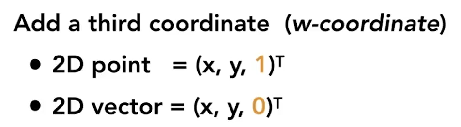

---

title: "Lecture 02-03 线性代数基础与线性变换"
tags: 
- CG
categories: 
- - CG 
  - GAMES101
- - Theory
date: 2021-12-24 20:43:09

---

# 线性代数基础

-   叉乘计算公式（两个向量的叉积等价于一个矩阵与一个向量的乘积）

    

-   任意向量在三维坐标中的分解（该向量在三个基方向上的投影之和）

    

-   向量与矩阵的联系

    

# 线性变换

-   基本概念

    -   如果 $AA^T=E$（E 为单位矩阵）或 $A^TA=E$，则 n 阶实矩阵 A 称为正交矩阵
    -   设 A 是一个 n 阶矩阵，若存在另一个 n 阶矩阵 B，使得： $AB=BA=E$ ，则称方阵 A 可逆，并称方阵 B 是 A 的逆矩阵

-   齐次坐标的目的：将线性变换（压缩、旋转等）和非线性变换（平移）都用一个变换矩阵来表示。向量和点的区别：**3D 向量的第 4 个代数分量是 0，而 3D 点的第 4 个代数分量是 1。**

    
    

-   仿射变换，又称仿射映射，是指在[几何](https://baike.baidu.com/item/%E5%87%A0%E4%BD%95/303227)中，一个[向量空间](https://baike.baidu.com/item/%E5%90%91%E9%87%8F%E7%A9%BA%E9%97%B4/5936597)进行一次[线性变换](https://baike.baidu.com/item/%E7%BA%BF%E6%80%A7%E5%8F%98%E6%8D%A2/5904192)并接上一个[平移](https://baike.baidu.com/item/%E5%B9%B3%E7%A7%BB/2376933)，变换为另一个向量空间。
-   投影变换（projection transformation）是将一种[地图投影](https://baike.baidu.com/item/%E5%9C%B0%E5%9B%BE%E6%8A%95%E5%BD%B1)点的[坐标变换](https://baike.baidu.com/item/%E5%9D%90%E6%A0%87%E5%8F%98%E6%8D%A2/5261943)为另一种地图投影点的[坐标](https://baike.baidu.com/item/%E5%9D%90%E6%A0%87/85345)的过程。研究投影点坐标变换的理论和方法。
-   从中可以思考得知，对于平移 T、旋转 R、缩放 S 这 3 个最常见的仿射变换，平移变换只对于点才有意义，因为普通向量没有位置概念，只有大小和方向
    
-   表示旋转的时候，变换矩阵的逆矩阵等于变换矩阵的转置（说明该变换矩阵为正交矩阵）

    

-   如何判断一个点是否在三角形中？
      
    按照逆时针方向连接三个顶点形成三个向量：$\vec{AB} \times\vec{AP}$、$\vec{BC}\times\vec{BP}$、$\vec{CA}\times\vec{CP}$，计算它们的结果是否同号（同为正或者同为负），是，则在三角形内部。
