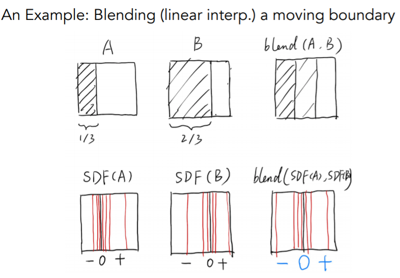
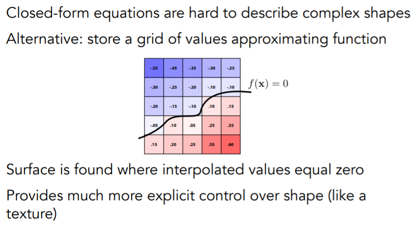
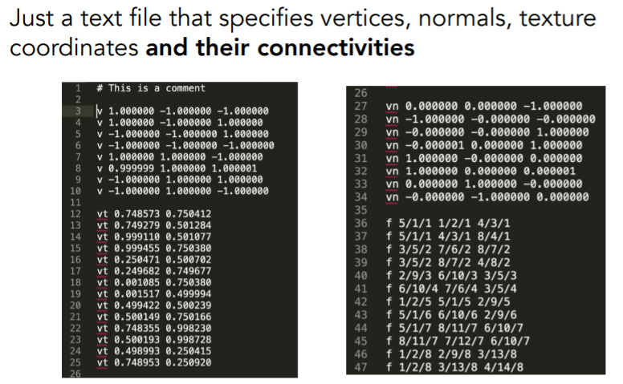

# [几何表示](https://sites.cs.ucsb.edu/~lingqi/teaching/resources/GAMES101_Lecture_10.pdf)

### 隐式表面（Implicit Surface）

- 特点

  - 一个函数定义一个隐式几何 f(x,y,z)=0。
  - 容易判断一个点是在几何体内部（f<0）还是外部（f>0）。

- 几种隐式表面

  - 代数曲面：表达式定义

    

  - Constructive Soild Geometry（CSG，隐式表示）

    - 通过几何体布尔运算合成的几何体

      

  - 距离函数（Distance Function，隐式表示）

    - 输入空间中的任意一个点，输出与这个点最近的几何体距离（有向距离，可正可负），得到各个几何体的距离函数后，将距离函数融合，再恢复为原来的物体，即可得到复杂的几何体。
    - Distance Function 的插值会有着几何融合（blend）的效果（与一般的插值效果很不一样）

      

    - 一个例子：A 状态被一个物体遮挡 1/3，B 状态被一个物体遮挡 2/3，那么想要得到中间状态，即被物体遮挡了 1/2，该如何做？求有向距离函数 SDF（Signed Distance Function），即求正方形内任意点到被遮挡的 1/3 边界的最短距离，形成距离函数。这里采用最简单的 SDF = SDF(A)+SDF(B)来举例，最终得到的 SDF 为零的点的集合即为 blend 之后曲面，对该例子来说，就是两道阴影之间中点的一条线。对于几何体混合效果自然不可能像这里简单的两个距离相加就可以得到了，该效果具体实现是找出任一个点到两个几何体表面距离中的最短距离再减去一个变量作为该点最终的 SDF。[Coding Adventure:Ray Marching](https://www.youtube.com/watch?v=Cp5WWtMoeKg)

      

    - 水平集（Level Set Methods）：水平集则是一种用来表示 Distance Function 的存储结构，网格存储近似函数值，坐标通过网格之间的插值可以得到函数输出。从水平集中可以得到函数值为 0 的位置，对应的就是物体表面。

      

    - 水平集也可以定义在三维中，如该纹理图定义的是组织的密度大小，取出该图中所有密度等于某个值的位置，得到某个密度下的物体表面。

      

  - 分型几何(Fractals，隐式表示)

    - 分型几何是指许许多多自相似的形体最终所组成的几何形状。
    - 如雪花是一个六边形，放大之后会发现每一个边上又是一个六边形，再放大六边形边上的六边形边上又是六边形，类似于递归。

### 显式表面（Explicit Surface）

- 特点

  - 低维参数映射成隐式函数的高维参数。

    

  - 相对容易采样，因为低维参数所需参数数量相对少了,可采样面积覆盖率更大。
  - 不容易判断点在几何体内部/外部（需要将多维参数解算成低维参数，这一步相当麻烦）。

- 几种显式表面

  - 点云：很多点构成的曲面，直接有着所有点的信息。点云通常是经过扫描物体之后的原始输出结果，常常会转化为多边形网格
  - 多边形网格(Polygon Mesh)

    - 通过定义各个多边形面的顶点以及顶点之间的连接关系就可以得到许许多多的三角形面或是四边形面，再通过这些面来近似表现出我们想要的模型效果。
    - 一个立方体的模型数据

      

      - 3-10 行定义了立方体的 8 个顶点信息。
      - 12-25 行定义了这些顶点的纹理坐标信息(每个面 4 个点，共 6 个面所以最多有 24 种不同的纹理坐标信息，这里有一些纹理对于不同面上的点是公用的)。
      - 27-34 行定义了 6 个面的法线信息，为什么有 8 个是因为建模软件输出的精度问题不必在意，其中有两个是重复的。
      - 36-47 行，f 代表一个面，其中 x/x/x 的第一位表示是哪个顶点，第二位表示该顶点纹理坐标是第几个，第三位表示法线信息是第几个。 3 个 x/x/x 表示 3 个顶点的信息构成一个三角形面。

  - 贝塞尔曲线与曲面

    - [课件](https://sites.cs.ucsb.edu/~lingqi/teaching/resources/GAMES101_Lecture_11.pdf)
    - [参考笔记](https://blog.csdn.net/qq_38065509/article/details/106127805)

# 曲面细分(Mesh subdivision)与曲面简化(Mesh Smplication)

- [课件](https://sites.cs.ucsb.edu/~lingqi/teaching/resources/GAMES101_Lecture_12.pdf)
- [参考笔记](https://blog.csdn.net/qq_38065509/article/details/106154299)
