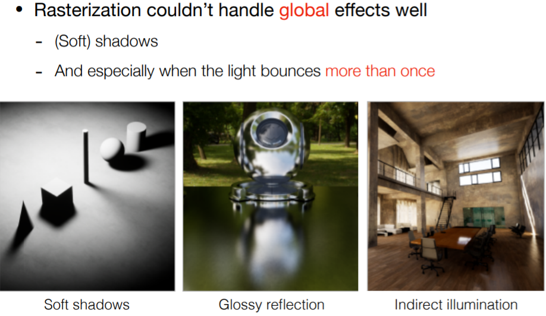
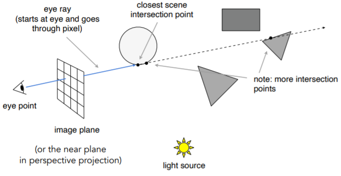
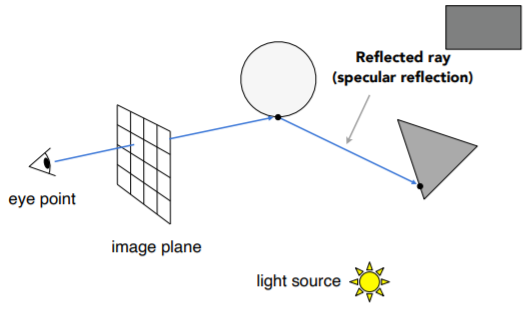
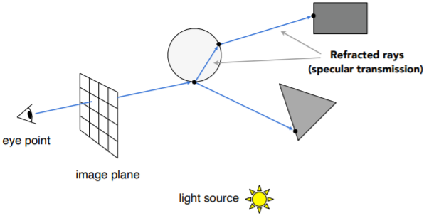
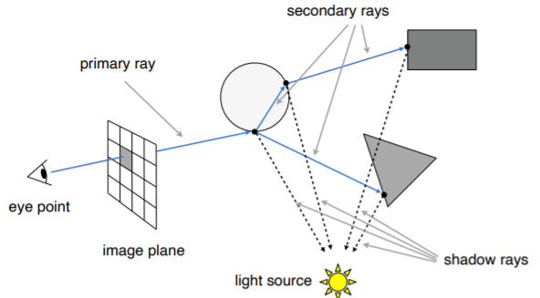

# 光栅化与光线追踪

- 光栅化主要用于实时渲染（速度快），光追主要用于离线渲染（速度慢）。
- 光栅化不能解决的问题

  

# 光线追踪原理

#### 基本假设

- 光线一定沿着直线传播
- 光线之间无法碰撞
- 光线路径可逆，即从 A 发出的到 B 的光线，一定也可以从 B 发出到 A（中途可发生反射和折射）

#### 光线投射过程（只考虑光线的一次投射，并未考虑反射和折射）

- Ray Casting。从人眼或摄像机向近投影平面上的每一个像素点发射一条光线，判断与场景物体的最近交点（其实是做了深度测试）

  

- 阴影判断。接着连接该交点和光源，只要判断这条连线之间是否有物体存在就可以知道该交点是否在阴影之中（比 shadow mapping 那一套简单了许多）。
- 着色，写入像素值。根据各种着色模型（如 Blinn-Phong)。

  

- 注意：

  - 明暗效果仅仅由第一次相交的物体表面法向方向、材质、视点和光照方向、以及光照强度等因素共同决定。
  - 光线投射并不考虑 第二层 以及更深层次的光线，因此 不具有阴影、反射 、折射 等效果。

#### (Whitted-Style) 光线追踪

- Recursive (Whitted-Style) Ray Tracing。在考虑 Ray Casting 的基础上，该条光线第一个与圆球物体相交，假设该圆球是一个玻璃球，那么便会发生镜面反射和折射。同时反射与折射出去的光线会可能与场景中的物体再次碰撞，发生第二次折射与反射。计算这些光线与物体的最近交点。

  
  

- 着色。将这些所有交点与光源连接，称这些线为 shadow rays（因为可以用来检测阴影），计算这些所有点的局部光。将其按照光线能量权重累加(该做法与递归过程等价，读者可以看看伪代码思考一下)，最终得到近投影平面上该像素点的颜色。

  

- 总结：递归的光线追踪算法

  

#### (Whitted-Style) 光线追踪注意点

- 整体过程是一个递归的过程，因此需要一定的递归终止条件，可以是：递归深度-在光线弹射一定次数后停止；光线的贡献-在光线的贡献衰减到足够小时停止。
- 光线在每次反射和折射之后都有能量损耗的，由系数决定，因此越往后的折射和反射光贡献的能量越小，这也是为什么在上文中提到根据光线能量权重求和。e.g. 反射系数为 0.7，那么第一次反射折损 30%，第二次反射折损 1-（70%x70%），依次类推。
- 如果反射或折射光线没有碰撞到物体，一般直接返回一个背景色。

# 细节实现（[参考文章](https://blog.csdn.net/qq_38065509/article/details/106299336)）

1. 光线求交

- 与隐式表面求交
- 与显式表面求交（对于某个封闭物体，如果光线与物体有奇数个交点，那么光线一定在物体内；偶数在外）
- 光线追踪加速（[参考文章](https://blog.csdn.net/qq_38065509/article/details/106396844)）

2. 光线反射
3. 光线折射

以上实现细节参看：[Lecture17 材质（微平面理论，Cook-Torrance BRDF）](https://dreamfields.github.io/2022/02/08/Lecture-17-%E6%9D%90%E8%B4%A8/)

# 笔记参考

- [Lecture 13： Whitted-Style 光线追踪原理详解及实现细节](https://zhuanlan.zhihu.com/p/144403005)
- [Lecture 14：利用包围盒技术加速光线追踪（KD-Tree and BVH）](https://zhuanlan.zhihu.com/p/144403802)
