# [基础知识](https://sites.cs.ucsb.edu/~lingqi/teaching/resources/GAMES101_Lecture_14.pdf)（[参考文章](https://blog.csdn.net/qq_38065509/article/details/106496354)）

### 基本概念

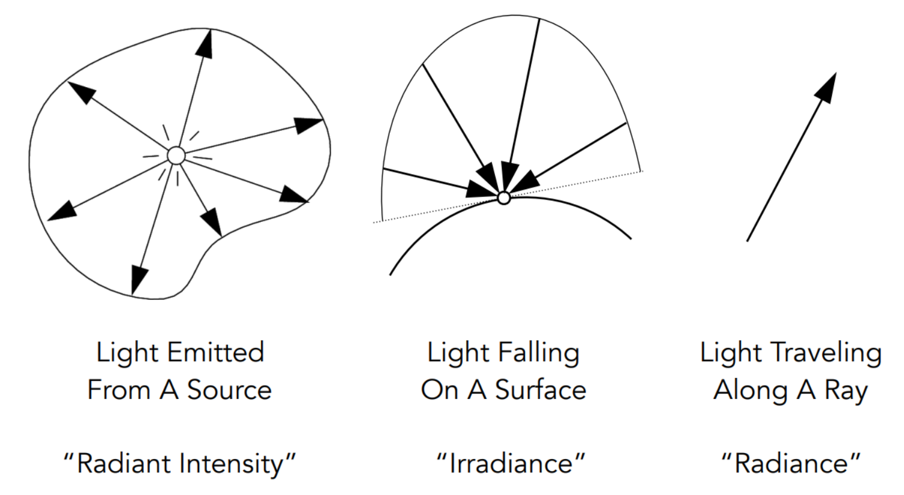  


- 辐射强度(Radiant intensity)

  - 从光源发出的每单位立体角上的 power（这里的 power 指单位时间的能量，相当于辐射功率，可以理解为亮度）。其大小不会随着 r 的增加而衰减，因为 r 变大的同时，立体角不变，辐射面积会以 r 平方的比例增加。

    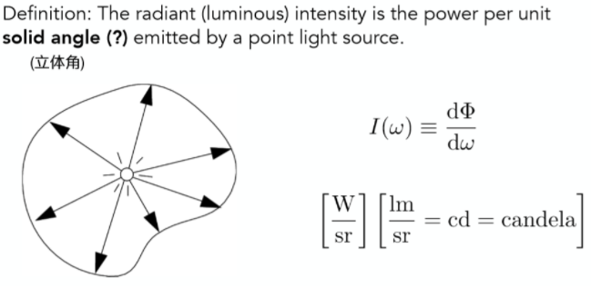

- irradiance

  - 指每单位照射面积所接收到的(入射的）power

    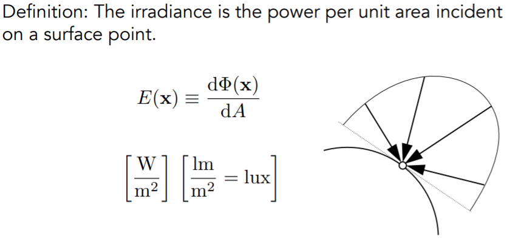

- radiance

  - 发射的、反射的、折射的、接收的光线在每单位立体角、每单位垂直面积上的 power，同时指定了光的方向与照射到的表面所接受到的亮度。

    

- 辨析

  - 由公式可以看出，radiance 可认为是：每单位立体角上的 irradiance；每单位投影面积上的 intensity。
  - radiance 可以分为入射的和出射的

    - 入射 radiance：每单位立体角上的接收的 irradiance

      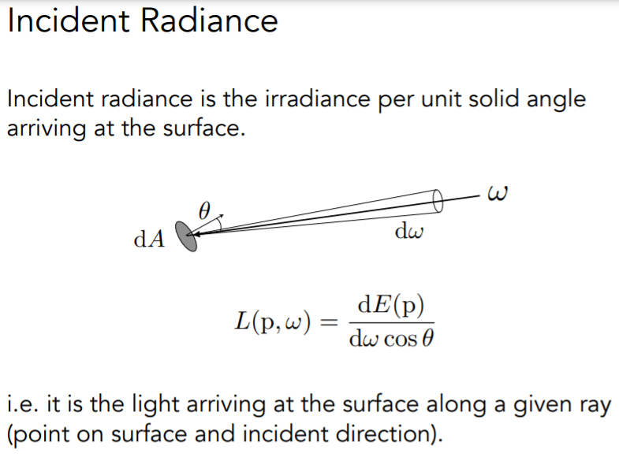

    - 出射 radiance：每单位投影面积发射的 intensity

      

  - 讨论比较重要的 radiance 和 irradiance 的关联

    - 整理

      

    - E ( p ) 就是点 p 的 irradiance，其物理含义是点 p 上每单位照射面积的 power，而 L (p,ω)指入射光每立体角，每垂直面积的 power。因此积分式子右边的 cosθ 解释了面积上定义的差异，而对 dω 积分，则是相当于对所有不同角度的入射光线做一个求和（这里的 H 平方是指的点 p 对应的整个半球面方向），那么该积分式子的物理含义便是：一个点(微分面积元)所接收到的亮度（irradiance)，由所有不同方向的入射光线亮度(radiance)共同贡献得到。

### BRDF

- 参考文章：[基于物理着色：BRDF](https://zhuanlan.zhihu.com/p/21376124)
- 光线反射的理解角度：一个点(微分面积元)在接受到一定方向上的亮度(dE(ωi ))之后，再向不同方向把能量辐射出去(dLr(ωr))。
- Bidirectional Reflectance Distribution Function 双向反射分布函数，定义了从单位面积上，吸收了某个方向的入射光线后，向某个方向射出的光线的比例。

  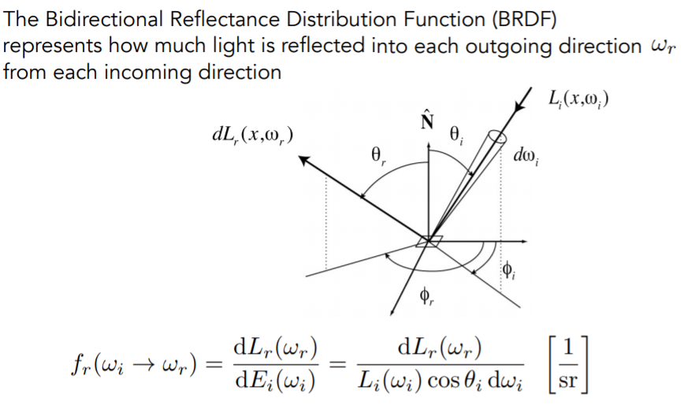

- 不同物体表面材质自然会把一定方向上的入射亮度反射到不同的方向的光线上，如理想光滑表面会把入射光线完全反射到镜面反射方向，其它方向则完全没有。如理想粗糙表面会把入射光线均匀的反射到所有方向。因此所谓 BRDF 就是描述这样一个从不同方向入射之后，反射光线分布情况的函数。
- 性质

  - 非负性。线性：表面上某一点的全部反射辐射度可以简单地表示为各 BRDF 反射辐射度之和。

    

  - 可逆性：交换入射光和反射光的角色，并不会改变 BRDF 的值。能量守恒：入射光的能量与出射光的总能量应该相等。

    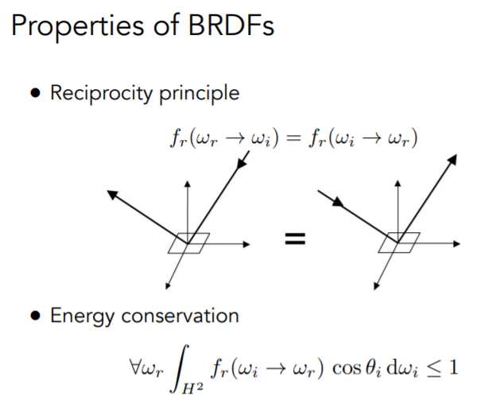

  - 各向同性与各向异性。如果是前者，其结果只与相对的方位角有关

    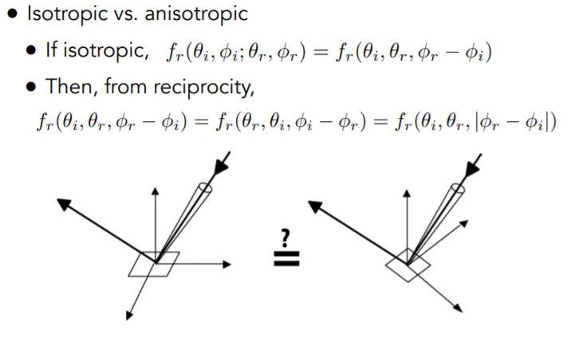

- Measuring BRDFs

### 渲染方程

- 由 BRDF 得到反射方程，描述的含义是：某个方向的反射光线，取决于从该点对应的半球面的所有方向（立体角）吸收的亮度 radiance。

  

- 当然实际情况中可能不会考虑整个半球面方向的入射光线，如只有若干个点光源或面光源，则只把光源进行求和或积分（此时暂时不考虑非光源的光线，如其他反射光等）即可。

# [蒙特卡洛路径追踪](https://sites.cs.ucsb.edu/~lingqi/teaching/resources/GAMES101_Lecture_16.pdf)（[参考文章](https://blog.csdn.net/qq_38065509/article/details/106619170)）

## (Whitted-Style) 光线追踪的问题

- 1.在磨砂材质上的表现不应该像镜面反射一样

  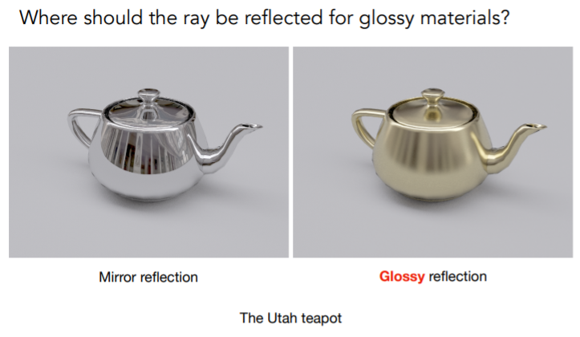

- 2.对于漫反射材质之间不应该停止，而是要继续反射光线，左图是直接光照，右图是全局光照（出现了 color bleeding 现象）。

  

## 路径追踪

路径追踪（Path Tracing）方法由 Kajiya 在 1986 年提出，该方法的基本思想是从视点发出一条光线，光线与物体表面相交时根据表面的材质属性继续采样一个方向，发出另一条光线，如此迭代，直到光线打到光源上（或逃逸出场景），然后用蒙特卡洛方法，计算光线的贡献，作为像素的颜色值。而使用蒙特卡洛方法对积分的求解是无偏的，只要时间足够长，最终图像能收敛到一个正确的结果。

总结：路径追踪 = 光线追踪+ 蒙特卡洛方法

- [蒙特卡洛积分推导和性质](https://www.zhihu.com/topic/19675767/hot)

### 实现过程

对于渲染方程：


要解出来需要解决两个问题：

1. 如何计算积分
2. 如何递归

#### **Stpe1 首先只考虑直接光照**

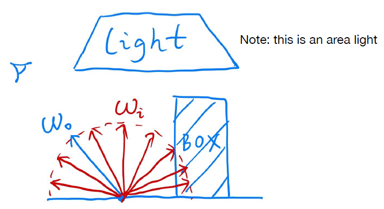  
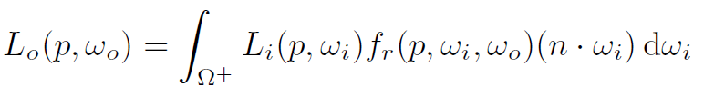

只有当采样的方向击中光源的时候，光源才会对该着色点有贡献，此时方程其实就只是一个单纯的积分计算了，其物理含义为着色点 p 到摄像机或人眼的 Radiance 值。

根据蒙特卡洛方法，积分项可以写成如下形式：


```bash
shade(p, wo)
  # 选定一个被积分变量的采样分布，随机选取N条光线
  Randomly choose N directions wi~pdf
  # 初始化出射光线Lo
  Lo = 0.0
  # 对于每个采样的立体角wi
  For each wi
    # 追踪入射光线，打到光源即计算积分
    Trace a ray r(p, wi)
    # 每条打在光源上的光线都取平均（1/N）
    If ray r hit the light
      Lo += (1 / N) * L_i * f_r * cosine / pdf(wi)
Return Lo
```

#### **Stpe2 加上间接光照后**

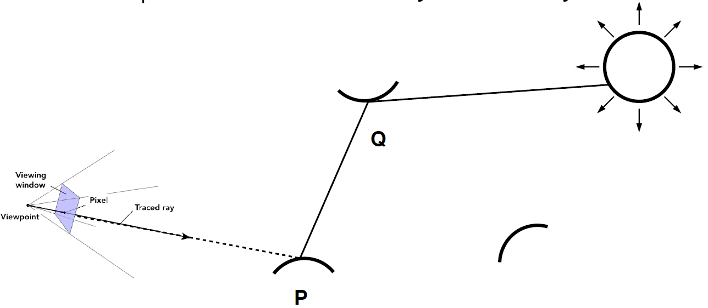

此时采样的光线碰撞到了另一个物体的 Q 点，那么该条路径对着色点 P 的贡献是多少呢？自然是在点 Q 的直接光照再乘上反射到该方向上的百分比了！显然这是一个类似光线追踪的递归过程，不同在于该方法通过对光线方向的采样从而找出一条条可行的路径，这也正是为什么叫路径追踪的原因。

```bash
shade(p, wo)
  # 选定一个被积分变量的采样分布，随机选取N条光线
  Randomly choose N directions wi~pdf
  # 初始化出射光线Lo
  Lo = 0.0
  # 对于每个采样的立体角wi
  For each wi
    # 追踪入射光线，打到光源即计算积分
    Trace a ray r(p, wi)
    # 每条打在物体上的光线都取平均（1/N）
    If ray r hit the light
      Lo += (1 / N) * L_i * f_r * cosine / pdf(wi)
    # 开始递归
    Else If ray r hit an object at q
      Lo += (1 / N) * shade(q, -wi) * f_r * cosine / pdf(wi)
Return Lo
```

**问题 1——光线数量的指数式增长**

  
通过每次对光线方向的采样从而解出方程，假设每次采样 100 条，那么从人眼出发的第一次采样就是 100 条，在进行第二次反射之后就是 10000 条，依次类推，反射越多次光线数量便会爆炸增长，计算量会无法负担，那么如何才能使得光线数量不爆炸增长呢？唯有每次只采样一个方向！

```bash
shade(p, wo)
  # 选定一个被积分变量的采样分布，随机选取1条光线
  Randomly choose ONE direction wi~pdf
  # 初始化出射光线Lo
  Lo = 0.0
  
  # 追踪入射光线，打到光源即计算积分
  Trace a ray r(p, wi)
  # 每条打在物体上的光线都直接返回该光线的贡献
  If ray r hit the light
    Return L_i * f_r * cosine / pdf(wi)
  # 开始递归
  Else If ray r hit an object at q
    Return shade(q, -wi) * f_r * cosine / pdf(wi)
```

每次如果只采样一个方向那么所带来的问题也是显而易见的，积分计算的结果会非常的 noisy，虽然蒙特卡洛积分是无偏估计，但样本越少显然偏差越大。但该问题很好解决，如果每次只去寻找一条路径结果不好，那么重复多次寻找到多条路径，将多条路径的结果求得平均即可！
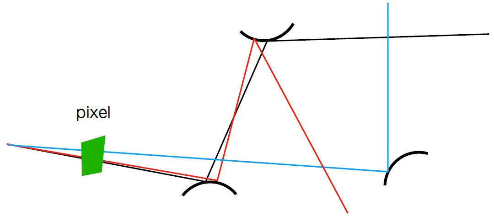

因此光线生成的时候有如下算法：

```bash
ray_generation(camPos, pixel)
  # 对于每个像素，发出N条采样光线
  Uniformly choose N sample positions within the pixel
  pixel_radiance = 0.0
  # 对于每条采样光线
  For each sample in the pixel
    Shoot a ray r(camPos, cam_to_sample)
    If ray r hit the scene at p
      # 每条打在物体上的光线都取平均（1/N）
      pixel_radiance += 1 / N * shade(p, sample_to_cam)
Return pixel_radiance
```

到此为止，有关于该算法的实现，其递归出口是光线追踪的设置最大递归深度，详细的实现见——[Raytracing in one weekend](https://raytracing.github.io/books/RayTracingInOneWeekend.html)

**问题 2—— shade 函数的递归没有出口**
这里并不没有采用类似光线追踪当中设定反射深度显式的给出递归出口的方法，而是非常精妙的采用了俄罗斯轮盘赌(Russian Roulette)。

```bash
shade(p, wo)
  # 手动确定一个概率
  Manually specify a probability P_RR
  # 在[0,1]中选随机数ksi
  Randomly select ksi in a uniform dist. in [0, 1]
  # 1-P_RR的概率返回0
  If (ksi > P_RR) return 0.0;

  # 选定一个被积分变量的采样分布，随机选取1条光线
  Randomly choose ONE direction wi~pdf
  # 初始化出射光线Lo
  Lo = 0.0
  
  # 追踪入射光线，打到光源即计算积分
  Trace a ray r(p, wi)
  # 每条打在物体上的光线都直接返回该光线的贡献/P_RR
  If ray r hit the light
    Return L_i * f_r * cosine / pdf(wi) / P_RR
  # 开始递归
  Else If ray r hit an object at q
    Return shade(q, -wi) * f_r * cosine / pdf(wi) / P_RR
```

而返回有效光线的概率是 P，有效光线在返回时除以了 P，那么最终期望 $E = P * (Lo / P) + (1 - P) * 0 = Lo$是不变的。

#### **Stpe3 直接对光源进行采样，减少无效光线**

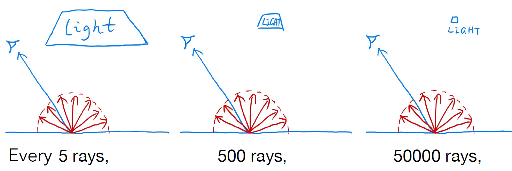  
在每次计算直接光照的时候，通过均匀采样任选一个方向，但很少会的光线可以碰到光源，尤其当光源较小的时候，这种现象越明显，大量采样的光线都被浪费了。

因此在计算直接光照的时候，取一个 pdf 能够直接采样光源，即改进为 **直接对光源进行采样** ，这样所有采样的光线都一定会击中光源(如果中间没有别的物体)，没有光线再会被浪费了。

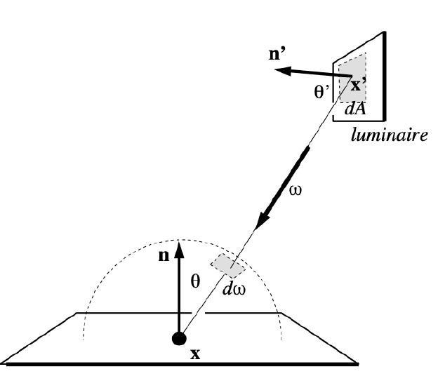  
如上图所示，如果只对光源（右上角的 luminaire）进行均匀采样，$pdf=1/A$(because $∫pdf dA = 1$);

那么对于渲染方程$Lo = ∫Li * fr * cos \theta dω$，如果想要对光源进行采样的并依然使用蒙特卡洛的方法，那么一定要将其修改为对光源面积 dA 的积分，就等价于只对光源对应的面积投影到半球立体角的那部分积分（左下角的积分域），换言之就是需要找到 dA 与 dω 的关系即可；

于是写出对应的关系式：
  

关系式中的 $cos \theta'$是为了计算出光源上微分面积元正对半球的面积，之后再按照立体角的定义 $dω=dA/r^2 $，除以着色点x与光源采样点x'距离的平方。

  

最终伪代码如下，分直接光照和间接光照两部分计算：
1. 来自于光源的贡献（不需要俄罗斯轮盘赌）
2. 其它物体
   
```bash
shade(p, wo)
  # part1：来自于光源的贡献
  Uniformly sample the light at x’ (pdf_light = 1 / A)
  L_dir = L_i * f_r * cos θ * cos θ’ / |x’ - p|^2 / pdf_light

  # part2：来自于其它物体的贡献
  
  # 手动确定一个概率
  Manually specify a probability P_RR
  # 在[0,1]中选随机数ksi
  Randomly select ksi in a uniform dist. in [0, 1]
  # 1-P_RR的概率返回0
  If (ksi > P_RR) return 0.0;

  # 选定一个被积分变量的采样分布，随机选取1条光线
  Randomly choose ONE direction wi~pdf_hemi (pdf_hemi = 1 / 2pi)
  # 初始化其他物体的光线贡献L_indir
  L_indir = 0.0

  Trace a ray r(p, wi)
  # 每条打在物体上的光线都直接返回该光线的贡献/P_RR
  If ray r hit a non-emitting object at q
    L_indir = shade(q, -wi) * f_r * cosine / pdf_hemi(wi) / P_RR

  Return L_dir + L_indir
```

其中，计算直接光照的时候还需要判断光源与着色点之间是否有物体遮挡，该做法也很简单，只需从着色点x向光源采样点x’发出一条检测光线判断是否与光源之外的物体相交即可。
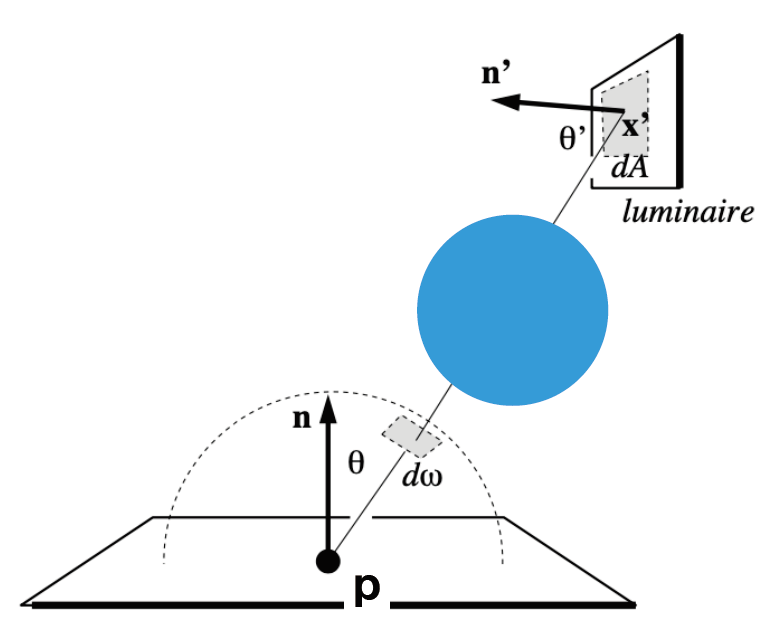  
```bash
shade(p, wo)
  # part1：来自于光源的贡献
  Uniformly sample the light at x’ (pdf_light = 1 / A)
  # 从着色点x向光源采样点x’发出一条检测光线
  Shoot a ray from p to x’
  If the ray is not blocked in the middle
    L_dir = L_i * f_r * cos θ * cos θ’ / |x’ - p|^2 / pdf_light

  # part2：来自于其它物体的贡献
  
  # 手动确定一个概率
  Manually specify a probability P_RR
  # 在[0,1]中选随机数ksi
  Randomly select ksi in a uniform dist. in [0, 1]
  # 1-P_RR的概率返回0
  If (ksi > P_RR) return 0.0;

  # 选定一个被积分变量的采样分布，随机选取1条光线
  Randomly choose ONE direction wi~pdf_hemi (pdf_hemi = 1 / 2pi)
  # 初始化其他物体的光线贡献L_indir
  L_indir = 0.0

  Trace a ray r(p, wi)
  # 每条打在物体上的光线都直接返回该光线的贡献/P_RR
  If ray r hit a non-emitting object at q
    L_indir = shade(q, -wi) * f_r * cosine / pdf_hemi(wi) / P_RR

  Return L_dir + L_indir
```

其它：点光源在路径追踪中并不好计算，建议做成很小的面积光源
# 笔记参考

- [Lecture 14-15：基于物理渲染的基础知识(辐射度量学，BRDF 和渲染方程)](https://zhuanlan.zhihu.com/p/145410416)
- [Lecture 16：全局光照(蒙特卡洛路径追踪)](https://zhuanlan.zhihu.com/p/146714484)
