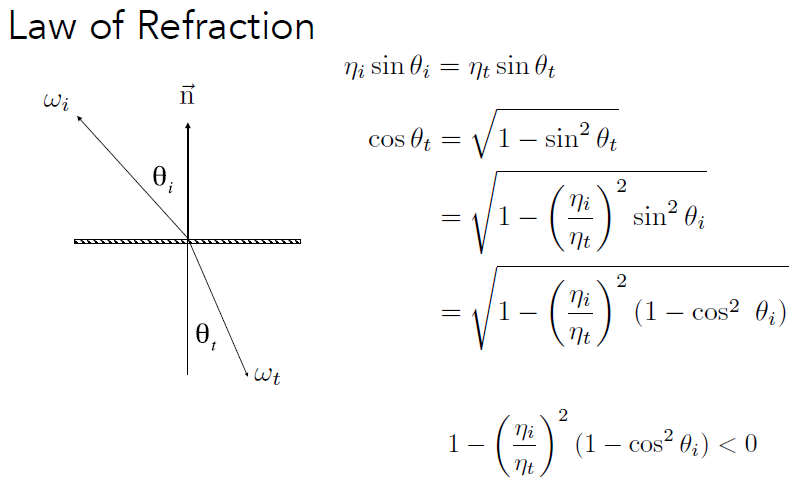
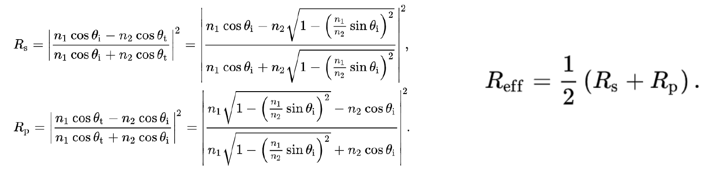
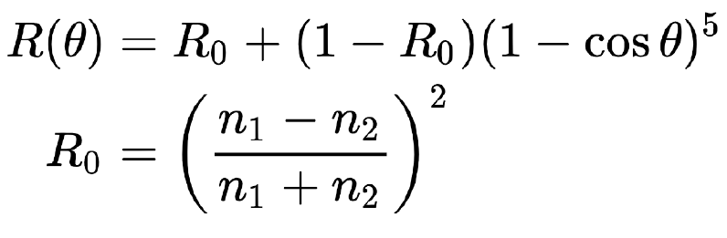
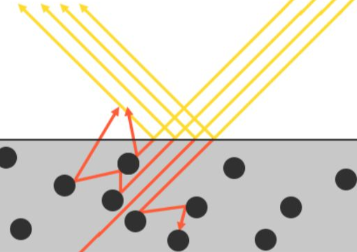
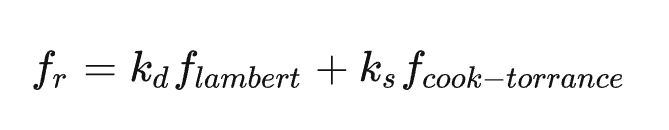

# 前置知识：光线追踪中的反射、折射
## 镜面反射

镜面反射光线的计算较为简单，公式如下：


## 折射

折射光线的计算公式推导：[折射光线的计算](https://dreamfields.github.io/2021/08/06/GAMES101%E9%87%8D%E8%A6%81%E5%85%AC%E5%BC%8F%E6%8E%A8%E5%AF%BC%E8%A1%A5%E5%85%85/#%E6%8A%98%E5%B0%84%E5%85%89%E7%BA%BF%E7%9A%84%E8%AE%A1%E7%AE%97)

#### 菲涅耳反射(Fresnel Reflection)

观察折射现象的几何描述：


如果从一个折射率大的空间折射如一个折射率小的空间，折射角度会增大，且有$\eta_i / \eta_t>1$，只要入射角度$\theta_i$足够大，$1-(\cos \theta_i)^2$ 就会接近 1，那么此时根号里的数便会小于 0，而这也就意味着，此时没有折射项，光线全部反射。

- 菲涅尔项反映了光线有多少发生反射，有多少发生折射


现象举例：垂直观察玻璃，你很容易看清玻璃外的东西(折射而来)，如果你视线玻璃近乎平行，此时你看到的大部分会是你自己(反射得到)，且视线越与玻璃平行，即与法线夹角越大，你的人像越加清晰，这种现象，就可以用菲涅尔反射来进行解释。

**对于绝缘体**：看图上的实心红线，观察角度与法线夹角越大（与观察平面越平行），反射的程度就越大，如玻璃。看图上的虚线，表示光线的极化现象（由于光的波动性），两个方向极化性的平均就是红心实线。


**对于导体**：观察角度很小时也有很大的反射率，如铜镜。


那么对于绝缘体和导体，如下公式可以精确计算反射率$R_{eff}$：


但计算过于复杂，就有了一个近似公式，Schlick Approximation：


认为曲线就是从 R0(由入射材质的折射系数和出射材质的折射系数决定) 开始，随着入射角的变化近似得到反射率，在 RayTacing In One Weekend 中有涉及：

```cpp
static double reflectance(double cosine, double refraction_idx) {
    // Use Schlick's approximation for reflectance.
    auto r0 = (1 - refraction_idx) / (1 + refraction_idx);
    r0 = r0 * r0;
    // return r0 + (1 - r0) * pow((1 - cosine), 5);
    // 用三次乘法计算五次方
    auto x1 = 1 - cosine;
    auto x2 = x1 * x1;
    auto x5 = x2 * x2 * x1;
    return r0 + (1 - r0) * x5;
}
```


# 微平面理论

微平面理论(Microfacets Theory)顾名思义，就是从微观的角度去分析，其认为任意物体的表面在到达微观的尺度之后，都是由许许多多的更小的镜面所组成的。
  
当这些微小的镜面的法线方向较为集中一致的时候，从宏观角度来看，物体的镜面反射会比较明显，反之，当这些微小镜面的法线方向较为杂乱，分布均匀的时候，物体表面则会相对粗糙。

但对于此，我们仅仅解释了微观角度的镜面反射现象，另外一个比较重要的部分则是漫反射。

对于微观尺度的漫反射可以作如下解释，当光线照射到物体表面时，一部分光线会与表面的许许多多的微小镜面发生镜面反射，另一部分光线则会折射进入物体内部，如下图：


当光线折射进入内部的时候会与物体的微小粒子不断发生碰撞并散射到随机方向，同时在碰撞的过程中一部分光线的能量会被吸收转换为热能，有些光线在多次碰撞之后能量消耗殆尽，则表示该光线完全被物体吸收。还有一部分折射到物体内部的光线会因为散射方向的随机性重新离开表面，而这部分光线就形成了漫反射。 (tips:光线折射进入物体内部之后再被散射出来，离开表面的点可能并不是进入表面的点，但这里并不考虑这种情形，次表面散射(Subsurface Scattering)技术则将这种现象考虑了进去。)

BRDF基于我们之前所探讨过的微平面理论来近似的求得材质的反射与折射属性。对于一个BRDF，为了实现物理学上的可信度，它必须遵守能量守恒定律，也就是说反射光线的总和永远不能超过入射光线的总量。严格上来说，同样采用ωi和ωo作为输入参数的 Blinn-Phong光照模型也被认为是一个BRDF。然而由于Blinn-Phong模型并没有遵循能量守恒定律，因此它不被认为是基于物理的渲染。

现在已经有很好几种BRDF都能近似的得出物体表面对于光的反应，但是几乎所有实时渲染管线使用的都是一种被称为Cook-Torrance BRDF模型。

Cook-Torrance模型作为图形学中最早的基于物理的BRDF模型，由Cook和Torrance提出，是Torrance-Sparrow模型的一个应用版本。现今，Cook-Torrance模型已经成为基于物理着色的标准模型之一。Cook-Torrance模型将物理学中的菲涅尔反射引入了图形学，实现了比较逼真的效果。

  
其中 $K_d,K_s$分别指**入射光线中被折射部分的能量所占的比率**与**被反射部分的比率(一般由菲涅尔项决定)**，而 $f_{lambert}$指漫反射的 BRDF，$f_{cook-torrance}$指镜面反射的 BRDF。两部分结合得到最终的 BRDF。

**但请注意**：$f_{cook-torrance}$已经采用了微表面模型，就不能在与宏观表面模型Diffuse的假设一同采用，同样在物理上也是错误的，能量不能保证守恒，可能会出现发光的BRDF的情况。由于不同角度、不同粗糙度损失的能量是完全不同的，因此直接加一个Diffuse是完全错误的。而由于可以近似一些效果，因此仍然使用。

# Cook-Torrance BRDF 推导

关键：**Material == BRDF**，以下讨论皆为Cook-Torrance BRDF。

## 漫反射材质的BRDF

漫反射会均匀的向每个方向反射，因此，漫反射的 BRDF 一定是一个常数。
  
由于能量守恒，入射的 radiance=出射的 radiance，两边的 Lo、Li 约去，得到漫反射的 BRDF 为$1/\pi$。

现在引入一个“反射率 albedo”的量，可以类比光栅化当中的漫反射系数去理解，本质就是一个 3 维向量，含有物体表面的颜色信息，这样的话就可以引入不同颜色的 BRDF。

因此：

$$
f_{lambert} = \rho/\pi
$$

Tips：Lambertian漫反射和我们之前经常使用的漫反射到底有什么关系？之前我们是用表面法向量与光照方向向量进行点乘，然后再将结果与平面颜色相乘得到漫反射参数。点乘依然还在，但是却不在BRDF之内，而是转变成为了Lo积分末公式末尾处的n⋅ωi 。
## 镜面反射与折射材质的BRDF

BRDF的镜面反射部分要稍微更高级一些，它的形式如下所示：
  

在图中看得更加明显：
  

Cook-Torrance BRDF的镜面反射部分包含三个函数，此外分母部分还有一个标准化因子 。字母D，F与G分别代表着一种类型的函数，各个函数分别用来近似的计算出表面反射特性的一个特定部分。三个函数分别为法线分布函数(Normal Distribution Function)，菲涅尔方程(Fresnel Rquation)和几何函数(Geometry Function)：

- D 法线分布函数：估算在受到表面粗糙度的影响下，取向方向与中间向量(half vector)一致的微平面的数量。这是用来估算微平面的主要函数。
- G 几何函数：描述了微平面自成阴影的属性。当一个平面相对比较粗糙的时候，平面表面上的微平面有可能挡住其他的微平面从而减少表面所反射的光线（grassing。
- F 菲涅尔方程：菲涅尔方程描述的是在不同的表面角下表面所反射的光线所占的比率。
以上的每一种函数都是用来估算相应的物理参数的，而且你会发现用来实现相应物理机制的每种函数都有不止一种形式。

具体的推导见文末的第一篇笔记参考：[Lecture 17：微平面理论(Cook-Torrance BRDF 推导)](https://zhuanlan.zhihu.com/p/152226698)


Tips：BSDF 是一个统称，表示散射（包括 BRDF 反射和 BTDF 折射）

# 笔记参考

- [Lecture 17：微平面理论(Cook-Torrance BRDF 推导)](https://zhuanlan.zhihu.com/p/152226698)
- [LearnOpenGL：Physically Based Rendering](https://learnopengl-cn.github.io/07%20PBR/01%20Theory/#_4)
- Cook-Torrance BRDF的Siggraph论文： [A Reflectance Model for Computer Graphics](https://dl.acm.org/doi/pdf/10.1145/965161.806819)
