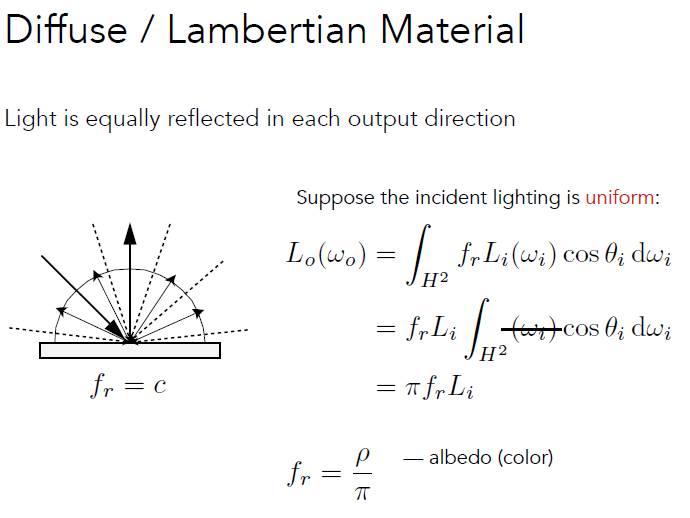
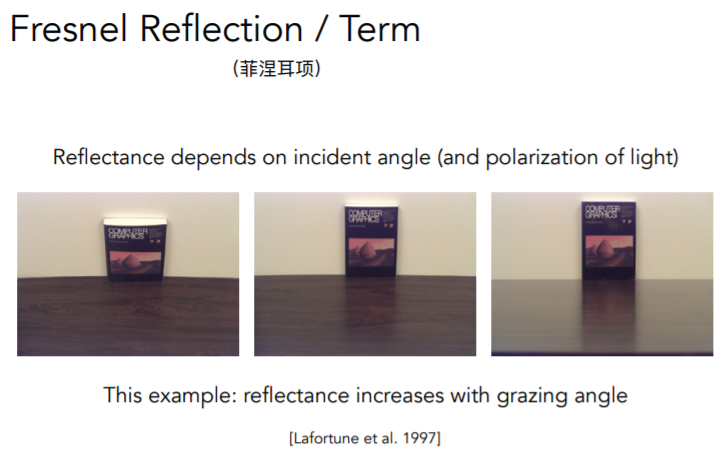
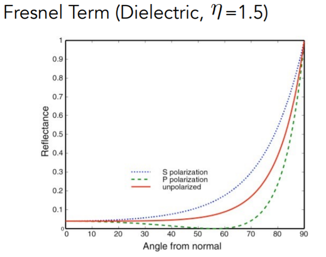
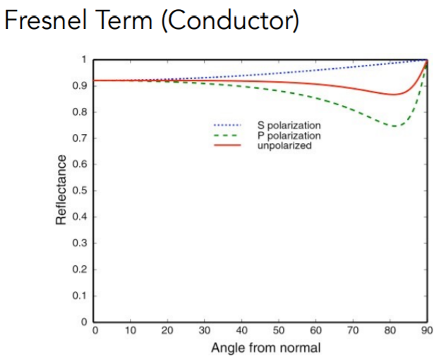

# Cook-Torrance BRDF推导
- 关键：**Material == BRDF**
- 漫反射材质，BRDF 为常数
    

- BSDF 是一个统称，表示散射（包括 BRDF 反射和 BTDF 折射）
- 菲涅尔项反映了光线有多少发生反射，有多少发生折射

  

  - 绝缘体

    

  - 导体

    

# 笔记参考
- [Lecture 17：微平面理论(Cook-Torrance BRDF推导)](https://zhuanlan.zhihu.com/p/152226698)