# Lecture 18 [高级光线传播和材质](https://sites.cs.ucsb.edu/~lingqi/teaching/resources/GAMES101_Lecture_18.pdf)

---

# 复习

- 无偏（Unbiased ）——估计量的期望等于真实值的期望；有偏则相反。
- 一致（Consistent）——随着样本容量的增加，估计量的序列在概率上收敛于 ​​​​​​，即估计值趋近于真实值。
- 区别：无偏描述的有限样本关于真实值的关系；一致性描述的大数样本与真实值的关系。
- 渲染上的简单理解：得到的画面结果只要有一点点模糊就是有偏；虽然画面有点模糊，但是样本足够多就能最后收敛到不模糊的结果，就是一致

  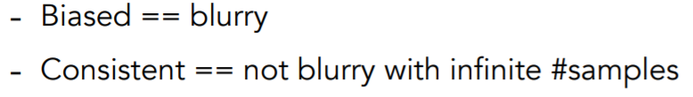

# 高级光线传播（Advanced Light Transport）

### 无偏光线传播方法（Unbiased light transport methods）

- 双向路径追踪 Bidirectional path tracing (BDPT)

  

  - 基本思想：

    - 对每个像素点进行多次采样
    - 每个采样点对应：一条视点子路径（eye path）​​​​​​​​​ 和光源子路径（light path）​​​​​​​​​​​​​​​​​ 上的顶点连接起来（连接时需要测试可见性），以快速产生很多路径
    - 计算每一条完整路径的贡献。在场景中，没有被物体拦截的每一条路径都会影响通过像素的估计通量或平均辐射。

  - 优点：能够产生一些传统路径追踪难以采样到的光路，是特别有效的渲染场景的间接照明方法。
  - 对比：下图中，光源向上打在了天花板，以右侧墙壁上的某一点为例（漫反射材质），如果应用普通路径追踪，从人眼（相机）发出的光线经过漫反射可能会继续打到左边墙壁上，关键在于普通路径追踪不好控制光线打到能量集中的区域；而应用 BDPT 后，从光源会产生多条光路，与右侧从人眼（相机）打出的子路径连接，就可以得到一条较高能量的光线。

    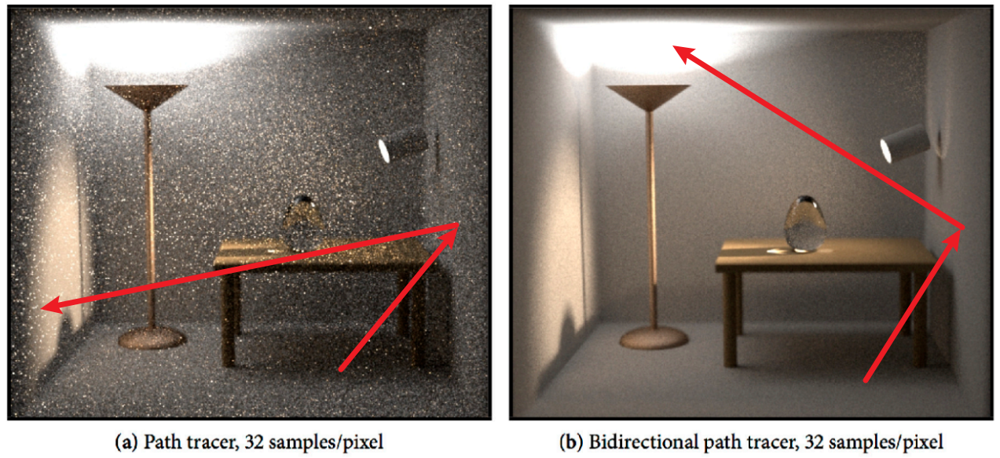

  - 缺点：一个严重的效率问题——每个采样点对应的多条完整路径中的大部分完整路径的贡献可能是 0。

- Metropolis 光线传播 Metropolis light transport (MLT)

  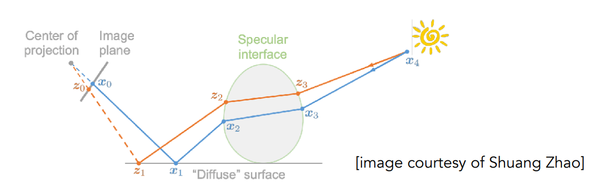

  - 基本思想：利用统计学上的一个工具——马尔科夫链，其本身的定义可以理解为：假设某一时刻状态转移的概率只依赖于它的前一个状态，MLT 利用该工具，就可以在已有的一条较为复杂的路径的基础上，在原本路径的周围产生更多相似的路径，因此适用于做困难的复杂的路径追踪，即增加更多有意义的路径。
  - 优点：给定足够时间，马尔科夫链的蒙特卡洛方法可以生成以任意函数的形状为 PDF（概率密度函数，probability density function）的样本，而统计学上的一个概念——采样的 PDF 和要积分的函数形状越相似，采样误差就越低
  - 对比：左图的场景，其复杂性在于光照只从半开的门缝中通过，场景大部分由间接光照亮；右图是 Caustics 现象（由于光线聚焦产生了一系列非常强的图案，俗称“水光”，波光粼粼），其复杂性在于这种路径为 SDS 路径——人眼（相机）发出的光线要透过水波（Specular 折射材质）并达到水底（Diffuse 漫反射材质）进行聚焦，最后聚焦到一定的线上，再透过水波（Specular 折射材质）到达光源。

    

  - 缺点

    - 很难从理论上判断其收敛速度（普通的路径追踪会有采样数与收敛速度的一个理论关系）
    - 所有的操作都是局部的，因此各个像素之间互不影响，导致各个像素收敛速度不一致，图片效果会很“脏”
    - 由于以上原因，该方法不适用于渲染动画——上一帧与下一帧各自有些像素收敛速度不同，图像抖动剧烈

### 有偏光线传播方法（Biased light transport methods）

- 光子映射（Photon mapping）

  

  - 特点：特别适合渲染 caustics 和 Specular-Diffuse-Specular（SDS）
  - 实现方法（其中一种）

    - Stage1——photon tracing：从光源出发辐射出光子，在路径上发生反射折射等，直到光子打到 diffuse 漫反射材质的物体上就停下，将所有光子记录在 diffuse 物体上

      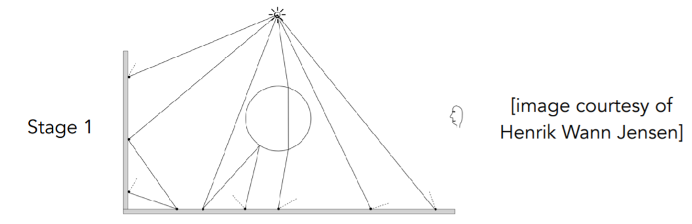

    - Stage2——photon collection (final gathering) ：从人眼（相机）出发，在路径上发生反射折射等，直到打到 diffuse 的物体上
    - Stage3——local density estimation

      

      - 思想：这一步建立在观察的基础上，越亮的地方光子应该越密集。
      - 具体做法：① 对于任何的一个着色点，取其周围最近的 N 个光子（Nearest Neighbor 问题，将所有光子组织成自上而下的加速结构模式如 KD-Tree 来解）；② 计算 N 个光子所占据面积，计算光子密度（N 光子数/所占面积）
      - 分析：为何光子映射是一个有偏的方法？

        - 正确的计算密度的方法应该是取一个很小的面积，计算里面的光子数，再用光子数/面积，即$dN/dA$ ​​​​​，而我们的计算方法是去确定一个 N，通过 $\Delta N/\Delta A​​​​​​​​​​​​​​​​​ $来估计。结论——只有 ​​$dA$ 无限小时结果才是正确的。如果发射的光子数越多，取一个着色点相同数量的 N 个光子，所占的面积就更小（更加集中），结果就会更准确。因此当发射的总光子数 Q 趋近于无穷时，得到的画面就是完全正确的了。$lim_{Q\rightarrow+\infty}\Delta A=dA$
​​​​​​​​​​​​​​​​​​​​​​​​​​​​​​​​​​​​​

          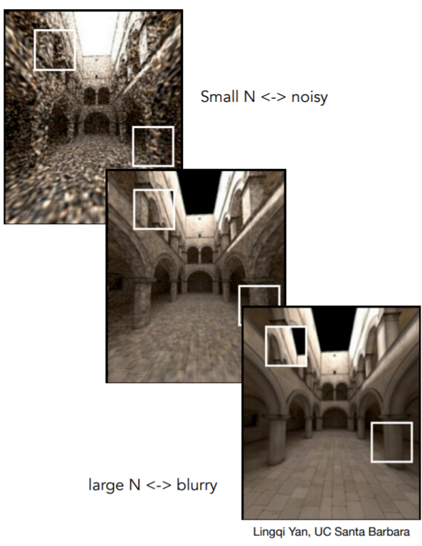

- Vertex connection and merging (VCM)

  

  - 结合了双向路径追踪和光子映射。上图中，左边的 path ​​​​​​​​​​​​​​​ 和右边的 path ​​​​​​​​​ 的两个端点即为接近，落在一个极小的区域中，这两根光线不能连接，也不浪费这样的光线，利用光子映射把能融合的光子融合起来。

### 对比

[Light transport simulation with vertex connection and merging（SIGGRAPH Asia 2012）](http://www.iliyan.com/publications/VertexMerging/comparison/)

---

### 实时辐射度算法 Instant radiosity (VPL / many light methods）

- 基本思想：已经被照亮的面都可以看作是一个光源，再让其来照亮其它物体

  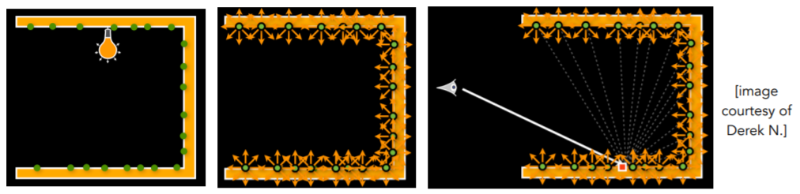

- 做法：从第一个真正的光源开始，向四周射出多个光源子路径（light sub-paths），假设每个光源子路径的终点都是一个虚拟光源（VPL，visual point light）；用这些 VPL 再照射其他地方；当摄像机看向一个着色点的时候，就研究所有的 VPL 对该着色点的影响，这样就用直接光照的方法完成了二次弹射的效果
- 优点：快速并且通常对漫反射场景的结果比较好
- 缺点：当 VPLs 非常接近着色点的时候，会产生亮点（右图）；不能处理 glossy 的材质

  

# 高级外观建模（Advanced Appearance Modeling）

### 非表面模型 Non-surface models

  - 散射介质 Participating media：雾、云…当光通过散射介质时，任何一点可以(部分)被吸收和被散射（外散射、内散射等）。视线在物体里任意方向任意距离传播，在每个着点对光源进行着色。

    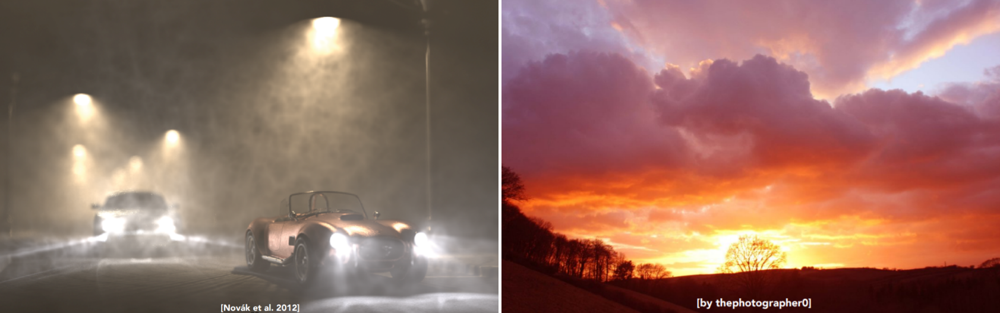
    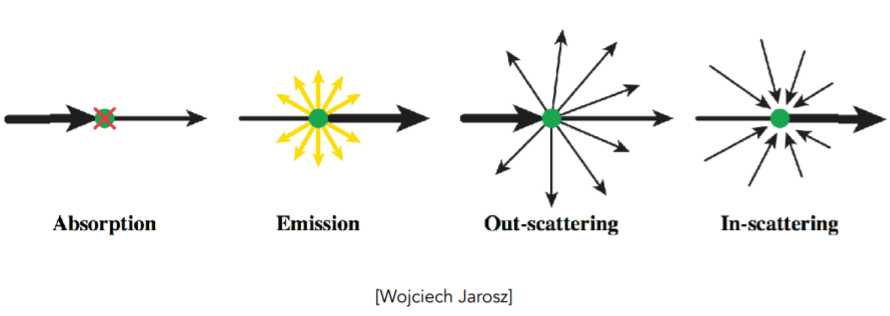

    - 使用相位函数（Phase Function）来描述参与介质中任意点的光散射角分布

      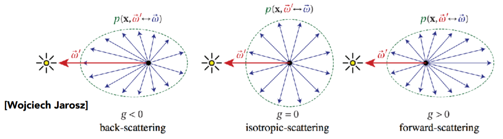

    - 如何渲染

      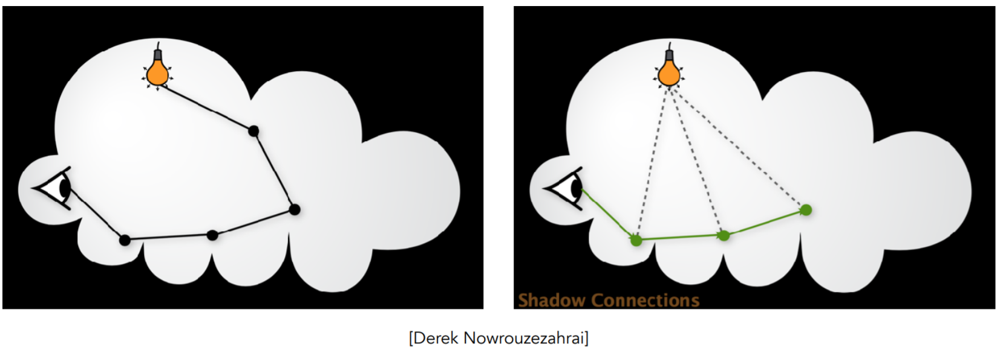

      - 光线进入散射介质中，随机选择一个方向来弹射。
      - 随机选择一个距离直行，其行进距离由该介质的吸收能力
      - 对于每一个“着色点”，把它连接到光源。

  - Hair / fur / fiber (BCSDF)

    - Hair Appearance 考虑光线如何与一个曲线作用而不是一个面，效果较好的一个模型 Marschner Model，该模型把头发当成玻璃圆柱，考虑了以下三种类型的光线：

      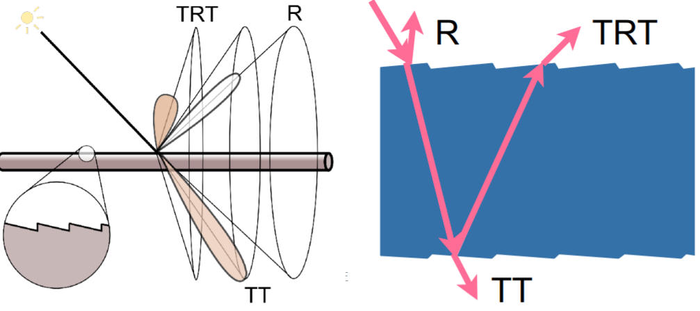

      - R：直接反射的光。
      - TT：传进去再传出去的光。
      - TRT：光线进到头发里面，在头发的内壁发生一次反射再回去。（R: reflection, T: transmission 透射）
      - 得到的效果如下

        

    - Fur Appearance：人和动物毛发都具有三层结构皮质（Cortex）、髓质（Medulla）、角质层（Cuticle），如下图所示，但动物的髓质（Medulla）比人大很多，导致不能用人的头发模型来渲染动物毛发。

      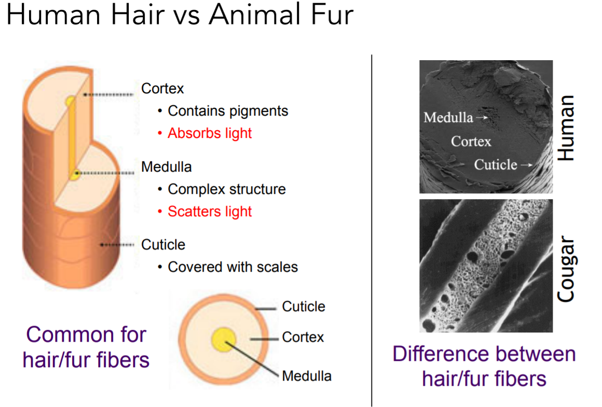

      - 有人就构造了另外一种模型——双层圆柱模型 Double Cylinder Model，就是将 Cortex 也描述出来。

        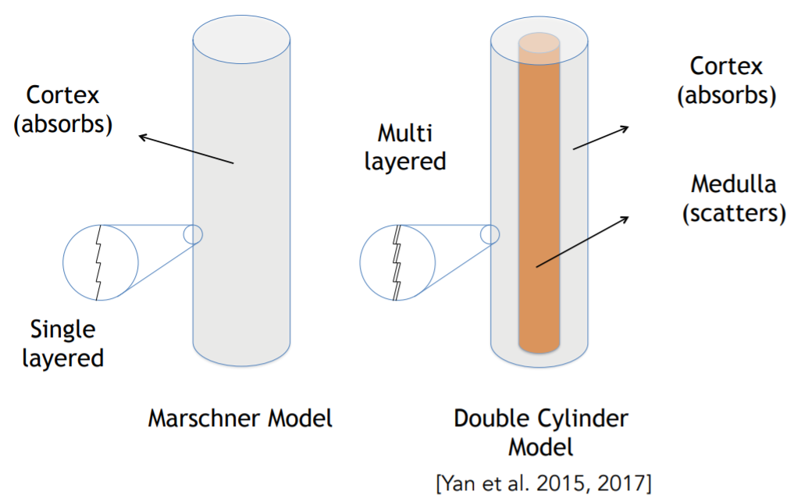

      - 双层圆柱模型考虑了 5 种光线：除了原来的 Marschner Model 中的 ​​​​​​​​ 三种光线外（没有穿过髓质），又添加了 ​​​​ 和 ​​​​​（​​​​​​ 传入毛发之后穿过了髓质）

        

      - 得到的效果如下

        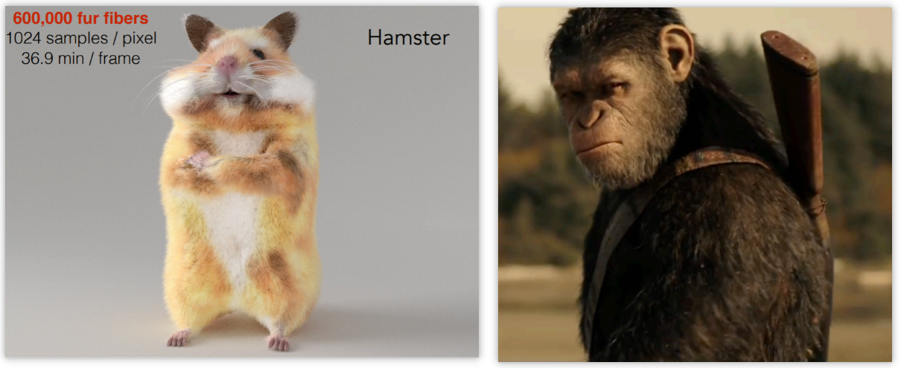

  - 颗粒材质 Granular material

    

    - 以一个沙堆城堡为例，为了避免渲染所有的颗粒，可以进行适当简化，将一个场景中整个的颗粒模型分为多个微小的单元，每个单元由不同比例的微粒来组成，最后拿去渲染。

      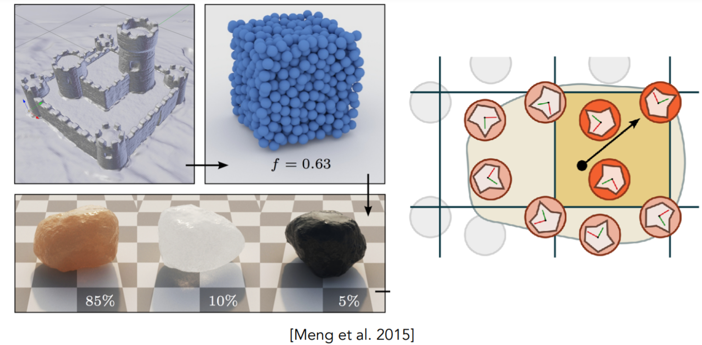
      

### 表面模型 Surface models

  - 半透明材质 Translucent material (BSSRDF)

    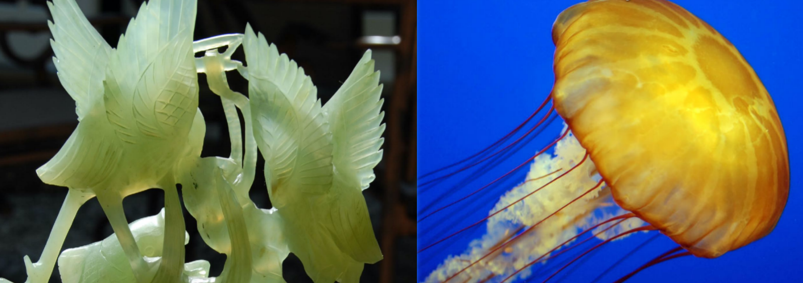

    - 反映到物理过程：光线沿一个点进入了一个表面，在表面下进行大量的散射，并从另外一个表面钻出，光线并没有在内部被吸收——这种散射方式被定义为次表面散射（Subsurface Scattering）
    - 如何理解次表面散射？

      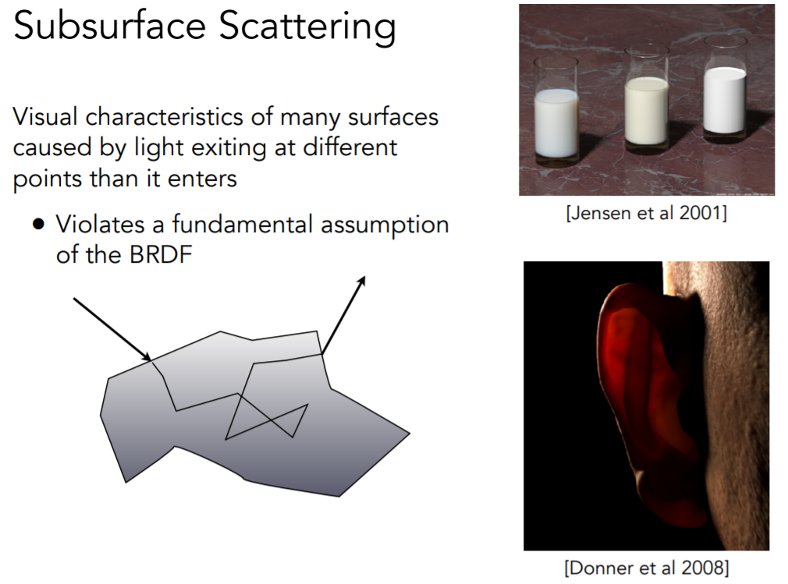

      - 直观描述：由光线从不同的点射出而不是从不同的点进入所引起的许多表面的视觉特征
      - 数学描述：可以认为是双向反射分布函数 BRDF（Bidirectional Reflectance Distribution Function）的延申

        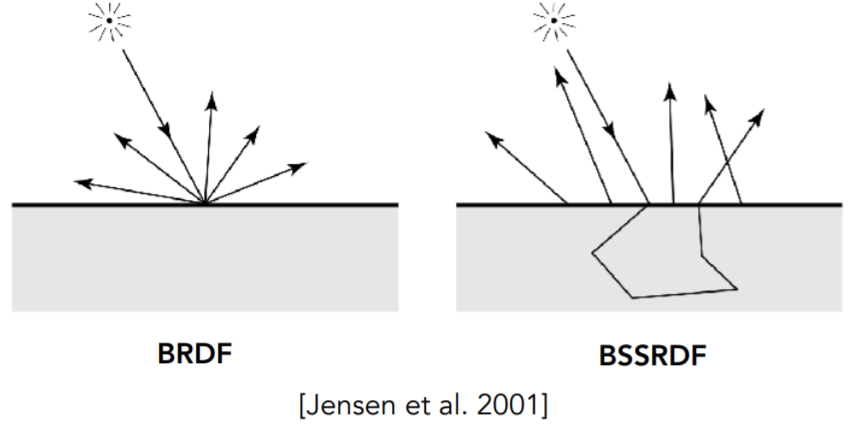

        - 公式上看反射方程：

          - BRDF 的反射方程：$​​​​​​​​​​​​​​​​​​​​​​​​​​​​​​​​​L_{o}\left(p, \omega_{o}\right)=L_{e}\left(p, \omega_{o}\right)+\int_{\Omega^{+}} L_{i}\left(p, \omega_{i}\right) f_{r}\left(p, \omega_{i}, \omega_{o}\right)\left(n \cdot \omega_{i}\right) \mathrm{d} \omega_{i}$
​​​​​​​​​​​​​​​​​​​​​​
          - BSSDRF的反射方程：$L\left(x_{o}, \omega_{o}\right)=\int_{A} \int_{H^{2}} S\left(x_{i}, \omega_{i}, x_{o}, \omega_{o}\right) L_{i}\left(x_{i}, \omega_{i}\right) \cos \theta_{i} \mathrm{~d} \omega_{i} \mathrm{~d} A​​​​​​​​​​​​​​​​​​​​​​​​​​​​​​​​​​​​​​​​​​​​​​​​​​​​​​​​​$​​​​​​​​​​​​​​​​​​​​​​​​​​​​​​​​​​​​​​​​​​​​​​​​​​​​​​​​​​​​​​​​​​​​​​​​​​​​​​​​​​​​​​​​​​​​​​​​​​​​​​​​​​​​​​​​​​​​​​​​​​​​​​​​​​​​​​​​
          - BRDF 规定了：光线达到了该点，并从该点出来向各个不同的方向去，所有的所用都发生在了一个点上，在渲染方程中积分区域为所有方向为正的方向（大小为半球的立体角）
          - BSSRDF 规定了：光线从哪个点进来，从哪个方向进来，从哪个点出去，从哪个方向出去，在渲染方程中为二重积分，积分区域为整个立体角（原因：某个入射点 ​​​ 可能有从其它点进入介质的光线从 ​​​ 射出）和面积（原因：所有的作用不再是一个点，而是一个面）

      - 近似方法——[Dipole Approximation 方法](https://graphics.stanford.edu/papers/bssrdf/bssrdf.pdf)

        

        - 由于计算量过大，可以将次表面散射最终的效果看作是——光实际从左上角照射过来，次表面散射就好像表面内部有一个光源，表面上方也有一个光源的结果（为了物理上的真实），然后用这两个光源去照亮着色点这一块儿得到的效果。举个 🌰：手机灯光透过手掌

          

    - 一个有趣的网站：[10 Most Realistic Human 3D Models that will WOW You - CG Elves](https://cgelves.com/10-most-realistic-human-3d-models-that-will-wow-you/?v=7516fd43adaa)

  - 布料 Cloth

    - 概述

      

      - 布料是一系列缠绕的纤维构成的。
      - 缠绕有两级：纤维（Fiber）第一次缠绕会成为股（Ply），股（Ply）缠绕会成为线（Yarn）

    - 渲染布料的三种方式

      - 把布料当作表面来渲染——给定编制图案，计算其总体表现；使用 BRDF 来渲染；但是对于天鹅绒，其纤维向各个方向进行分布，因此用手去滑过天鹅绒就会发现表面发生变化，所以根本不是一个平面，当作表面来渲染并不合理。

        
        

      - 把布料当作散射介质（空间中分布的体积）来渲染——把单个纤维和它们分布的性质转化为散射参数，然后把它们当作散射介质来渲染，就好像在渲染云、雾一样（计算量 ​​​​​​​​)

        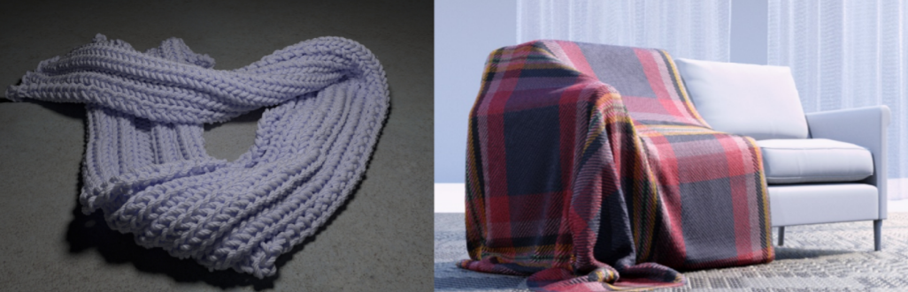

      - 把布料当作真实的纤维来渲染——即明确的渲染每一根纤维（最暴力的做法）

        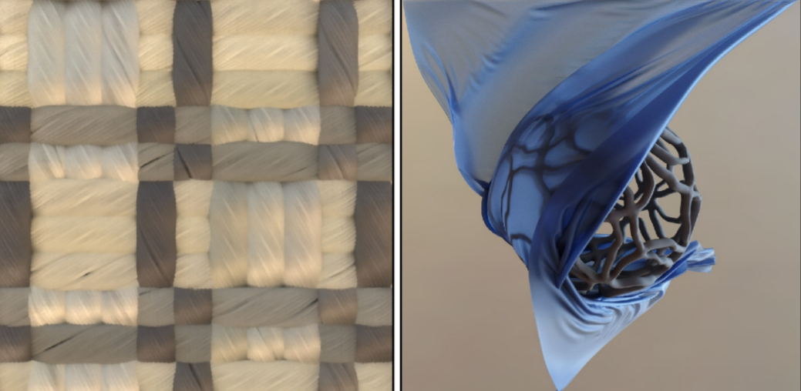

  - Detailed material (non-statistical BRDF)

    - 背景：渲染出来的太过“完美”，而真实的世界中充满着各种各样的细节，而细节很难通过渲染表现出来。

      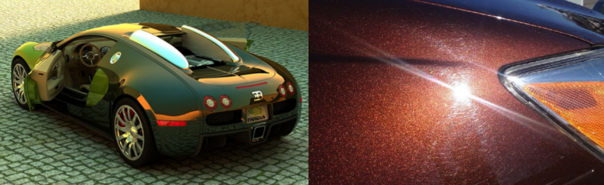

    - 重提微表面模型——最重要的是其法线分布，而我们描述分布时通常运用的是简单的分布函数，如正态分布、高斯等，自然得到的结果没有太多细节

      

      - Statistical NDF vs. Actual NDF

        

      - 实际效果对比：左图是细节的法线贴图得到的结果，右图是原始的采样 2h 得到，按照 996 工作制大约 20 天才能得到想要的结果

        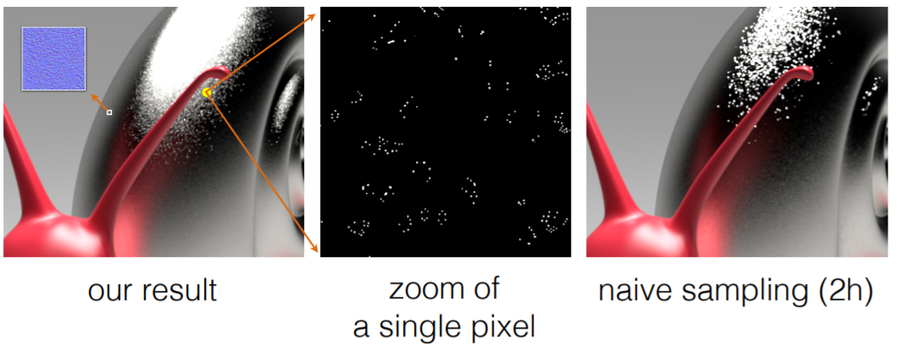

      - 渲染如此困难的原因在于：认为每一个小的微表面是一个镜面，通过从光源的不断反射，只有非常少的一部分会被反射到相机

        

      - 解决方法

        - 将一个小的范围内的微表面拿出来，计算其法线分布然后替换光滑的法线分布，用在微表面模型里。

          

        - 一个像素可以覆盖不同大小的微表面，对于比较大的范围会得到统计学规律，而对于比较小的微表面得到的就比较有特点。

          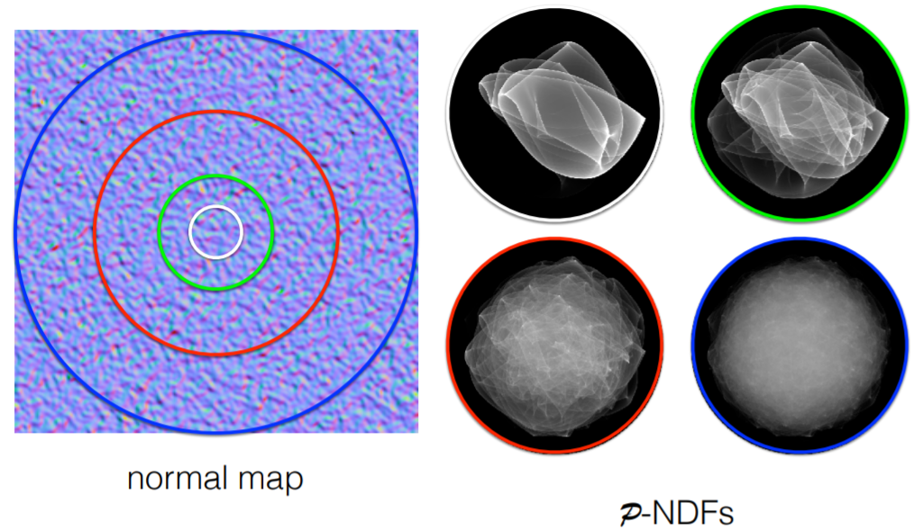

        - 不同类型的法线贴图会得到不同的法线分布。左上：各向同性法线；右上：各向异性法线；左下：离散的亮片；右下：纹路类型法线

          

        - 效果

          
          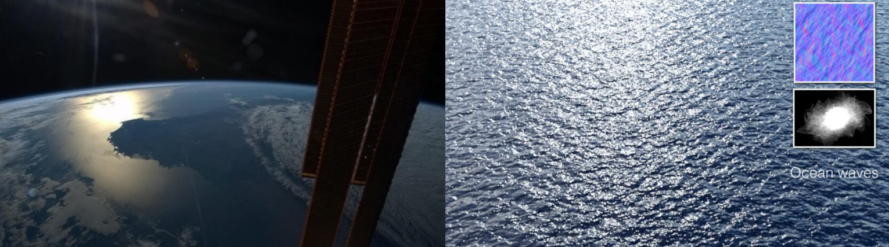

    - 深入探索

      - 有趣的是，事情还没有结束，当我们考虑细节的时候，如果一个物体表面的大小极小，小到和光的波长相当的时候，就不能再用几何学来计算了，此时光不再沿直线传播。举个 🌰：

        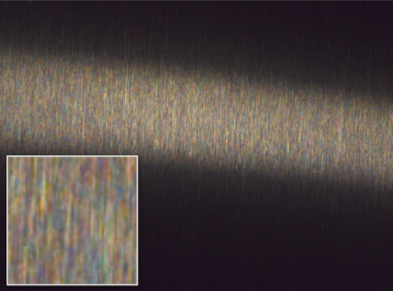

      - 波动光学下的法线分布，可以发现：波动光学的 BRDF 与几何相似，但是相对而言比较不连续，原因在于光的干涉效应，使得有些地方接收不到光子，有些地方持续接收光子，可以联想物理上的双缝干涉实验来理解。

        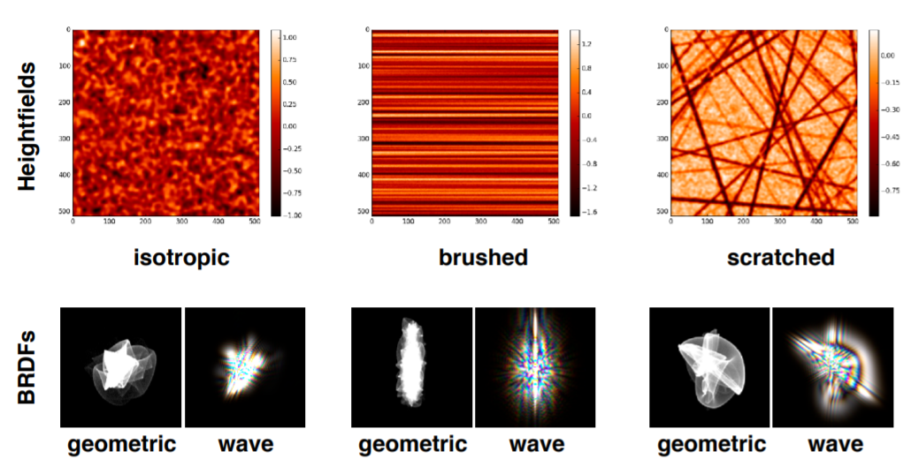

### 程序化生成外观 Procedural appearance

  

  - 背景：一个模型的外观通过纹理定义，模型内部并不存在纹理细节。
  - 3D noise（噪声函数） 可以直接通过噪声函数来计算细节，即每次通过模型的一点，来查询该点所对应的纹理，使用这种方法可以看到被切割或断裂的内部纹理，相当于——这个纹理贴图已经不再是 2D，而是 3D。
