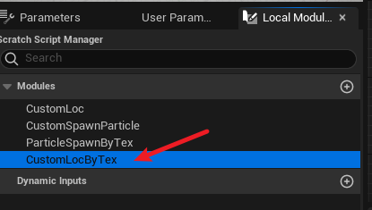

来自官方的`Content Example -> Maps -> Niagara_Advanced_Particles`

部分参考：
- [Niagara Advance 笔记 - 知乎 (zhihu.com)](https://zhuanlan.zhihu.com/p/614315995)

- [UE4 Niagara源码解析 - 知乎 (zhihu.com)](https://zhuanlan.zhihu.com/p/362638250)

# 操作



脚本模块的重命名需要连续三次单击才能重命名

# 1.1 FillRenderTarget

[UE5 Niagara_Render Target 2D笔记 - 知乎 (zhihu.com)](https://zhuanlan.zhihu.com/p/509101203)

[1.1-1.2 Simulation Stage 和 Grid2dCollection - 知乎 (zhihu.com)](https://zhuanlan.zhihu.com/p/333783850)

整个发射器是下面这个样子，注意常规模拟阶段设置。其中Data Interface（数据接口，是所有中间数据结构的统称），用来从上到下转递数据的中间结构，即存储上一个模块的迭代结果，给下一个模块或者之后使用。


Fill Texture to RenderTarget模块如下：


注意节点内部的引脚连接：


注意修改渲染器的源模式：


系统BUG：每次写完暂存区脚本后，需要关闭整个粒子系统的文件，关之前会提示是否应用，之后再打开才能看见报错信息，并且也会显示暂存区脚本在系统总览的输入选项。

# 1.2 AdvectGrid

[Niagara_Advanced  1.2 Advect Grid 2D Collection_niagara grid2d](https://blog.csdn.net/xcinkey/article/details/117450602)

[1.1-1.2 Simulation Stage 和 Grid2dCollection - 知乎 (zhihu.com)](https://zhuanlan.zhihu.com/p/333783850)

**Grid2D Collection**——是一段缓冲区数组，用来作属性的“缓冲”。Render Target 2D可以认为是一个2维的数组，数组内存着的是一个又一个对应位置的颜色数据。Grid2D Collection是它的超集，即Grid2D Collection也是这样一个数组，其内存着的可以是颜色数据，也可以是其他类型数据，这些数据可以供你模拟，变换等，但是如果希望输出（显示），还是得借助Render Target（所以才说Grid2D Collection是数据的缓冲区）。

**StackContent**——参考【[UE4：Niagara的变量与HLSL - 知乎 (zhihu.com)](https://zhuanlan.zhihu.com/p/342315125)】，说白了这就是个懒人命名空间，各个阶段都能用。当你有一些各层级实体都可能具备的一些属性，不想每个命名空间都分别创建这些同名变量，不想随着算法的迭代去调整到底哪个命名空间应该保留这个变量时，就可以使用StackContext命名空间。

1.1中的流程为：Texture -> RenderTarget2D。

1.2中只是多了一个步骤：Texture -> Grid2DCollection -> RenderTarget2D。

- Fill Grid with Texture阶段将Texture拿到的数据存到Grid2D Collection里，该阶段的常规模拟阶段设置中，Data Interface（数据接口，是所有中间数据结构的统称）必须是所利用的Grid2DCollection，否则StackContent所填充的数据并不是到Grid2DCollection。
- OperateGrid（示例中的Advect Grid阶段）对Grid里的数据做一些运算从而获得流动的效果。
- Fill Render Target with Grid阶段将Grid2D Collection里的数据写入Render Target里以最终显示出来。

## 问题与解决

UE 5.1中找不到对Grid2D Collection的num cell设置，网上的方案在5.1里也找不到：[Grid2d collection no cellnums setting shown in ue5 niagara - Asset Creation / FX - Epic Developer Community Forums (unrealengine.com)](https://forums.unrealengine.com/t/grid2d-collection-no-cellnums-setting-shown-in-ue5-niagara/531971)


下面是官方用例的Grid2D Collection预览效果


我通过那个论坛提问了一下，果然回复我了，其实就是要下载插件：


然后在Emitter Update中添加模块，取消勾选”Only Library“就能搜到。

# ****1.6 Distance Field Traversal****

[Niagara Advance 笔记 - 知乎 (zhihu.com)](https://zhuanlan.zhihu.com/p/614315995)

[1.6 Distance Field Traversal （一） - 知乎 (zhihu.com)](https://zhuanlan.zhihu.com/p/351610683)

# **3.1 Color Copy by Cell**

- [UE5.1 Niagara Advance 案例理解分析 3.1 - 知乎 (zhihu.com)](https://zhuanlan.zhihu.com/p/589478561)
- [3.1 Neighbor Grid 3D - 知乎 (zhihu.com)](https://zhuanlan.zhihu.com/p/344191067)
- [Spatial Hashing in Unreal’s Niagara with Neighbor Grid 3D – AliCormack](https://alicormack.com/spatial-hashing-in-unreals-niagara-with-neighbor-grid-3d/)
- [UE4：Niagara中的Ribbon - 知乎 (zhihu.com)](https://zhuanlan.zhihu.com/p/350347223)
- [Niagara Neighbor Grid 3D 相关节点的解读 和原理（一） - 知乎 (zhihu.com)](https://zhuanlan.zhihu.com/p/395801716)

整体效果与思路：利用neighbor grid3D实现粒子快速查询，使得大粒子在生成之后填入neighbor grid3D，之后生成的小粒子通过当前所在位置来查询neighbor grid3D存储的最近的大粒子索引，从而获得其颜色。


**Neighbir Grid是先将空间划分为N*N*N个子空间（Cell）。其中：每个子空间有”Max Neighbor Per Cell“个单位存储一个Int数据（通常用于记录粒子Index），表示每个子空间所能存储信息的最大数量**。

在Grid中并没有存储任何粒子的属性信息,，而只是用来“加速”的，最终他起到的作用就能够通过：粒子位置-在网格中的索引(NeighborIndex)-粒子的索引(Index)产生联系，给出从属粒子位置就能得到leader粒子的另外两个索引，而Attribute Reader正是通过粒子的Index读取粒子属性的，这样就能通过空间划分的方式来快速查找粒子进行属性相关计算。

下面解析实现方法：

1. 整体的发射器由三部分构成：
    1. Visualize_Grid3D：neighbor grid 3D的条带渲染可视化
    2. GridWrite：neighbor grid 3D的信息写入，负责生成大粒子并写入neighbor grid 3D
    3. GridRead：负责生成小粒子并查询neighbor grid 3D来改变颜色


1. FillNeighborGrid3D模块中的hlsl代码

```glsl
// 每一个粒子都会执行该代码
IsAddedToGrid = false;

#if GPU_SIMULATION

// 从世界坐标位置转换到Grid网格的UV 0-1的单位空间的坐标
float3 UnitPos;
NeighborGrid.SimulationToUnit(Position, SimulationToUnit, UnitPos);

// 提取Neighbor Grid的Index，相当于把单位空间划分为NumCells.x* NumCells.y*NumCells.z个子空间
// 这个Index表示粒子所在的子空间的位置，可以理解为在x y z 方向上的第几个网格上
int3 Index;
NeighborGrid.UnitToIndex(UnitPos, Index.x,Index.y,Index.z);

// 判断这个粒子获取的子空间Index是有效的
int3 NumCells;
NeighborGrid.GetNumCells(NumCells.x, NumCells.y, NumCells.z);

if (Index.x >= 0 && Index.x < NumCells.x && 
    Index.y >= 0 && Index.y < NumCells.y && 
	Index.z >= 0 && Index.z < NumCells.z)
{
    // 根据子空间Index（位置，即三维索引）获取子空间的线性索引
    // 源码如下：
    // Out_Linear = In_IndexX + In_IndexY * {NumVoxelsName}.x + In_IndexZ * {NumVoxelsName}.x * {NumVoxelsName}.y;
    int LinearIndex;
    NeighborGrid.IndexToLinear(Index.x, Index.y, Index.z, LinearIndex);

    // 增加这个LinearIndex对应的子空间的 NeighborCount，即+1，表示当前子空间的存储信息多了一个。（该样例中表示当前子空间所能存储的粒子Index的数量）
    // PreviousNeighborCount : 表示增量之前的Count
    int PreviousNeighborCount;
    NeighborGrid.SetParticleNeighborCount(LinearIndex, 1, PreviousNeighborCount);

    // Neighbir Grid是先将空间划分为N*N*N个子空间（Cell）。其中：每个子空间有”Max Neighbor Per Cell“个单位存储一个Int数据（通常用于记录粒子Index），
    // 表示每个子空间所能存储信息的最大数量。
    int MaxNeighborsPerCell;
    NeighborGrid.MaxNeighborsPerCell(MaxNeighborsPerCell);

    // 不让该子空间的当前数量（存储的信息数量）超过MaxNeighborsPerCell
    // 当网格还没有装满时，才会真正执行划分操作
    if (PreviousNeighborCount < MaxNeighborsPerCell)
    {
        // 判断当前粒子是否被加入Neighbor Grid
        IsAddedToGrid = true;

        // 源码如下：
        // Out_Linear = In_Neighbor 
        //                  + In_IndexX * {MaxNeighborsPerVoxelName} 
        //                  + In_IndexY * {MaxNeighborsPerVoxelName}*{NumVoxelsName}.x 
        //                  + In_IndexZ * {MaxNeighborsPerVoxelName}*{NumVoxelsName}.x*{NumVoxelsName}.y
        // 计算的是：这个粒子在当前子空间的下标In_Neighbor，范围应该是[0,MaxNeighborsPerCell），放到整个Grid空间下的一维下标
        // PreviousNeighborCount : 表示增量之前的Count
        int NeighborGridLinear;
        NeighborGrid.NeighborGridIndexToLinear(Index.x, Index.y, Index.z, PreviousNeighborCount, NeighborGridLinear);

        // 把粒子的ExecIndex赋值到NeighborGridLinear对应的空间，这样的话就可以通过Neighbor Index得到粒子的Index从而查询粒子的属性
        int IGNORE;
        NeighborGrid.SetParticleNeighbor(NeighborGridLinear, ExecIndex, IGNORE);
    }		
}
#endif
```

1. FindClosestNeighbor模块的hlsl代码

```glsl
NeighborIndex = -1;

#if GPU_SIMULATION

bool Valid;

float3 UnitPos;
NeighborGrid.SimulationToUnit(Position, WorldToUnit, UnitPos);

int3 Index;
NeighborGrid.UnitToIndex(UnitPos, Index.x,Index.y,Index.z);

// 用一个比较大的值初始化距离该粒子最近的距离
float neighbordist =  3.4e+38;

int MaxNeighborsPerCell;
NeighborGrid.MaxNeighborsPerCell(MaxNeighborsPerCell);

// 每个子空间（Cell）中包含有MaxNeighborsPerCell个Neighbor这样的存储数据的结构。
// 从上一个GridWrite的粒子发射器所填入的Neighbor Grid3D结构中，遍历该粒子所处的
// 子空间的Neighbor，查找距离最近的大粒子
for (int i = 0; i < MaxNeighborsPerCell; ++i)
{
    // 当前子空间（Cell）中第i个Neighbor的NeighborLinearIndex
    int NeighborLinearIndex;
    NeighborGrid.NeighborGridIndexToLinear(Index.x, Index.y, Index.z, i, NeighborLinearIndex);

    // 读取NeighborLinearIndex中真正保存的数据，也就是之前写入的大粒子的索引Index赋给CurrNeighborIdx
    // 如果这个Neighbor中没有保存数据，就返回-1
    int CurrNeighborIdx;
    NeighborGrid.GetParticleNeighbor(NeighborLinearIndex, CurrNeighborIdx);

    // 如果读取到的大粒子的索引Index!=-1，此时有效，说明这个Neighbor中存了大粒子的索引
    if (CurrNeighborIdx != -1)
    {
        // 使用 Attribute Reader + CurrNeighborIdx 来查询大粒子的位置
        float3 NeighborPos;
        AttributeReader.GetVectorByIndex<Attribute="Position">(CurrNeighborIdx, Valid, NeighborPos);

        // Position是每个执行该代码的小粒子的位置
        // 比较它和查找到的大粒子的距离
        const float3 delta = Position - NeighborPos;
        const float dist = length(delta);

        if( dist < neighbordist )
        {
            // 在小粒子所在的子空间（Cell）中更新距离该小粒子最近的那个大粒子的真实索引Index
            neighbordist = dist;
            NeighborIndex = CurrNeighborIdx;
        }
    }  
}    

#endif
```

# ****3.6 Position Based Dynamics****

（待完善）

# 3.9 Boids

[【Unreal从0到1】【第九章：粒子系统与物理引擎】9.4，Boid群集算法浅析 - 知乎 (zhihu.com)](https://zhuanlan.zhihu.com/p/441231656)

## 集群行为模型-Boids

[Flocks, herds and schools: A distributed behavioral model - Google 学术搜索](https://scholar.google.com/scholar?q=Flocks,+herds+and+schools:+A+distributed+behavioral+model&hl=zh-CN&as_sdt=0&as_vis=1&oi=scholart)

克雷格的Boids模型正是以“自下而上的控制”为核心，提出了一个在二维或三维空间上模拟集群行为的模型，该模型要求集群的个体遵守三条基本原则：

### 分离（seperation）

与邻域内的集群个体避免碰撞。对于一个集群个体来言，每一个在其邻域范围内的集群个体与它之间都有一个排斥力，这个排斥力是与它们之间的距离成反比的。每一个集群个体所受到的排斥力是它邻域范围内其它集群个体对它的排斥力的累加。

### 聚合（cohesion）

与邻域内的集群个体保持紧凑。集群个体需要获得其邻域内其它集群个体的位置信息，并计算出邻域内集群个体位置的平均值，由此产生一个作用于该邻域内所有集群个体的吸引力

### 对齐（alignment）

与邻域内的集群个体速度保持一致。为了能够实现速度一致，每个集群个体需要获得邻域内其它集群个体速度信息，计算出邻域内集群个体的平均速度。通过速度对齐，可以使得集群个体速度大小和方向与这个邻域内所有集群个体速度的平均值保持一致。

## 特化-鱼群模拟

[The simulation of the movement of fish schools - ScienceDirect](https://www.sciencedirect.com/science/article/abs/pii/S0022519305806812)

模拟的基本假设是: (1)鱼的运动只受其最近邻的位置和方向的影响。(2)在考虑随机影响的情况下，利用概率分布计算每条鱼(经过一个时间步后)的新速度和转向角。(3)每条模型鱼的运动都基于相同的行为模式，即模型鱼群在没有领导者的情况下游动。

基本的行为模式是吸引、排斥和平行取向。我们的调查表明，鱼类如何混合其邻居的影响是非常重要的。如果一条鱼对其邻近鱼群的影响取平均值，则模型鱼群表现出真实鱼群的典型特征: 强凝聚力和高极化程度。如果一条鱼只对一个邻居作出反应，那么这个模型就创建了一个混乱的鱼群。


Boid Force模块：

```glsl

OutForce = float3 (0,0,0); 
// 寻找所有能够影响当前执行代码的粒子的数量
NeighborCount = 0;

//----传出变量-----
// 分离（seperation）
ParticleAvoidanceForce = float3 (0,0,0); 
// 聚合（cohesion）
ParticleCohesionCenter = float3 (0,0,0); 
ParticleCohesionForce = float3 (0,0,0); 
// 对齐（alignment）
ParticleVelocityMatchingForce = float3 (0,0,0); 

#if GPU_SIMULATION

//--------------------------

// 归一化朝向矢量用于后续矫正速度的计算
float VelocityVectorLength = distance(Velocity, float3(0, 0, 0));
float3 NormalizedFacingVector = float3(0, 0, 0);
if (VelocityVectorLength > 0){
    NormalizedFacingVector = (Velocity/VelocityVectorLength);
} else {
		// SafeFacingVector从Update Mesh Orientation模块得到
		NormalizedFacingVector = SafeFacingVector;
}

//---临时变量-----
// 分离（seperation）
float3 RepulsiveForce = float3(0, 0, 0);
// 对齐（alignment）
float3 VelocityMatchingForce = float3(0, 0, 0);
// 聚合（cohesion）
float3 CohesionCenter = float3(0, 0, 0);

// 寻找所有当前执行代码的粒子需要躲避的数量（从后面代码看出）
int MinDistanceNeighborCount = 0;

const int3 IndexOffsets [ 27 ] = 
{
	int3(-1,-1,-1),
	int3(-1,-1, 0),
	int3(-1,-1, 1),
	int3(-1, 0,-1),
	int3(-1, 0, 0),
	int3(-1, 0, 1),
	int3(-1, 1,-1),
	int3(-1, 1, 0),
	int3(-1, 1, 1),

	int3(0,-1,-1),
	int3(0,-1, 0),
	int3(0,-1, 1),
	int3(0, 0,-1),
	int3(0, 0, 0),
	int3(0, 0, 1),
	int3(0, 1,-1),
	int3(0, 1, 0),
	int3(0, 1, 1),

	int3(1,-1,-1),
	int3(1,-1, 0),
	int3(1,-1, 1),
	int3(1, 0,-1),
	int3(1, 0, 0),
	int3(1, 0, 1),
	int3(1, 1,-1),
	int3(1, 1, 0),
	int3(1, 1, 1),
};

// 当前粒子从世界坐标位置转换到Grid网格的UV 0-1的单位空间的坐标
float3 UnitPos;
myNeighborGrid.SimulationToUnit(Position, SimulationToUnit, UnitPos);

// Index表示粒子所在的子空间的位置
int3 Index;
myNeighborGrid.UnitToIndex(UnitPos, Index.x,Index.y,Index.z);

int3 NumCells;
myNeighborGrid.GetNumCells(NumCells.x, NumCells.y, NumCells.z);

int MaxNeighborsPerCell;
myNeighborGrid.MaxNeighborsPerCell(MaxNeighborsPerCell);

// Index表示粒子所在的子空间的位置，Index + IndexOffsets[xxx]表示遍历当前所在子空间的周围
// 27个相邻空间数据
for (int xxx = 0; xxx < 27; ++xxx) 
	{
		for (int i = 0; i < MaxNeighborsPerCell; ++i)
		{
			const int3 IndexToUse =Index + IndexOffsets[xxx];
			// 当前子空间（Cell）中第i个Neighbor的NeighborLinearIndex，以下得到的粒子称为OtherParticle
			int NeighborLinearIndex;
			myNeighborGrid.NeighborGridIndexToLinear(IndexToUse.x, IndexToUse.y, IndexToUse.z, i, NeighborLinearIndex);
			// 该Neighbor中的Idx
			int CurrNeighborIdx;
			myNeighborGrid.GetParticleNeighbor(NeighborLinearIndex, CurrNeighborIdx);

			// 临时bool，捕获每次读取Neighbor中获取的粒子属性
			bool myBool; 
			float3 OtherPos;
			DirectReads.GetVectorByIndex<Attribute="Position">(CurrNeighborIdx, myBool, OtherPos);
			float3 OtherVel;
			DirectReads.GetVectorByIndex<Attribute="Velocity">(CurrNeighborIdx, myBool, OtherVel);
			bool OtherAwake;
			DirectReads.GetBoolByIndex<Attribute="Awake">(CurrNeighborIdx, myBool, OtherAwake);
			// 判断是否在Neighbor Grid 3D中。InstanceIdx 是当前执行代码的粒子的index
			if (IndexToUse.x >= 0 && IndexToUse.x < NumCells.x && 
				IndexToUse.y >= 0 && IndexToUse.y < NumCells.y && 
				IndexToUse.z >= 0 && IndexToUse.z < NumCells.z && 
				CurrNeighborIdx != InstanceIdx && CurrNeighborIdx != -1 && OtherAwake == true)
			{
				//////////////////////////////////////////////////////////////////////////////////////////
				//otherawake == 1.0 有可能不能正常工作，应该涉及到bool转型的问题
				//////////////////////////////////////////////////////////////////////////////////////////
				// 计算从Neighbor中取得的粒子（OtherParticle）与当前执行代码的粒子的距离
				float CurrentDistance = distance ( OtherPos , Position );
				float3 VectorToOtherParticle = float3(OtherPos - Position); 
				float3 NormalizedVectorToOtherParticle = float3( normalize(VectorToOtherParticle) );
				float CurrentViewToOtherBirdPercentage = dot(NormalizedVectorToOtherParticle, NormalizedFacingVector);
				// 求当前执行代码的粒子的朝向与从Neighbor中取得的粒子的夹角cos值（-1~1之间）并映射到0~1之间。如果是1，说明其它粒子在当前执行代码的粒子的正前方；0就是正后方
				CurrentViewToOtherBirdPercentage = (CurrentViewToOtherBirdPercentage + 1.0f) * 0.5f;
            
				if (
                    // 如果在最小的可视cos值内，且距离在最大感知距离之内，就会对当前执行代码的粒子产生影响
					CurrentViewToOtherBirdPercentage >= MinVisionConeAngle && 
					CurrentDistance <= MaxDistance)
				{
					//This bird will be considered an influencer now
					//We need to make them avoid each other if they are too close
					//match each others velocities if they are roughly in line with each other
					//form an attraction with the center of the clump for cohesion
					//Avoid each other if they're heading toward each other
					
                    // 根据距离计算影响权重		
					float DistanceWeighting = 1.0f - saturate (CurrentDistance / MaxDistance);
					//Make the particles match each others velocities if they're vaguely aligned
					float OtherVelocityVectorLength = distance(OtherVel, float3(0, 0, 0));
					float3 NormalizedOtherVelocity = float3(0, 0, 0);
					if (OtherVelocityVectorLength > 0)
					{
						NormalizedOtherVelocity=(OtherVel/OtherVelocityVectorLength);
					}
                    // 源代码没有*DistanceWeighting，说明没有进行距离加权
					CohesionCenter += OtherPos;

					// Avoidance，或者叫分离（seperation）
					// OtherParticle指向当前执行代码的粒子的向量
					float3 VectorTowardCurrentBird = NormalizedVectorToOtherParticle * float3(-1, -1, -1);
                    // 此时的CollisionAvoidanceVector垂直于NormalizedFacingVector、VectorTowardCurrentBird，注意hlsl是左手坐标系，cross是左手法则
					float3 CollisionAvoidanceVector = cross( NormalizedFacingVector, VectorTowardCurrentBird );
                    // 此时的CollisionAvoidanceVector是垂直于VectorTowardCurrentBird，面向OtherParticle的右向量
					CollisionAvoidanceVector = cross( CollisionAvoidanceVector, VectorTowardCurrentBird );
                    // MovementPreferenceVector是模块输入，注释：We can bend the resulting forces in a given direction before combining them with Transient.PhysicsForces. A value of 1,1,.5 would allow the boid to move naturally on x and y but less so on z.
                    // 意思是对xyz三个方向设置混合的权重，(1,1,.5)表示保持xy值而z变为原来的0.5，意义是在z方向上的Avoidance会小一些，不让粒子在上下方向移动过大而主要是在xy平面移动，符合鸟的躲避行为
					CollisionAvoidanceVector *= MovementPreferenceVector;
					if (length(CollisionAvoidanceVector)>0.0f)
						{
							CollisionAvoidanceVector = normalize(CollisionAvoidanceVector); 
						} else {
							CollisionAvoidanceVector = float3 (0.0f,0.0f,0.0f); 
						}
                    // OtherParticle的速度方向和当前执行代码的粒子的朝向cos值并截取到0~1之间
					float FlightDirectionAngleComparison = saturate(dot(NormalizedOtherVelocity, NormalizedFacingVector));
                    // MinDistance模块输入，注释：Boids will attempt to avoid other boids that are within this distance and their cone of vision based on the "Avoidance" force.
                    // 意思是当前距离小于这个阈值了，就一定要执行躲避防止碰撞
					if (CurrentDistance <= MinDistance) {
						MinDistanceNeighborCount += 1;
                        // 根据距离计算排斥力权重
						float RespulsionForceDistanceWeighting = 1.0f - saturate(CurrentDistance / MinDistance);
						if ( FlightDirectionAngleComparison <= 0.0 ) { 
							// OtherParticle没有朝向正在执行代码的粒子飞来，排斥力朝向面向OtherParticle的右向量，应该是进行了聚合（cohesion）的效果
							RepulsiveForce += CollisionAvoidanceVector * RespulsionForceDistanceWeighting;
						} else {
                            // OtherParticle大致朝向正在执行代码的粒子飞来，那么排斥力就设置为远离OtherParticle的方向，同时进行速度对齐（alignment）
							RepulsiveForce += normalize (VectorToOtherParticle * float3(-1,-1,-1)) * RespulsionForceDistanceWeighting;				
							VelocityMatchingForce += (OtherVel - Velocity); //* FlightDirectionAngleComparison;
						}
					}
				NeighborCount += 1;
			}
		}
	}
} //end for loop

if ( MinDistanceNeighborCount > 0)
{
	///////////////////对齐（alignment）的力和分离（seperation）的力///////////////////
    // 平均一下（并没有加权）
	VelocityMatchingForce = VelocityMatchingForce / MinDistanceNeighborCount;
    // VelocityMatchingStrength模块输入，注释：Enter a 0-1 value. 1 will force particles to attempt to match their neighbors velocity. 
	VelocityMatchingForce *= VelocityMatchingStrength;
    
    // 加权平均排斥力，因为上面有*RespulsionForceDistanceWeighting
	RepulsiveForce = RepulsiveForce / MinDistanceNeighborCount;
	RepulsiveForce *= RepulsiveForceStrength;

    // 赋值给输出变量
	ParticleAvoidanceForce = RepulsiveForce;
	ParticleVelocityMatchingForce = VelocityMatchingForce;
}

if ( NeighborCount > 0)
{
    ///////////////////聚合（cohesion）的力///////////////////
	float3 AveragedCohesionCenter = float3(0, 0, 0);
	//CohesionCenter += Position; 
	AveragedCohesionCenter = float3 (CohesionCenter / NeighborCount + 1 );
	float3 VectorToCenter = float3 (AveragedCohesionCenter - Position);
	float VectorToCenterDistance = float (length (VectorToCenter));
    // 距离聚合中心越远，distanceToCenterFalloffMultiplier系数就越大
	float distanceToCenterFalloffMultiplier = saturate (VectorToCenterDistance/MaxDistance);
	distanceToCenterFalloffMultiplier = 1.0f - distanceToCenterFalloffMultiplier;
	float3 normalizedVectorToCenter = float3 (normalize(VectorToCenter)); 
	//consider a power op etc here.
	float3 CohesionForce = float3(normalizedVectorToCenter * CohesionForceStrength); //* distanceToCenterFalloffMultiplier

    // 赋值给输出变量
	ParticleCohesionCenter = AveragedCohesionCenter;
	ParticleCohesionForce = CohesionForce;
	OutForce = CohesionForce + RepulsiveForce + VelocityMatchingForce;
}
#endif
```

注意：`Transient`类型的变量仅在给定的堆栈上下文(例如Particle Update)中是局部的，并且每帧从头开始重新计算，它们的值不会从一帧持续到另一帧。这使得它们与Particle不同。这些变量保存在粒子有效载荷中，并从一帧到另一帧持续存在，这是以内存和性能为代价的。大致意思应该是保存从上一帧到这一帧的数据，具体还不太理解。