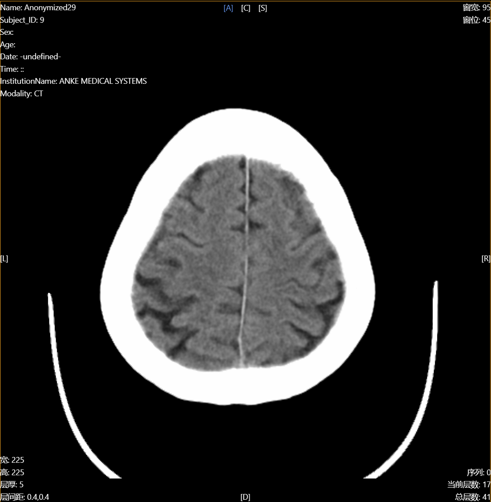
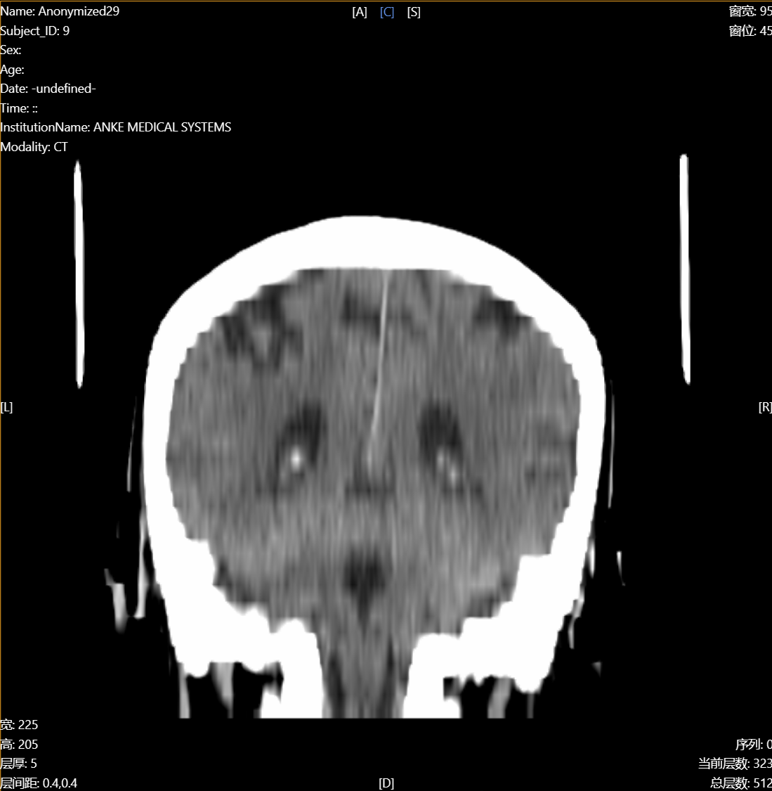
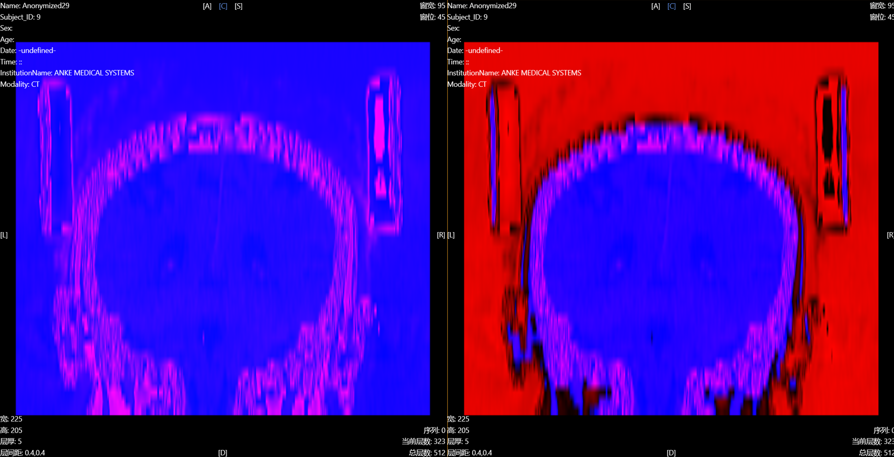
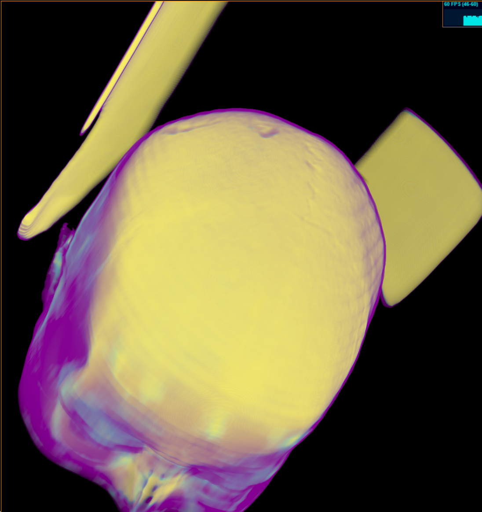

# 问题引入

最近在项目中，遇到了一个有趣的问题。

一个包含 41 张图片，每张图片的分辨率为 512 x 512 的脑部 CT，把他们渲染到屏幕上后，如果横断位（Axial）来观察，图片很清晰，因为是 512 x 512 分辨率，如下图：



但是从其它视角如冠状位（Coronal）来观察，会有强烈的锯齿感，因为是 512 x 41 的分辨率，经过拉伸变为实际尺寸，如下图：


体积重建的结果，一言难尽：


为了消除锯齿，我使用了 WebGL 中可配置的纹理过滤方法——LinearFilter，返回距离指定的纹理坐标最近的四个纹理元素的加权平均值，于是我得到了如下的效果：



在体积重建的结果中也有了质的飞跃：


正当我美滋滋的时候，问题出现了——原本的影像数据是以像素值（pixelArray3D）大小存储，转换为 RGB 的纹理渲染到场景中，由于需要外接某些算法，需要将影像数据转换为真实的浓度值（intensityArray3D）来存储，转换完再渲染，发现一下子打回了原形。下图的左边两幅图是 pixelArray3D，右边两幅图是 intensityArray3D，上边两幅图是没有开线性过滤，也就是最近点过滤（NearestFilter），下边两幅图是线性过滤（LinearFilter）：


可以看到右下的图，根本没有过滤的痕迹啊！这就是问题所在。

# 问题分析

## 1.纹理可视化

首先，把 pixelArray3D（左）和 intensityArray3D（右）的真实纹理，在**没有线性过滤**时进行可视化：


再把 pixelArray3D（左）和 intensityArray3D（右）的真实纹理，在**线性过滤**时进行可视化：


可以看得出来，在加上线性过滤后，采样得到的纹理都很好地进行了平滑过渡，说明配置没有出问题，那么只可能出现在纹理的生成中。

## 2.纹理生成算法

项目中，对于纹理的生成做了如下步骤：

```ts
function storedPixelDataToImageData(pixelData, width, height, depth) {
  // Transfer image data to alpha and luminance channels of WebGL texture
  // Pack int16 into three uint8 channels (r, g, b)
  const numberOfChannels = 3;
  const data = new Uint8Array(width * height * depth * numberOfChannels);
  let offset = 0;

  for (let i = 0; i < pixelData.length; i++) {
    const val = Math.abs(pixelData[i]);
    data[offset++] = val & 0xff;
    data[offset++] = val >> 8;
    data[offset++] = pixelData[i] < 0 ? 0 : 1; // 0 For negative, 1 for positive
  }

  return data;
}
```

也就是将 int16 的影像数据将绝对值的高 8 位与低 8 位存储到纹理的 G 通道与 A 通道，将正负值存储到 B 通道，然后在着色器中计算浓度值和灰度值，显示到屏幕：

```glsl
vec4 color=texture(diffuse,pos.xyz);
float intensity=color.r*256.+color.g*65536.;
if(color.b==0.){
    intensity=-intensity;
}
```
那么，问题似乎已经浮出水面，是否是纹理的正负号只相差1的问题（0为负，1为正），导致插值不明显呢？

测试一下，当int16值是正数的时候，就设置为255吧，把pixelArray3D（左）和 intensityArray3D（右）的纹理数据再可视化一下：

  

用像素分析软件Snipaste查看一下，果然有问题：从背景到脑部外壳这部分，B通道从0插值到了255！可是LinearFilter就是应该做插值啊，确实，插值没有错，错在——正负的插值是没有意义的，正就是正，负就是负。

这让我想到如果B通道非0即1的话，如果插值，会导致**只有在完全是负值的情况下恢复原始数据的正负**，其它情况均判定为正，那么过滤就完全失效了，关键代码在这：
```glsl
if(color.b==0.){
    intensity=-intensity;
}
```

# 问题解决

如何避免这种问题？或者说为什么之前pixelArray3D没有出现这种问题呢？


这是因为pixelArray3D在这个例子中大多数为正值，而intensityArray3D是经过处理后的数据，在这个例子中体现在脑部外壳以外是负，以内是正。

于是就可以把intensityArray3D完全变为正值存储到纹理，再在着色器中恢复原来的数据即可保证其符号。

```glsl
function storedPixelDataToImageData(pixelData, width, height, depth, minScalarValue) {
  // Transfer image data to alpha and luminance channels of WebGL texture
  // Pack int16 into three uint8 channels (r, g, b)
  const numberOfChannels = 3;
  const data = new Uint8Array(width * height * depth * numberOfChannels);
  let offset = 0;
  for (let i = 0; i < pixelData.length; i++) {
    const val = pixelData[i] + Math.abs(minScalarValue);
    data[offset++] = val & 0xff;
    data[offset++] = (val >> 8) & 0xff;
    // data[offset++] = pixelData[i] < 0 ? 0 : 1; // 0 For negative, 1 for positive
    data[offset++] = 0;
  }

  return data;
}
```
把数据加上最小值的绝对值，可以保证用R、G通道不丢失数据地保存在纹理中，剩下的B通道甚至可以保存其它数据。


后来仔细看了看修改之前的intensityArray3D的结果，发现也只有边缘没有过滤的效果，内部还是有过滤痕迹的，因为内部绝大多数已经变为正值，这更加印证了问题所在。


修改后的结果，舒服了：

  

# 感想
- 之前没有发现这个问题所在，因为大多数情况下不需要插值，好多数据的分辨率还是很高的
- 而在使用intensityArray3D之前，也没有发现问题，因为大多数情况下它存的本身就是正值，可见有些问题还是很隐蔽的，不容易被发现
- 另外也应该注意有符号数的打包问题
