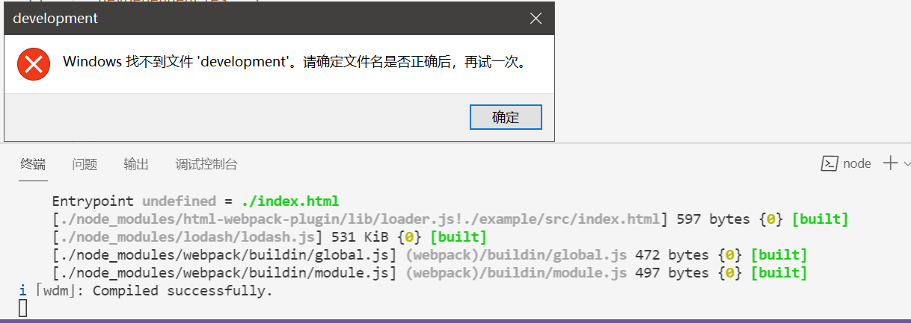
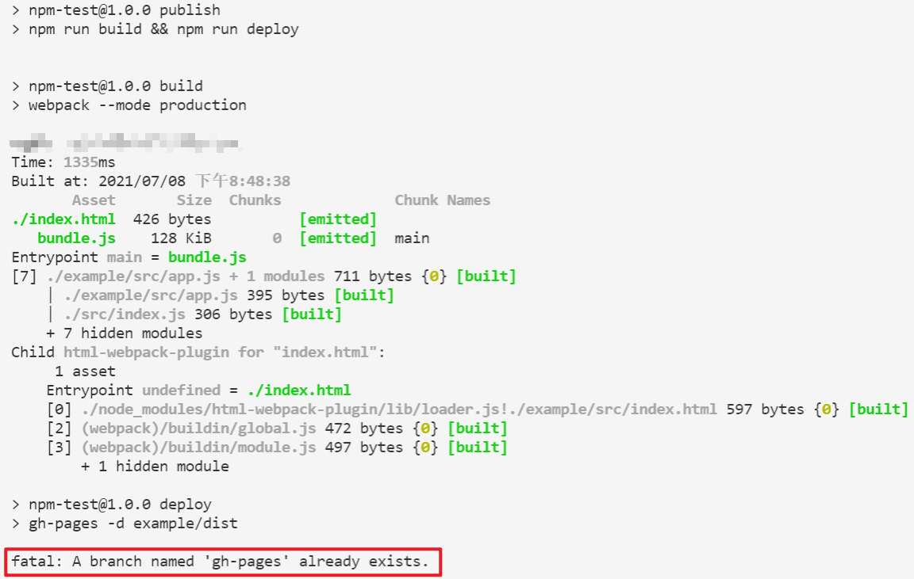
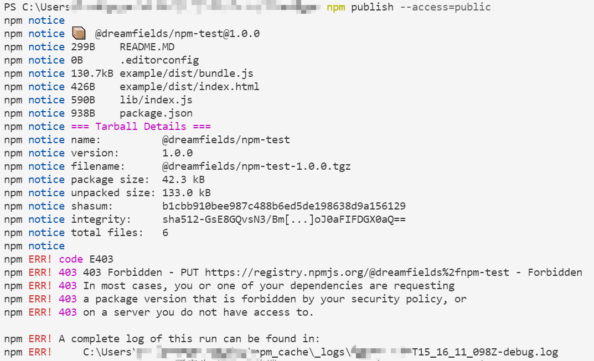
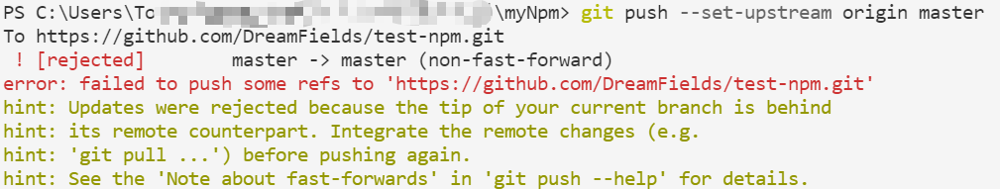
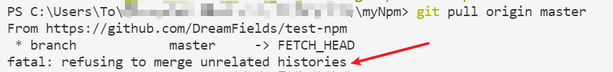

> 参考链接与官方文档：
> 1. [教程——发布 react 组件到 npm 上](https://segmentfault.com/a/1190000018079170)
> 2. [webpack中文文档](https://webpack.docschina.org/configuration)
> 3. [NPM: webpack-dev-server](https://www.npmjs.com/package/webpack-dev-server#browser-support)
> 4. [Github 徽章shields使用教程](https://blog.csdn.net/woshiwangdaye/article/details/105182357)
> 5. [NPM的 package.json 配置官网](https://docs.npmjs.com/cli/v7/configuring-npm/package-json)
> 6. [包的版本控制规范](https://semver.org/lang/zh-CN/)

## 🔵 问题与解决

#### 1.包版本兼容问题
按照教程来，会自动进行安装最新的npm包，最后在启动本地服务时会产生版本不匹配的错误，解决方法是先对**package.json**文件的依赖版本设定好，再使用`npm install`命令安装相关依赖。
```bash
"devDependencies": {
    "@babel/cli": "^7.14.5",
    "@babel/core": "^7.14.6",
    "@babel/preset-env": "^7.14.7",
    "@babel/preset-react": "^7.14.5",
    "babel-loader": "^8.2.2",
    "html-webpack-plugin": "^3.2.0",
    "react": "^16.7.0",
    "react-dom": "^16.7.0",
    "webpack": "^4.29.0",
    "webpack-cli": "^3.2.1",
    "webpack-dev-server": "^3.1.14"
```

#### 2.启动本地服务的问题
运行`npm run start`命令之后，会出现这个错误：


但是浏览器中输入**localhost:3001**依旧可以正常访问，说明打包和启动服务过程没有问题，看上去应该是环境变量的问题，并且跟脚本中命令里的`"start": "webpack-dev-server --open development"`有关，查看**webpack-dev-server**文档后，是直接使用了`webpack-dev-server`命令。

`--open`命令是告诉 dev-server 在服务器启动后打开浏览器；对于`development`，对比**webpack中文文档**后，发现这个`development`是用在**mode**中：


而**webpack-dev-server**其实是webpack在开发环境中使用的一个包，提供实时重新加载功能，应该代码编辑完之后进行增量编译的意思。

所以将脚本命令改为`"start": "webpack-dev-server"`即可，然后在**webpack.config.js**文件中的devServer部分配置改为：
```bash
devServer: {
        port: 3001,
        open:true, //自动打开浏览器       
    }
```

#### 3.部署到GitHub Page
按照参考链接1的步骤对组件开发完毕后，部署时发现报错：


在仓库中也没有发现gh-pages这个分支，卸载重装gh-pages包依旧报错。其实应该先在GitHub上的仓库中手动创建gh-pages分支，再运行部署的命令。

#### npm login报错
报错信息：`500 Internal Server Error - PUT https://registry.npm.taobao.org`

原因是，之前使用的淘宝镜像改变了原本的地址，需要通过:`npm config set registry https://registry.npmjs.org/`命令换成原本的镜像地址。

#### 4.无法发布


原因在于新注册的账号没有验证邮箱，如果手机端无法验证，就在网页端，或者去npm登录之后再发一次验证的邮件。

#### 5.git push出现的问题
**Error1：**

原因是没有将本地的分支与远程仓库的分支进行关联，解决方法是使用命令：
```bash
$ git remote add origin git@github.com:github—name/repository-name.git
```

**Error2：**

出现这个错误的原因是git本地仓库的当前版本低于远程仓库的版本，需要通过git pull来更新，将远程仓库的内容拉取到本地代码。

**Error3：**

原因是两个分支是两个不同的版本，具有不同的提交历史，需要使用下面的命令，可以允许不相关历史，强制合并：
```
$git pull origin master --allow-unrelated-histories
```
但是合并后，远程仓库与本地仓库不同的地方需要进行手动更改。

另一种安全的解决办法是使用`git stash`命令，参见：
[git stash和git stash pop](https://blog.csdn.net/qq_36898043/article/details/79431168?utm_medium=distribute.pc_relevant.none-task-blog-2%7Edefault%7EBlogCommendFromMachineLearnPai2%7Edefault-4.control&depth_1-utm_source=distribute.pc_relevant.none-task-blog-2%7Edefault%7EBlogCommendFromMachineLearnPai2%7Edefault-4.control)


## 🔵最终发布
最终的测试包已经发布：https://www.npmjs.com/package/@dreamfields/npm-test


