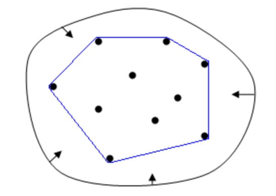

# 凸包概念与性质

**顶点定义法**

给定空间$R^{n}$上的有限点集$S$，由点集中有限个极点Extreme Point）构成的凸对象（Convex Object），就称为凸多胞体。

极点：可以看成是多胞体的顶点，以二维多边形为例，极点就相当于凸多边形的顶点。使用严格的数学定义来说，极点是指那些不能由凸多胞体内的其它点的凸组合（Convex Combination）表示出来的点。

凸多胞体任意两点的连线，还在凸多胞体内部。

**半空间交定义法**

一个凸多胞体可以表示成有限个半空间（Half Space）相交的密闭空间。 

半空间：例如在二维空间下，一条直线可以把平面分成两半，这两半就可以称为半空间，在三维空间下，一个平面可以把空间分成两半，这两半也就是两个半空间，在更高的维度下也可以有类似的表示。把$R^{n}$空间分成两半的平面称为超平面，例如二维的直线和三维的平面，都可以称为超平面。

以每条边所在直线（或每个面所在平面）将空间分为两个半空间，凸多胞体只存在其中一个半空间中。

# 二维凸包算法

问题引入：在二维空间中给定一个有限点集，如何构造最大的凸多边形？



常见的八种算法：


## Jarvis步进法


直观上，可以把Jarvis步进法看做是在集合Q的外面紧紧地包了一条线，线的一端固定在最下角的点上。把线向右拉使其绷紧，再拉高些，直到碰到一个点，这个点一定在凸包上。使线继续处于绷紧状态，查到下一个顶点，直至回来原点。更形式化的表示，是通过判断极角的大小，来确定下一个顶点。

实现：

```cpp
#include <iostream>
#include <vector>
#include <math.h>
#include <algorithm>
#define Pi 3.1415926;

using namespace std;

void printData(vector<vector<int>> data)
{
    for (size_t i = 0; i < data.size(); i++)
    {
        cout << "[" << data[i][0] << "," << data[i][1] << "]   ";
    }
}

vector<vector<int>> JarvisFunc(vector<vector<int>> &points)
{
    if (points.size() <= 3)
        return points;

    int minY = 65535;
    int maxY = -65535;
    vector<vector<int>>::iterator idxMinY;
    vector<vector<int>>::iterator idxMaxY;
    // 找到Y值最小和Y值最大的点，一定是凸包上的点
    for (vector<vector<int>>::iterator it = points.begin(); it != points.end(); ++it)
    {
        if ((*it)[1] < minY)
        {
            minY = (*it)[1];
            idxMinY = it;
        }
        if ((*it)[1] > maxY)
        {
            maxY = (*it)[1];
            idxMaxY = it;
        }
    }

    // 将最终结果存入convexHull
    vector<vector<int>> convexHull;
    convexHull.push_back(*idxMinY);

    // 寻找剩余点中与当前点的连线在极坐标下角度
    vector<int> curPoint = (*idxMinY);
    vector<int> maxYPoint = (*idxMaxY); // 最大的Y坐标点
    bool isRightChainOver = false;      //标记右链是否结束
    bool isOver = false;                // 标记是否退出循环
    // 进入循环迭代
    while (!isOver)
    {
        printData(points);
        cout << "curPoint:[" << curPoint[0] << "," << curPoint[1] << "]" << endl;

        // 迭代初始化
        double minAngle = 2 * Pi;
        vector<vector<int>> minPointStack = {}; //  极坐标角度减小则入栈
        vector<int> eraseIdxStack = {};         //   极坐标角度减小，对应的points下标入栈
        int startIdx = 0;
        vector<int> visited = {-1, -1}; // points中已经访问过的点的标记

        // 遍历points的剩余点
        for (int it = 0; it < points.size(); ++it)
        {
            if (points[it] == visited)
                continue;

            // 计算极坐标角度的cos值
            double curCos = (points[it][0] - curPoint[0]) / sqrt((pow((points[it][0] - curPoint[0]), 2) + pow((points[it][1] - curPoint[1]), 2)));

            // 如果是右链，角度相对于x轴正方向；左链的角度相对于x轴负方向
            curCos = isRightChainOver ? -curCos : curCos;
            // 得到当前的
            double curAngle = acos(curCos);

            // 计算大于180度的角度
            if (!isRightChainOver && (points[it][1] < curPoint[1]) || isRightChainOver && (points[it][1] > curPoint[1]))
                curAngle = 2 * Pi - curAngle;

            vector<int> test = {13, 49};
            if (curPoint == test)
            {
                cout << "---------------------------------" << endl;
            }

            // 将最小值的改变过程全部入栈
            if (curAngle <= minAngle || (curAngle - minAngle) < 1e-6)
            {
                if (curPoint == test)
                {
                    cout << "进栈！" << endl;
                }
                minPointStack.push_back(points[it]);
                eraseIdxStack.push_back(it);
                int curStackSize = minPointStack.size();

                if (curAngle < minAngle)
                    startIdx = curStackSize - 1;
                else // 当角度相同，即有多个点在同一条直线上时，均入栈
                {
                    // 决定入栈顺序
                    if (curStackSize > 1)
                    {
                        if (isRightChainOver) // 左链构造时，将Y值更小的点保持在栈顶；Y值相等时，X值更小的点保持在栈顶
                        {
                            if (minPointStack[curStackSize - 1][1] > minPointStack[curStackSize - 2][1] || minPointStack[curStackSize - 1][1] == minPointStack[curStackSize - 2][1] && minPointStack[curStackSize - 1][0] > minPointStack[curStackSize - 2][0])
                            {
                                swap(minPointStack[curStackSize - 1], minPointStack[curStackSize - 2]);
                                swap(eraseIdxStack[curStackSize - 1], eraseIdxStack[curStackSize - 2]);
                            }
                        }
                        else
                        { // 右链构造时，将Y值更大的点保持在栈顶；Y值相等时，X值更大的点保持在栈顶
                            if (minPointStack[curStackSize - 1][1] < minPointStack[curStackSize - 2][1] || minPointStack[curStackSize - 1][1] == minPointStack[curStackSize - 2][1] && minPointStack[curStackSize - 1][0] < minPointStack[curStackSize - 2][0])
                            {
                                swap(minPointStack[curStackSize - 1], minPointStack[curStackSize - 2]);
                                swap(eraseIdxStack[curStackSize - 1], eraseIdxStack[curStackSize - 2]);
                            }
                        }
                    }
                }

                minAngle = curAngle;
            }
            else
            {
                if (curPoint == test)
                {
                    cout << "未进栈！" << endl;
                }
            }
            cout << "*it:[" << points[it][0] << "," << points[it][1] << "]  ";
            cout << "curAngle:" << curAngle << "   ";
            cout << "minAngle:" << minAngle << "   ";
            cout << "curCos:" << curCos << endl;
        }

        // * 识别同一条直线上的目标点
        cout << "minPointStack:";
        printData(minPointStack);
        cout << "startIdx:" << startIdx << endl;
        for (int idx = startIdx; idx < minPointStack.size(); ++idx)
        {
            curPoint = *(minPointStack.begin() + idx);
            // 当前点查找到原来的点，闭包结束，退出循环
            if (curPoint == convexHull[0])
            {
                isOver = true;
                break;
            }
            convexHull.push_back(*(minPointStack.begin() + idx));
            *(points.begin() + eraseIdxStack[idx]) = visited;
        }
        // 更新当前点，进入下一次迭代
        curPoint = *(minPointStack.end() - 1);
        // 判断右链是否结束构造
        if (curPoint[1] == maxY)
            isRightChainOver = true;

        printData(convexHull);
        cout << "minAngle " << minAngle << endl;
        cout << "targetIdx:[" << curPoint[0] << "," << curPoint[1] << "]" << endl;
        cout << "\n-----------------------------" << endl;
    }

    // 返回
    return convexHull;
}

int main()
{

    // vector<vector<int>> testData = {{1, 1}, {2, 2}, {2, 0}, {3, 3}, {4, 0}};
    // vector<vector<int>> testData = {{1, 1}, {2, 2}, {2, 0}, {2, 4}, {3, 3}, {4, 2}};
    // vector<vector<int>> testData = {{1, 2}, {2, 2}, {4, 2}};
    // vector<vector<int>> testData = {{3, 0}, {4, 0}, {5, 0}, {6, 1}, {7, 2}, {7, 3}, {7, 4}, {6, 5}, {5, 5}, {4, 5}, {3, 5}, {2, 5}, {1, 4}, {1, 3}, {1, 2}, {2, 1}, {4, 2}, {0, 3}};
    // vector<vector<int>> testData = {{0, 2}, {1, 2}, {1, 8}, {2, 3}, {2, 4}, {3, 0}, {3, 3}, {3, 4}, {3, 9}, {4, 3}, {4, 5}, {4, 9}, {5, 6}, {6, 0}, {6, 8}, {7, 1}, {7, 2}, {7, 6}, {7, 7}, {8, 0}, {8, 3}, {8, 4}, {8, 6}, {8, 7}, {9, 5}, {9, 9}};
    vector<vector<int>> testData = {{10, 11}, {10, 44}, {10, 46}, {11, 17}, {11, 21}, {11, 28}, {11, 36}, {11, 41}, {12, 17}, {12, 18}, {12, 19}, {12, 30}, {12, 41}, {12, 43}, {12, 48}, {13, 15}, {13, 39}, {13, 42}, {13, 43}, {13, 49}, {14, 21}, {90, 34}, {91, 49}, {92, 12}};
    vector<vector<int>> res = JarvisFunc(testData);
    cout << "res:";
    printData(res);
    return 0;
}
```

## 增量算法


---

- 随机选择若干个不共线的点，作为初始凸包
- 每次增加一个点
    - 若该点在当前凸包内，则移除该点；
    - 否则，移除对该点可见的边（可能有多条这样的边），连接该点与当前凸包上和该点相切的点，产生新的凸包；
    - 重复上述步骤，直至点集中所有的点都处理为止。

> 初始凸包可以是三角形也可以是四边形，为了使初始的凸包尽可能多的囊括非极点，可以选择最左、最右、最上、最下的四个点构成的四边形作为初始凸包。
> 

---


可见：若一个点p在凸多边形的边 e指向外的法向量的一侧，称点p对边e可见或者称边e对点p可见。

相切：若点p在凸多边形外，那么对点p可见的边必然是连续的，则边e的两个端点$Pi、Pj$为凸多边形上与点p相切的两个点。

## 快速凸包算法


- 首先，找到点集中最左、最右、最上、最下的四个点，作为初始的凸包
- 左上和右下两个点连线将凸包一分为二
- 对两个凸包外侧的点做如下递归处理：
    - 对于当前凸包的每条边：
        - 找到与该边e距离最远的点P0，找到当前凸包上与点P相切的两点P1和P2
        - 删除边e，连接P0与P1，P0与P2，形成新的凸包；
        - 舍弃新的凸包内的点
        - 将新的凸包以P0为分界点，将凸包一分为二
    - 重复上述步骤，直至点集中所有的点都处理为止。

# 三维凸包算法

## 礼物包裹算法(Gift Wrapping)

**简介**

礼物包裹算法最早由Chand&Kapur (1970) 提出的，它不仅可以实现二维、三维凸包，还可以实现更高维的凸包。

Jarvis步进法是礼物包裹算法在二维情况下的特例。

直观上，三维的礼物包裹算法，可以看做是在点集的外面包围了一张纸，每次更新一个新的顶点，用纸覆盖住它，就像包裹礼物一样，直至覆盖整个点集。

**关键问题**

1. 给定一个凸包上的面，如何确定与该面片上任意一条边相邻的三角形面片？
    
    
    
    
    
2. 如何确定在凸包上的初始三角形面片？
    
    
    
    从点集中找到最小的点，即点的x分量最小，若x分量最小的点有多个，则取其中y分量最小的点，若y分量最小的点有多个，则取其中z分量最小的点。
    

**时间复杂度**

在礼物包裹算法中，确定初始的三角形面片，算法需要三次遍历点集，时间规模：$O(3n)$

把边结构存储在一个平衡二叉树的数据结构中，边结构的查询、插入操作只需要时间：$O(log m)$（m为边的个数），根据三维空间的凸多胞体欧拉公式$V-E+F=2$可知，$m$与$n$线性相关。（其中：V：顶点数， E：边数， F：面数）

总的时间复杂度：$O(nlogm)$

## 快速凸包算法


**简介**
快速凸包算法也可以看成是增量算法的一种变种，其思想类似于快排，因此得名。

**基本思想**

快速凸包算法首先会初始化一个4个点的凸包，然后把点集分割成各个面的外部点集，挑选距离面最远的点进行处理。任意一个极点都不会因为分割为外部点集导致被丢弃。

与增量算法相比，它们的不同就在于每次迭代从面的外部点集中选择的点不同。增量算法从外部点集中遍历所有点，但是快速凸包算法是选择距离最远的一个点。

最好的情况：每次划分都是平衡的，时间复杂度：$O(nlogn)$

最坏的情况：每次划分点后某一半凸包不再需要处理，另一半需要处理划分前剩余的点，时间复杂度：$O(nn)$

平均时间复杂度：$O(n*logn)$

# 参考

[凸包问题--概述](https://zhuanlan.zhihu.com/p/158043191)

[凸包问题--礼物包裹算法](https://zhuanlan.zhihu.com/p/158877025)